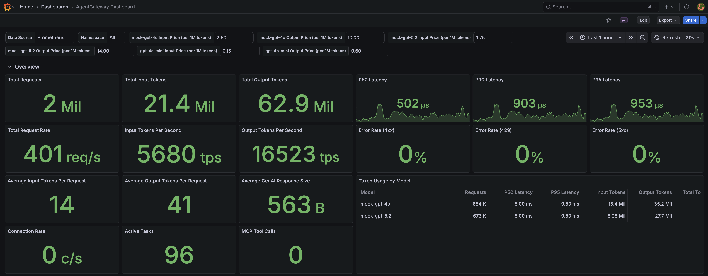
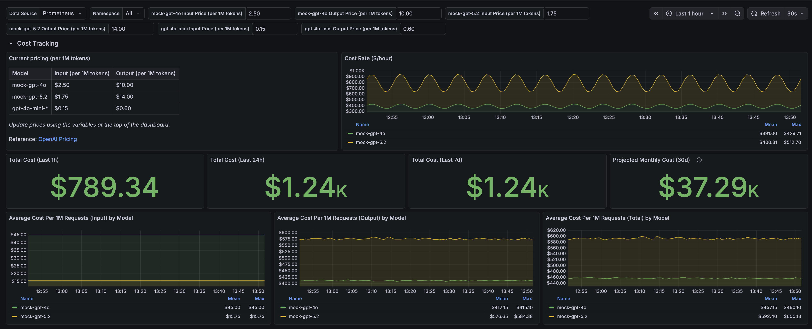
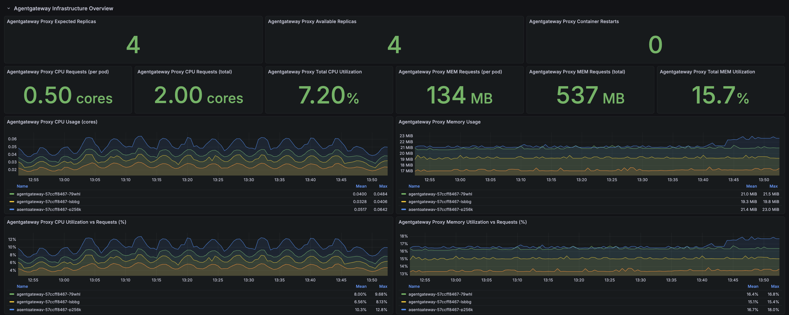
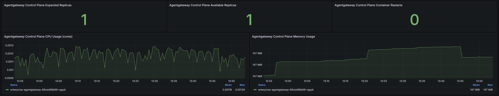
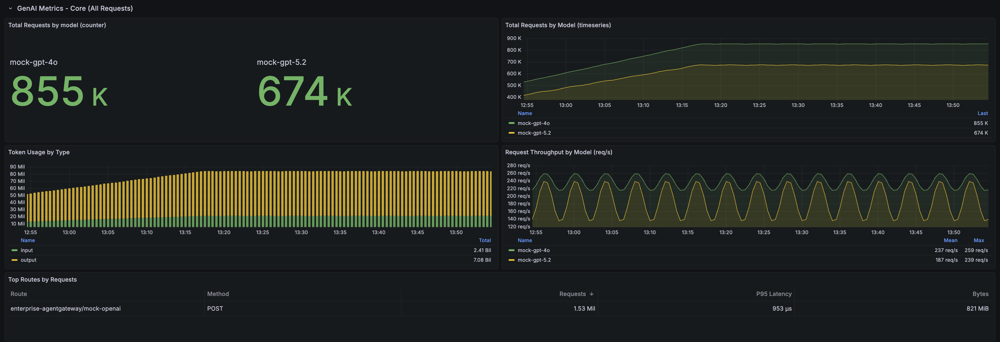
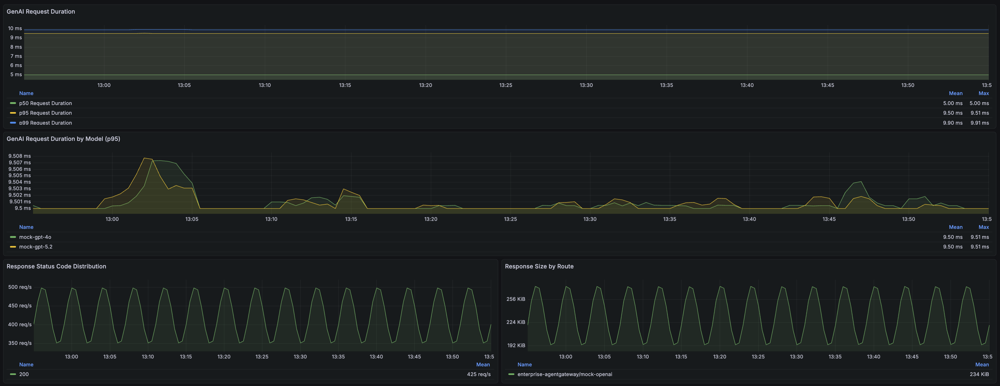
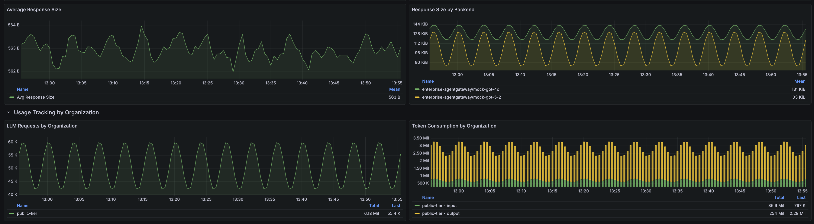
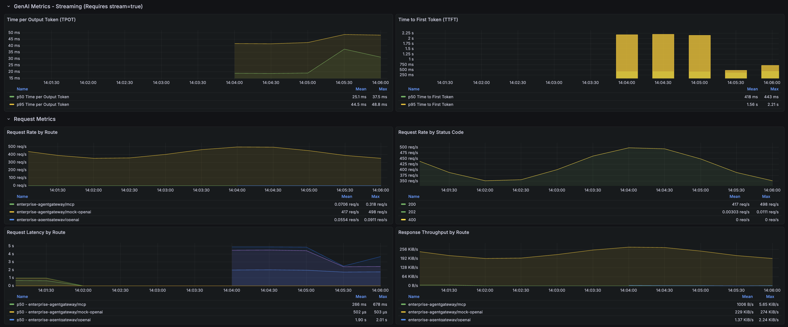

# Set up monitoring tools
Agentgateway emits OpenTelemetry-compatible metrics, logs, and traces out of the box. In this lab, we’ll deploy Grafana, Loki, Tempo, and Prometheus to collect, store, and visualize this observability data in later labs

## Pre-requisites
This lab assumes that you have completed the setup in `001`

## Lab Objectives
- Deploy tracing (Tempo)
- Deploy metrics + logs (Prometheus, Grafana, Loki)
- Configure Prometheus to scrape Agentgateway

## Deploy tracing

Install Tempo:
```bash
helm repo add grafana https://grafana.github.io/helm-charts
helm repo update grafana
helm upgrade --install tempo \
grafana/tempo-distributed \
--namespace monitoring \
--create-namespace \
--wait \
--values - <<EOF
minio:
  enabled: false
traces:
  otlp:
    grpc:
      enabled: true
    http:
      enabled: true
  zipkin:
    enabled: false
  jaeger:
    thriftHttp:
      enabled: false
  opencensus:
    enabled: false
EOF
```

## Deploy metrics + logs

(Optional) Set a custom Grafana admin password before installation:
```bash
export GRAFANA_ADMIN_PASSWORD="your-secure-password"
```

Install Grafana Prometheus and add Tempo as a data source
```bash
helm repo add prometheus-community https://prometheus-community.github.io/helm-charts
helm repo update prometheus-community
helm upgrade --install grafana-prometheus \
  prometheus-community/kube-prometheus-stack \
  --version 80.4.2 \
  --namespace monitoring \
  --values - <<EOF
alertmanager:
  enabled: false
grafana:
  adminPassword: "${GRAFANA_ADMIN_PASSWORD:-prom-operator}"
  service:
    type: ClusterIP
    port: 3000
  additionalDataSources:
    - name: Tempo
      type: tempo
      access: proxy
      url: "http://tempo-query-frontend.monitoring.svc.cluster.local:3200"
      uid: 'local-tempo-uid'
  sidecar:
    dashboards:
      enabled: true
      label: grafana_dashboard
      labelValue: "1"
      searchNamespace: monitoring
nodeExporter:
  enabled: false
prometheus:
  service:
    type: ClusterIP
  prometheusSpec:
    ruleSelectorNilUsesHelmValues: false
    serviceMonitorSelectorNilUsesHelmValues: false
    podMonitorSelectorNilUsesHelmValues: false
EOF
```

Add PodMonitor for scraping metrics from the agentgateway
```bash
kubectl apply -f- <<EOF
apiVersion: monitoring.coreos.com/v1
kind: PodMonitor
metadata:
  name: data-plane-monitoring-agentgateway-metrics
  namespace: enterprise-agentgateway
spec:
  namespaceSelector:
    matchNames:
      - enterprise-agentgateway
  podMetricsEndpoints:
    - port: metrics
  selector:
    matchLabels:
      app.kubernetes.io/name: agentgateway
EOF
```

## Install AgentGateway Grafana Dashboard

Install the AgentGateway dashboard that provides comprehensive metrics visualization including:
- Core GenAI metrics (request rates, token usage, model breakdown)
- Streaming metrics (TTFT, TPOT)
- MCP metrics (tool calls, server requests)
- Connection and runtime metrics

```bash
kubectl create configmap agentgateway-dashboard \
  --from-file=agentgateway-overview.json=lib/observability/agentgateway-grafana-dashboard-v1.json \
  --namespace monitoring \
  --dry-run=client -o yaml | \
kubectl label --local -f - \
  grafana_dashboard="1" \
  --dry-run=client -o yaml | \
kubectl apply -f -
```

The dashboard will be automatically loaded by the Grafana sidecar. You can access it in Grafana under "Dashboards" > "AgentGateway Overview".

Check that our observability tools are running:

```bash
kubectl get pods -n monitoring
```

Expected Output:

```bash
NAME                                                     READY   STATUS    RESTARTS   AGE
grafana-prometheus-fbdf9c69f-p9qq5                       3/3     Running   0          2m54s
grafana-prometheus-kube-pr-operator-857d774dbf-djxch     1/1     Running   0          2m54s
grafana-prometheus-kube-state-metrics-7c6d5ff8f6-77hkl   1/1     Running   0          2m54s
prometheus-grafana-prometheus-kube-pr-prometheus-0       2/2     Running   0          2m50s
tempo-compactor-6648b659d4-wdkrj                         1/1     Running   0          6m17s
tempo-distributor-8454cf454-lsd7f                        1/1     Running   0          6m17s
tempo-ingester-0                                         1/1     Running   0          6m17s
tempo-ingester-1                                         1/1     Running   0          6m17s
tempo-ingester-2                                         1/1     Running   0          6m17s
tempo-memcached-0                                        1/1     Running   0          6m17s
tempo-querier-5888ff7f7f-zq8qs                           1/1     Running   0          6m17s
tempo-query-frontend-96497bc8-p49cs                      1/1     Running   0          6m17s
```

## Access Grafana

To access Grafana and view the AgentGateway dashboard:

1. Port-forward to the Grafana service:
```bash
kubectl port-forward -n monitoring svc/grafana-prometheus 3000:3000
```

2. Open your browser and navigate to `http://localhost:3000`

3. Login with credentials:
   - Username: `admin`
   - Password: Value of `$GRAFANA_ADMIN_PASSWORD` environment variable, or `admin` if not set

   To set a custom password before installation, export the environment variable:
   ```bash
   export GRAFANA_ADMIN_PASSWORD="your-secure-password"
   ```

4. Navigate to Dashboards > AgentGateway Dashboard to view the dashboard

Note: The dashboard includes a namespace filter that allows you to view metrics for specific namespaces. By default, it shows metrics for all namespaces where AgentGateway is deployed.

## Agentgateway Dashboard Overview

The AgentGateway dashboard provides comprehensive observability into your AI gateway operations. As you progress through these labs and send requests through the gateway, the dashboard panels will populate with real-time metrics. This section showcases what you can expect to visualize out-of-the-box.

### Dashboard Capabilities

The dashboard is organized into several key metric categories:

**Overview**
- High level summary of important details



**Cost Tracking**
- Cost Rate ($/hour)
- Total Cost (1h, 24h, 7d)
- Projected Monthly Cost (30d)
- Average cost per 1M requests by Model (Input, Output, Total)



**Infrastructure Overview**
- Control Plane Health
- Data Plane Health
- CPU/MEM Resource Requests
- CPU/MEM Utilization




**Core GenAI Metrics**
- Request rates and throughput across all routes
- Token usage breakdown (input/output tokens)
- Per-model request distribution and performance
- Cost tracking and analysis





**Streaming and Request Metrics**
- Time to First Token (TTFT) - measures latency before streaming begins
- Tokens Per Output Token (TPOT) - measures streaming throughput
- Streaming request success rates



**MCP (Model Context Protocol) Metrics**
- Tool call frequency and patterns
- MCP server request rates
- Tool execution performance
