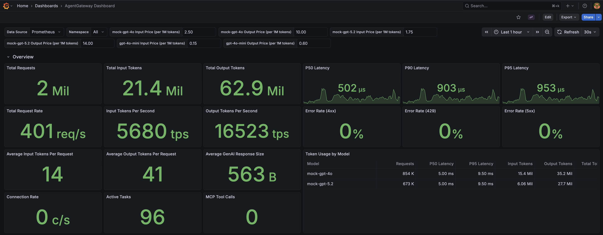
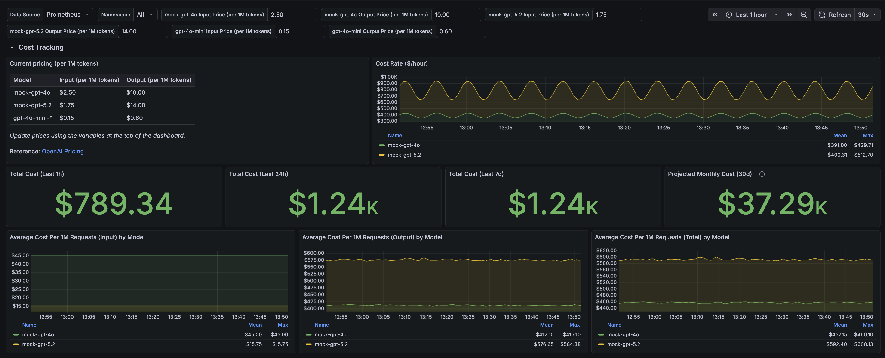
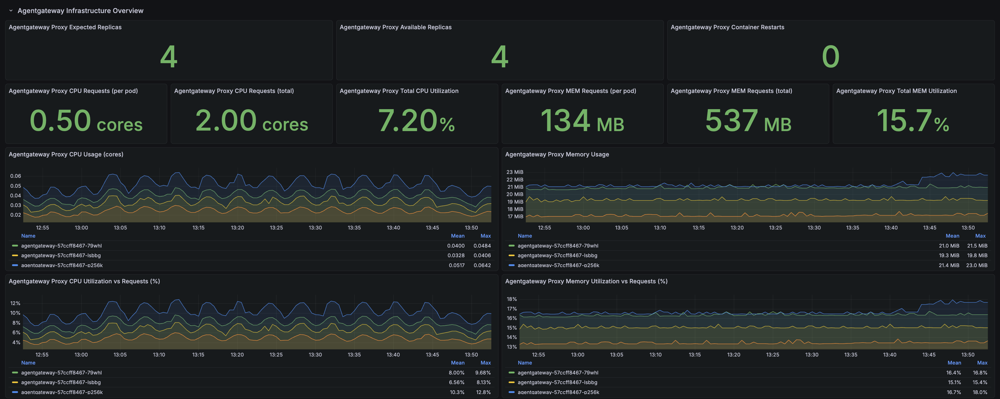
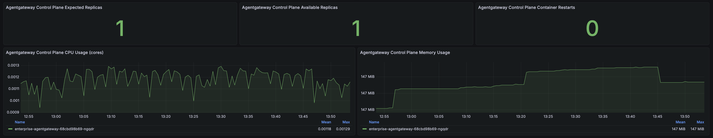
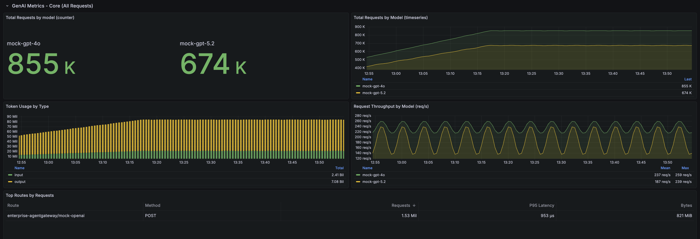
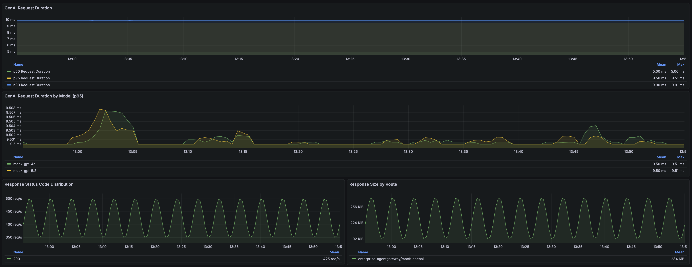
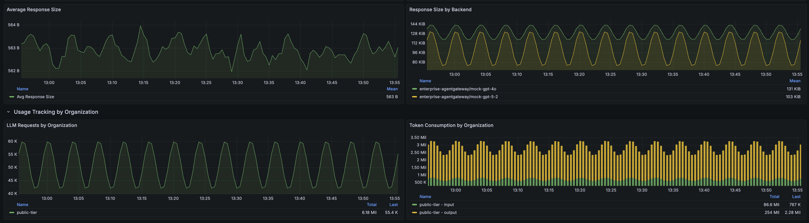
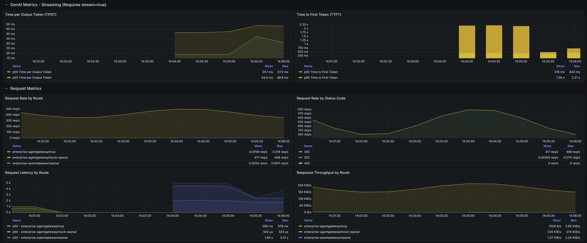

# Set up UI and monitoring tools
Agentgateway emits OpenTelemetry-compatible metrics, logs, and traces out of the box. In this lab, we’ll deploy the Solo UI (with its built-in OTEL collector) for tracing, and Grafana + Prometheus for metrics visualization.

## Pre-requisites
This lab assumes that you have completed the setup in `001`

## Lab Objectives
- Deploy Solo UI with OTEL collector (for tracing)
- Deploy metrics (Prometheus, Grafana)
- Configure Prometheus to scrape Agentgateway

## Deploy Solo UI

The Solo UI includes a built-in OpenTelemetry collector (`solo-enterprise-telemetry-collector`) that receives traces from AgentGateway and surfaces them in the UI.

```bash
export AGW_UI_VERSION=0.3.18
helm upgrade -i management oci://us-docker.pkg.dev/solo-public/solo-enterprise-helm/charts/management \
--namespace agentgateway-system \
--create-namespace \
--version "$AGW_UI_VERSION" \
-f - <<EOF
global:
  imagePullPolicy: IfNotPresent
  #--- imagePullSecrets for private registry (propagated to all subcharts) ---
  #imagePullSecrets:
  #- name: my-registry-secret
  imagePullSecrets: []
  #--- Image overrides for all Solo-owned images (UI, OTEL collector) ---
  #image:
  #  registry: my-registry.example.com
  #  repository: solo-enterprise
  #  tag: ""
service:
  type: ClusterIP
  clusterIP: ""
products:
  kagent:
    enabled: false
  agentgateway:
    enabled: true
    namespace: agentgateway-system
  mesh:
    enabled: false
  agentregistry:
    enabled: false
clickhouse:
  enabled: true
  #--- Image override for ClickHouse (no registry key — embed registry in repository if needed) ---
  #image:
  #  repository: clickhouse/clickhouse-server
  #  tag: ""
tracing:
  verbose: true
EOF
```

Check that the Solo UI components are running:

```bash
kubectl get pods -n agentgateway-system -l app.kubernetes.io/instance=management
```

## Deploy metrics

(Optional) Set a custom Grafana admin password before installation:
```bash
export GRAFANA_ADMIN_PASSWORD="your-secure-password"
```

Install Grafana and Prometheus
```bash
helm repo add prometheus-community https://prometheus-community.github.io/helm-charts
helm repo update prometheus-community
helm upgrade --install grafana-prometheus \
--create-namespace \
  prometheus-community/kube-prometheus-stack \
  --version 80.4.2 \
  --namespace monitoring \
  --values - <<EOF
#--- imagePullSecrets for private registry ---
#global:
#  imagePullSecrets:
#  - name: my-registry-secret
alertmanager:
  enabled: false
grafana:
  #--- Image override for private registry ---
  #image:
  #  registry: docker.io
  #  repository: grafana/grafana
  #  tag: ""
  adminPassword: "${GRAFANA_ADMIN_PASSWORD:-prom-operator}"
  service:
    type: ClusterIP
    port: 3000
  sidecar:
    dashboards:
      enabled: true
      label: grafana_dashboard
      labelValue: "1"
      searchNamespace: monitoring
nodeExporter:
  enabled: false
prometheus:
  service:
    type: ClusterIP
  prometheusSpec:
    #--- Image override for private registry ---
    #image:
    #  registry: quay.io
    #  repository: prometheus/prometheus
    #  tag: ""
    ruleSelectorNilUsesHelmValues: false
    serviceMonitorSelectorNilUsesHelmValues: false
    podMonitorSelectorNilUsesHelmValues: false
#--- Image overrides for private registry ---
#prometheusOperator:
#  image:
#    registry: quay.io
#    repository: prometheus-operator/prometheus-operator
#    tag: ""
#kube-state-metrics:
#  image:
#    registry: registry.k8s.io
#    repository: kube-state-metrics/kube-state-metrics
#    tag: ""
EOF
```

Add PodMonitor for scraping metrics from the agentgateway
```bash
kubectl apply -f- <<EOF
apiVersion: monitoring.coreos.com/v1
kind: PodMonitor
metadata:
  name: data-plane-monitoring-agentgateway-metrics
  namespace: agentgateway-system
spec:
  namespaceSelector:
    matchNames:
      - agentgateway-system
  podMetricsEndpoints:
    - port: metrics
  selector:
    matchLabels:
      app.kubernetes.io/name: agentgateway-proxy
EOF
```

## Install AgentGateway Grafana Dashboard

Install the AgentGateway dashboard that provides comprehensive metrics visualization including:
- Core GenAI metrics (request rates, token usage, model breakdown)
- Cost Tracking
- Infrastructure Performance
- Streaming metrics (TTFT, TPOT)
- MCP metrics (tool calls, server requests)
- Connection and runtime metrics

```bash
kubectl create configmap agentgateway-dashboard \
  --from-file=agentgateway-overview.json=lib/observability/agentgateway-grafana-dashboard-v1.json \
  --namespace monitoring \
  --dry-run=client -o yaml | \
kubectl label --local -f - \
  grafana_dashboard="1" \
  --dry-run=client -o yaml | \
kubectl apply -f -
```

The dashboard will be automatically loaded by the Grafana sidecar. You can access it in Grafana under "Dashboards" > "AgentGateway Overview".

Check that our observability tools are running:

```bash
kubectl get pods -n monitoring
```

Expected Output:

```bash
NAME                                                     READY   STATUS    RESTARTS   AGE
grafana-prometheus-fbdf9c69f-p9qq5                       3/3     Running   0          2m54s
grafana-prometheus-kube-pr-operator-857d774dbf-djxch     1/1     Running   0          2m54s
grafana-prometheus-kube-state-metrics-7c6d5ff8f6-77hkl   1/1     Running   0          2m54s
prometheus-grafana-prometheus-kube-pr-prometheus-0       2/2     Running   0          2m50s
```

## Access Solo UI

To access the Solo UI and view traces:

1. Port-forward to the Solo UI service:
```bash
kubectl port-forward -n agentgateway-system svc/solo-enterprise-ui 4000:80
```

2. Open your browser and navigate to `http://localhost:4000`

## Access Grafana

To access Grafana and view the AgentGateway dashboard:

1. Port-forward to the Grafana service:
```bash
kubectl port-forward -n monitoring svc/grafana-prometheus 3000:3000
```

2. Open your browser and navigate to `http://localhost:3000`

3. Login with credentials:
   - Username: `admin`
   - Password: Value of `$GRAFANA_ADMIN_PASSWORD` environment variable, or `prom-operator` if not set

   To set a custom password before installation, export the environment variable:
   ```bash
   export GRAFANA_ADMIN_PASSWORD="your-secure-password"
   ```

4. Navigate to Dashboards > AgentGateway Dashboard to view the dashboard

Note: 
- The dashboard includes a namespace filter that allows you to view metrics for specific namespaces. By default, it shows metrics for all namespaces where AgentGateway is deployed.
- This dashboard is compatible with both OSS and Enterprise Agentgateway. By default, it's configured for **Enterprise**. If you're using **OSS Agentgateway**, update the following template variables at the top of the dashboard to **OSS**:
    - Proxy Deployment Naming Pattern
    - Control Plane Deployment Naming Pattern
    - Enterprise Add-on Exclusion Pattern

## Agentgateway Dashboard Overview

The AgentGateway dashboard provides comprehensive observability into your AI gateway operations. As you progress through these labs and send requests through the gateway, the dashboard panels will populate with real-time metrics. This section showcases what you can expect to visualize out-of-the-box.

### Dashboard Capabilities

The dashboard is organized into several key metric categories:

**Overview**
- High level summary of important details



**Cost Tracking**
- Cost Rate ($/hour)
- Total Cost (1h, 24h, 7d)
- Projected Monthly Cost (30d)
- Average cost per 1M requests by Model (Input, Output, Total)



**Infrastructure Overview**
- Control Plane Health
- Data Plane Health
- CPU/MEM Resource Requests
- CPU/MEM Utilization




**Core GenAI Metrics**
- Request rates and throughput across all routes
- Token usage breakdown (input/output tokens)
- Per-model request distribution and performance
- Cost tracking and analysis





**Streaming and Request Metrics**
- Time to First Token (TTFT) - measures latency before streaming begins
- Tokens Per Output Token (TPOT) - measures streaming throughput
- Streaming request success rates



**MCP (Model Context Protocol) Metrics**
- Tool call frequency and patterns
- MCP server request rates
- Tool execution performance
