# Set up UI and monitoring tools
Agentgateway emits OpenTelemetry-compatible metrics, logs, and traces out of the box. In this lab, we’ll deploy the Solo UI (with its built-in OTEL collector) for tracing, and Grafana + Prometheus for metrics visualization.

## Pre-requisites
This lab assumes that you have completed the setup in `001`

## Lab Objectives
- Deploy Solo UI with OTEL collector (for tracing)
- Deploy metrics (Prometheus, Grafana)
- Configure Prometheus to scrape Agentgateway

## Deploy Solo UI

The Solo UI includes a built-in OpenTelemetry collector (`solo-enterprise-telemetry-collector`) that receives traces from AgentGateway and surfaces them in the UI.

### Set required variables

Export your Solo license key (same key used in lab 001):
```bash
export SOLO_TRIAL_LICENSE_KEY=$SOLO_TRIAL_LICENSE_KEY
export AGW_UI_VERSION=0.5.1
```

### Step 1: Install/upgrade CRDs

```bash
helm upgrade -i management-crds oci://us-docker.pkg.dev/solo-public/solo-enterprise-helm/charts/management-crds \
  --namespace agentgateway-system \
  --create-namespace \
  --version "$AGW_UI_VERSION"
```

### Step 2: Install/upgrade the chart

The `management-crds` subchart is bundled inside `management` and enabled by default. Since we installed it separately in Step 1, disable it here to avoid ownership conflicts:

```bash
helm upgrade -i management oci://us-docker.pkg.dev/solo-public/solo-enterprise-helm/charts/management \
--namespace agentgateway-system \
--create-namespace \
--version "$AGW_UI_VERSION" \
-f - <<EOF
management-crds:
  enabled: false
licensing:
  licenseKey: "${SOLO_TRIAL_LICENSE_KEY}"
global:
  imagePullPolicy: IfNotPresent
  #--- imagePullSecrets for private registry (propagated to all subcharts) ---
  #imagePullSecrets:
  #- name: my-registry-secret
  imagePullSecrets: []
  #--- Image overrides for all Solo-owned images (UI, OTEL collector) ---
  #image:
  #  registry: my-registry.example.com
  #  repository: solo-enterprise
  #  tag: ""
service:
  type: ClusterIP
  clusterIP: ""
products:
  kagent:
    enabled: false
  agentgateway:
    enabled: true
    namespace: agentgateway-system
  mesh:
    enabled: false
  agentregistry:
    enabled: false
clickhouse:
  enabled: true
  #--- Image override for ClickHouse (no registry key — embed registry in repository if needed) ---
  #image:
  #  repository: clickhouse/clickhouse-server
  #  tag: ""
tracing:
  verbose: true
EOF
```

Check that the Solo UI components are running:

```bash
kubectl get pods -n agentgateway-system -l app.kubernetes.io/instance=management
```

## Deploy metrics

(Optional) Set a custom Grafana admin password before installation:
```bash
export GRAFANA_ADMIN_PASSWORD="your-secure-password"
```

Install Grafana and Prometheus
```bash
helm repo add prometheus-community https://prometheus-community.github.io/helm-charts
helm repo update prometheus-community
helm upgrade --install grafana-prometheus \
--create-namespace \
  prometheus-community/kube-prometheus-stack \
  --version 80.4.2 \
  --namespace monitoring \
  --values - <<EOF
#--- imagePullSecrets for private registry ---
#global:
#  imagePullSecrets:
#  - name: my-registry-secret
alertmanager:
  enabled: false
grafana:
  #--- Image override for private registry ---
  #image:
  #  registry: docker.io
  #  repository: grafana/grafana
  #  tag: ""
  adminPassword: "${GRAFANA_ADMIN_PASSWORD:-prom-operator}"
  service:
    type: ClusterIP
    port: 3000
  sidecar:
    dashboards:
      enabled: true
      label: grafana_dashboard
      labelValue: "1"
      searchNamespace: monitoring
nodeExporter:
  enabled: false
prometheus:
  service:
    type: ClusterIP
  prometheusSpec:
    #--- Image override for private registry ---
    #image:
    #  registry: quay.io
    #  repository: prometheus/prometheus
    #  tag: ""
    ruleSelectorNilUsesHelmValues: false
    serviceMonitorSelectorNilUsesHelmValues: false
    podMonitorSelectorNilUsesHelmValues: false
#--- Image overrides for private registry ---
#prometheusOperator:
#  image:
#    registry: quay.io
#    repository: prometheus-operator/prometheus-operator
#    tag: ""
#kube-state-metrics:
#  image:
#    registry: registry.k8s.io
#    repository: kube-state-metrics/kube-state-metrics
#    tag: ""
EOF
```

Add PodMonitor for scraping metrics from the agentgateway
```bash
kubectl apply -f- <<EOF
apiVersion: monitoring.coreos.com/v1
kind: PodMonitor
metadata:
  name: data-plane-monitoring-agentgateway-metrics
  namespace: agentgateway-system
spec:
  namespaceSelector:
    matchNames:
      - agentgateway-system
  podMetricsEndpoints:
    - port: metrics
  selector:
    matchLabels:
      app.kubernetes.io/name: agentgateway-proxy
EOF
```

## Install AgentGateway Grafana Dashboard

Install the AgentGateway dashboard that provides comprehensive metrics visualization including:
- Core GenAI metrics (request rates, token usage, model breakdown)
- Cost Tracking (by model, organization, team, route, and provider)
- Infrastructure Performance (data plane and control plane)
- Context Size (cache read/write token metrics)
- Streaming metrics (TTFT, TPOT)
- MCP metrics (tool calls, server requests, latency)
- Usage Tracking by Organization

```bash
kubectl create configmap agentgateway-dashboard \
  --from-file=agentgateway-overview.json=lib/observability/agentgateway-grafana-dashboard-v1.json \
  --namespace monitoring \
  --dry-run=client -o yaml | \
kubectl label --local -f - \
  grafana_dashboard="1" \
  --dry-run=client -o yaml | \
kubectl apply --server-side --force-conflicts -f -
```

The dashboard will be automatically loaded by the Grafana sidecar. You can access it in Grafana under "Dashboards" > "AgentGateway Overview".

Check that our observability tools are running:

```bash
kubectl get pods -n monitoring
```

Expected Output:

```bash
NAME                                                     READY   STATUS    RESTARTS   AGE
grafana-prometheus-fbdf9c69f-p9qq5                       3/3     Running   0          2m54s
grafana-prometheus-kube-pr-operator-857d774dbf-djxch     1/1     Running   0          2m54s
grafana-prometheus-kube-state-metrics-7c6d5ff8f6-77hkl   1/1     Running   0          2m54s
prometheus-grafana-prometheus-kube-pr-prometheus-0       2/2     Running   0          2m50s
```

## Access Solo UI

To access the Solo UI and view traces:

1. Port-forward to the Solo UI service:
```bash
kubectl port-forward -n agentgateway-system svc/solo-enterprise-ui 4000:80
```

2. Open your browser and navigate to `http://localhost:4000`

## Access Grafana

To access Grafana and view the AgentGateway dashboard:

1. Port-forward to the Grafana service:
```bash
kubectl port-forward -n monitoring svc/grafana-prometheus 3000:3000
```

2. Open your browser and navigate to `http://localhost:3000`

3. Login with credentials:
   - Username: `admin`
   - Password: Value of `$GRAFANA_ADMIN_PASSWORD` environment variable, or `prom-operator` if not set

   To set a custom password before installation, export the environment variable:
   ```bash
   export GRAFANA_ADMIN_PASSWORD="your-secure-password"
   ```

4. Navigate to Dashboards > AgentGateway Dashboard to view the dashboard

Note: 
- The dashboard includes a namespace filter that allows you to view metrics for specific namespaces. By default, it shows metrics for all namespaces where AgentGateway is deployed.
- This dashboard is compatible with both OSS and Enterprise Agentgateway. By default, it's configured for **Enterprise**. If you're using **OSS Agentgateway**, update the following template variables at the top of the dashboard to **OSS**:
    - Proxy Deployment Naming Pattern
    - Control Plane Deployment Naming Pattern
    - Enterprise Add-on Exclusion Pattern

## Agentgateway Dashboard Overview

The AgentGateway dashboard provides comprehensive observability into your AI gateway operations. As you progress through these labs and send requests through the gateway, the dashboard panels will populate with real-time metrics. This section showcases what you can expect to visualize out-of-the-box.

### Dashboard Capabilities

The dashboard is organized into several key metric categories:

**Overview**
- Total Requests, Input/Output Token counts
- P50, P90, P95 latency
- Request rate, token throughput (input/output tokens per second)
- Error rates (4xx, 429, 5xx)
- Average token usage per request and average GenAI response size
- Connection Rate, Active Tasks, MCP Tool Calls
- Token Usage breakdown by Model

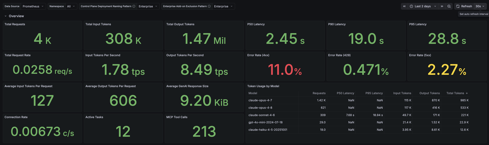

**Cost Tracking**
- Total Cost (5h, 24h, 7d windows) and Projected Monthly Cost
- Average cost per request and token spend (input, output, cache read, cache write)
- Cost Rate ($/hour) over time
- Cost breakdown by Model, Organization, Team, Route, and Provider
- Per-model pricing reference tables (OpenAI, Anthropic/Claude, API Gateway)
- Token throughput consumption by model

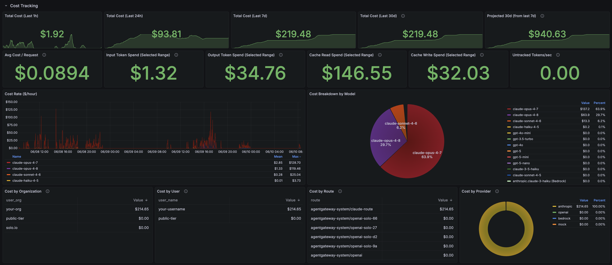
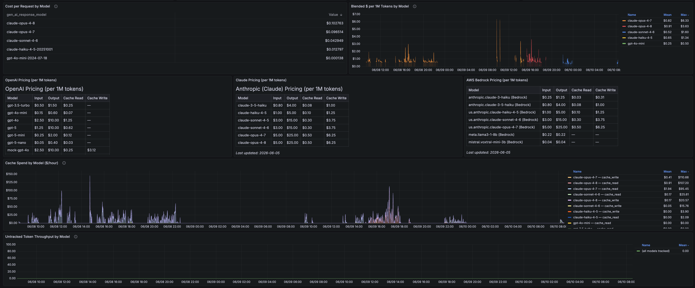

**Infrastructure Overview**

*Data Plane (AgentGateway Proxy):*
- Proxy replica counts (expected vs. available) and container restarts
- CPU and memory requests and utilization
- Per-instance CPU and memory usage charts
- CPU and memory utilization normalized per request

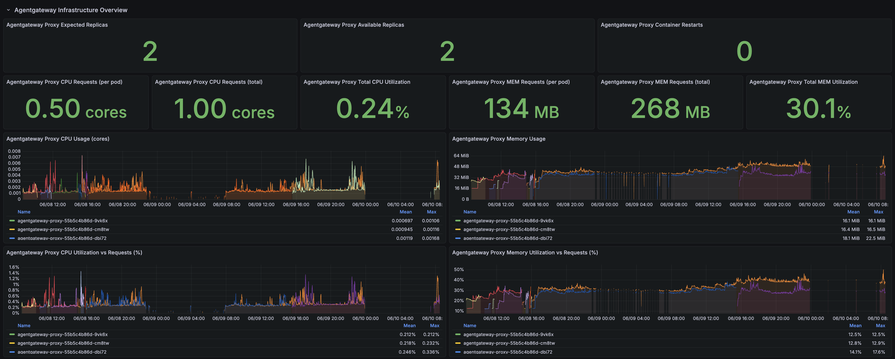

*Control Plane:*
- Control plane replica health and restarts
- CPU and memory usage over time

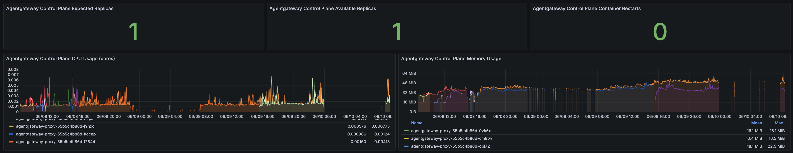

**Core GenAI Metrics**
- Total request counts and throughput by model
- Token usage by type (input, output, cache read, cache write)
- Request duration percentiles (p50, p90, p99) overall and per model
- Response code distribution and average response size
- Top routes by request volume and latency

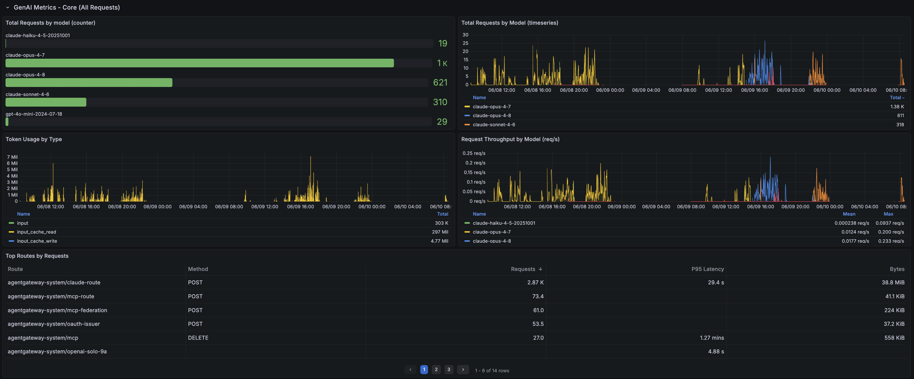
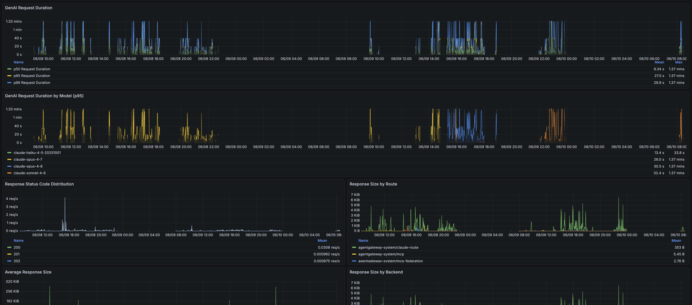

**Context Size**
- Cache Read Tokens Per Request (context size) — p50, p95, p99 percentiles
- Cache Write Tokens Per Request (cache churn) — p50, p95, p99 percentiles
- Cache Read Tokens Per Request — p95 breakdown by model

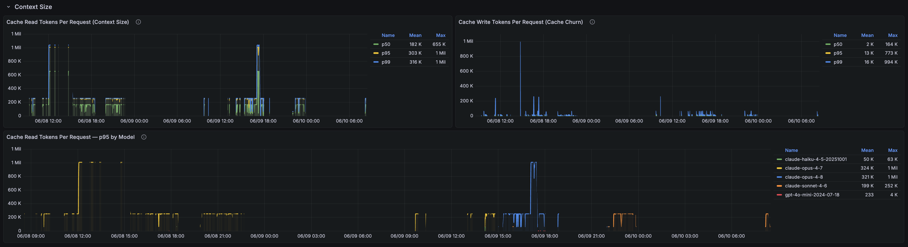

**Streaming and Request Metrics**
- Time per Output Token (TPOT) — measures streaming throughput
- Time to First Token (TTFT) — measures latency before streaming begins
- Request rate by route and by status code
- Request latency by route
- Response throughput by route

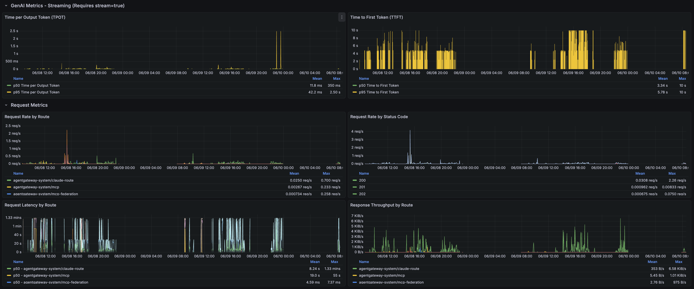

**MCP (Model Context Protocol) Metrics**
- MCP Tool Calls by Tool
- MCP Requests by Server
- MCP Request Latency (P50, P90, P99)
- MCP Error Rate (Success vs Errors)
- MCP Requests by Route

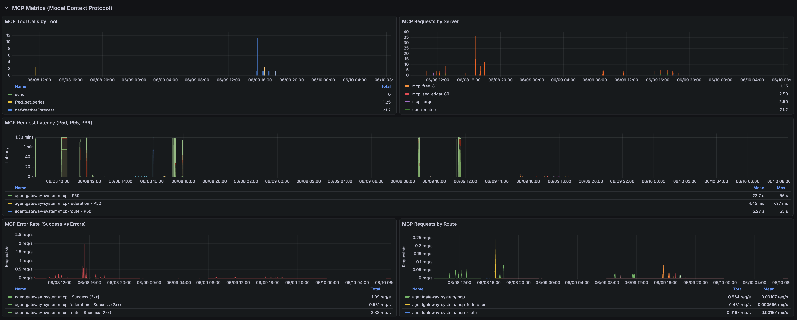

**Usage Tracking by Organization**
- LLM Requests by Organization
- Token Consumption by Organization (input tokens per org)

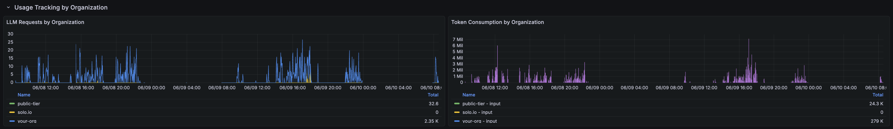

## Uninstall

Remove the Solo UI:

```bash
helm uninstall management -n agentgateway-system
helm uninstall management-crds -n agentgateway-system
```

Remove Grafana and Prometheus:

```bash
helm uninstall grafana-prometheus -n monitoring
kubectl delete namespace monitoring
```

Remove the AgentGateway PodMonitor:

```bash
kubectl delete podmonitor data-plane-monitoring-agentgateway-metrics -n agentgateway-system
```
