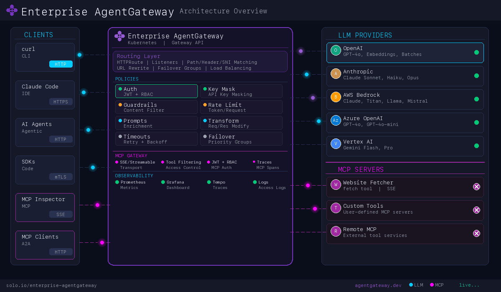

# Enterprise Agentgateway Workshop

## Prerequisites

Before starting this workshop, you will need:
- **Solo.io Trial License Key**: Enterprise Agentgateway requires a valid license key. You can obtain a free trial license by visiting [Solo.io](https://www.solo.io/) or contacting Solo.io sales.
- Kubernetes cluster (version 1.29.4 - 1.33.3 or compatible)
- kubectl CLI installed and configured
- helm CLI installed

# Table of Contents

- [Installation](#installation)
- [Routing](#routing)
- [Security](#security)
- [Rate Limiting](#rate-limiting)
- [Guardrails](#guardrails)
- [Transformations](#transformations)
- [MCP (Model Context Protocol)](#mcp-model-context-protocol)
- [Agent Frameworks](#agent-frameworks)
- [Identity & Delegation](#identity--delegation)
- [Evaluations](#evaluations)
- [Load Testing](#load-testing)

---

## Installation

> **Start here.** All other labs depend on these two.

- [001 — Install Enterprise Agentgateway](001-install-enterprise-agentgateway.md)
- [002 — Set Up UI and Monitoring Tools](002-set-up-ui-and-monitoring-tools.md)

> **OpenShift users:** Use the OpenShift-specific versions instead:
>
> [001 — Install Enterprise Agentgateway (OCP)](install-on-openshift/001-set-up-enterprise-agentgateway-ocp.md)
>
> [002 — Set Up Monitoring Tools (OCP)](install-on-openshift/002-set-up-monitoring-tools-ocp.md)

---

## Routing

- [Configure Mock OpenAI Server](configure-mock-openai-server.md) _(OpenAI)_
- [Basic Routing to OpenAI](configure-routing-openai.md) _(OpenAI)_
- [Path-per-Model Routing](routing-path-per-model.md) _(OpenAI)_
- [Header Matching Routing](routing-header-matching.md) _(OpenAI)_
- [Query Parameter Matching Routing](routing-query-parameter-matching.md) _(OpenAI)_
- [Body-Based Routing](configure-body-based-routing.md) _(OpenAI + Mock LLM)_
- [Routing to AWS Bedrock](configure-routing-aws-bedrock.md) _(AWS Bedrock)_
- [Routing to AWS Bedrock via API Keys](configure-routing-aws-bedrock-apikey.md) _(AWS Bedrock)_
- [Routing to Anthropic](configure-routing-anthropic.md) _(Anthropic)_
- [Routing to Azure OpenAI](configure-routing-azure-openai.md) _(Azure OpenAI)_
- [Routing to Google Vertex AI](configure-routing-vertexai.md) _(Google Vertex AI)_
- [Routing to Google Vertex AI via Service Account](configure-routing-vertexai-service-account.md) _(Google Vertex AI)_
- [OpenAI Embeddings](configure-openai-embeddings.md) _(OpenAI)_
- [OpenAI Batch API](configure-openai-batches.md) _(OpenAI)_
- [OpenAI Streaming](openai-streaming.md) _(OpenAI)_
- [Direct Response](direct-response.md)
- [Timeouts and Retries](timeouts-and-retries.md)
- [LLM Failover](llm-failover.md)

---

## Security

- [API Key Masking](api-key-masking.md)
- [JWT Auth with RBAC](jwt-auth-with-rbac.md)
- [TLS Termination](tls-termination.md)
- [Frontend mTLS](frontend-mtls.md)
- [SNI Matching](sni-matching.md)

---

## Rate Limiting

- [Request-Based Rate Limiting](request-based-rate-limiting.md)
- [Local Token-Based Rate Limiting](local-token-rate-limiting.md)
- [Global Token-Based Rate Limiting](global-token-rate-limiting.md)

---

## Guardrails

- [Built-in Guardrails](builtin-guardrails.md)
- [External Moderation (OpenAI)](external-moderation-guardrails.md)
- [Advanced Guardrails Webhook](advanced-guardrails-webhook.md)

---

## Transformations

- [Prompt Enrichment](prompt-enrichment.md)
- [Request/Response Transformations](transformations.md)

---

## MCP (Model Context Protocol)

- [In-Cluster MCP](in-cluster-mcp.md)
- [Remote MCP](remote-mcp.md)
- [Dynamic MCP](dynamic-mcp.md)
- [CrewAI Agent with MCP and OBO Auth](obo-crewai-agent-with-mcp.md) _(see also: Identity & Delegation)_

---

## Agent Frameworks

- [Claude Code](claude-code.md)
- [CrewAI](crewai-with-agentgateway.md)
- [LangChain](langchain-with-agentgateway.md)

---

## Identity & Delegation

- [OBO Token Exchange Fundamentals](obo-token-exchange-fundamentals.md)
- [CrewAI Agent with MCP and OBO Auth](obo-crewai-agent-with-mcp.md) _(see also: MCP)_
- [Microsoft Entra ID OBO](msft-entra-obo.md)

---

## Evaluations

- [Evaluate OpenAI Model Performance](evaluate-openai-model-performance.md)

---

## Load Testing

- [Load Testing with k6s](load-testing-k6s.md)

# Use Cases
- Support Kubernetes Gateway API
- Install Enterprise Agentgateway
- Configure agentgateway for LLM, MCP, and A2A consumption
- Unified access point for consumption of LLMs
    - LLM Providers supported in this repo:
        - OpenAI
        - AWS Bedrock (IAM credentials and API keys)
        - Anthropic (Claude)
        - Azure OpenAI
        - Google Vertex AI
    - OpenAI Embeddings support
    - OpenAI Batches API support (asynchronous batch processing)
    - Streaming responses support for real-time token generation
    - Claude Code CLI integration with full observability
    - CrewAI multi-agent workflow integration
    - LangChain multi-agent pipeline integration
- Identity & Delegation
    - OBO (On-Behalf-Of) token exchange fundamentals (impersonation + delegation)
    - CrewAI agent with MCP tools secured by OBO delegation
    - Microsoft Entra ID On-Behalf-Of (OBO) token exchange
- LLM API Key Management
    - API Key masking in logs
- Token-based metrics from LLM
- LLM request/response metadata in Traces
- Traffic Routing patterns (path, host, header, queryparameter)
- Model Evaluations
- Security & Access Control
    - Control access with org-specific API-key
    - Control access with JWT authentication
    - JWT-based RBAC (Role-Based Access Control)
    - Frontend TLS termination
    - Frontend mTLS with client certificate validation
    - SNI (Server Name Indication) matching for multi-domain HTTPS
- Prompt Guard & Content Moderation
    - Comprehensive built-in Prompt Guard (prompt injection, jailbreak, PII, secrets, harmful content, encoding evasion, and more)
    - External moderation guardrails (OpenAI moderation API)
    - Advanced Webhook Prompt Guard
- Prompt Enrichment
- Rate Limiting
    - Rate Limit on a per-request basis
    - Local token-based rate limiting
    - Global token-based rate limiting
- Request/Response Transformations
    - Response transformations
    - Header enrichment for observability
- MCP (Model Context Protocol)
    - Route to in-cluster MCP servers
    - Route to external/remote MCP servers through AgentGateway
    - Secure MCP servers with JWT auth
    - Tool-level access control
    - Integration with Claude Code CLI
- Direct Response / Health Checks
    - Configure fixed responses without backend calls
- Timeouts and Retries
    - Request timeout configuration
    - Retry policies on specific error codes (503, etc.)
    - Observing how timeouts and retries interact together
- LLM Failover
    - Priority group failover between LLM providers
    - Health-based routing across multiple backends
    - Failover on rate limit errors (429)
- Load Testing with K6s
    - Performance testing with k6s load generator
    - Ramping and constant load patterns
    - Integration with Grafana and Prometheus metrics

## Validated on
- Kubernetes 1.29.4 - 1.33.3
- Enterprise Agentgateway 2.1.0

## User Stories / Acceptance Criteria

As a platform operator, I want the AI Gateway to apply granular token quotas and rate limits to requests based on either an API key or a user/group identified in a JSON Web Token (JWT), so that I can control costs, ensure fair resource usage, and have the necessary metrics and logs to enable real-time monitoring and accurate chargeback.

---

This section is a comprehensive list of all the functionality and data requirements.

#### Flexible Identification
- The AI Gateway must be able to authenticate requests using either a static API key or by validating a JWT.
- The gateway can be configured to identify the request source using the API key itself, or by extracting specific `user_id` and `group_id` claims from the JWT payload.

#### Dynamic Quotas and Rate Limiting
- The platform operator can define and apply token quotas and rate limits to individual API keys, specific users, or entire user groups.
- When a limit is reached, the gateway must enforce it by preventing further requests and returning an appropriate error response (e.g., `429 Too Many Requests`).

#### Granular Token Usage Tracking
- The gateway must track and log the number of prompt and completion tokens for every request.
- Each log record must be tagged with the relevant identifier from the request (either the `api_key_id` or the `user_id` and `group_id` from the JWT).

#### Comprehensive Logging for Troubleshooting & Auditing
- The gateway must generate structured, machine-readable logs for every request.
- These logs must include all relevant data points: a unique `request_id`, timestamp, `http_status_code`, `total_tokens`, and the specific identifier of the request source.
- The log format should be designed for easy ingestion into a centralized logging platform for long-term storage and detailed queries.

#### Metrics for Real-time Monitoring & Analysis
- The gateway must expose a `/metrics` endpoint that provides real-time, Prometheus-compatible metrics.
- The metrics must include dimensions that correspond to the request identifiers (`api_key_id`, `user_id`, `group_id`) and key usage data (`tokens_consumed_total`).
- This enables the operator to create real-time dashboards and configure automated alerts (e.g., *"Alert me if the Marketing group's token usage exceeds 80% of their monthly quota"*).

#### Data for Chargeback & Reporting
- The combined logs and metrics must provide a complete and auditable data set that can be used to generate reports for cost attribution.
- The operator can easily query or export usage data aggregated by `api_key_id`, `user_id`, or `group_id` over any given time period.

#### Management Mechanisms
- The platform operator can manually set, adjust, and reset quotas for any user, group, or API key.
- The system can also be configured to perform automated, recurring quota resets (e.g., at the beginning of each calendar month).

---

### Why This is Important

This functionality is crucial for managing an enterprise-scale AI Gateway and directly addresses critical business needs:

- **Financial Control:** By setting and enforcing token quotas, the organization can prevent unexpected cost overruns and maintain predictable spending on AI services.
- **Operational Excellence:** Real-time metrics and detailed logs provide the necessary visibility to monitor system health, troubleshoot issues quickly, and ensure the gateway is performing as expected.
- **Organizational Governance:** The ability to track and attribute costs to specific teams or departments facilitates an accurate chargeback model, making business units accountable for their resource consumption and promoting efficient usage.
- **Fair Access:** Quotas and rate limits prevent a small number of users or applications from monopolizing resources and ensure that the AI services remain available and performant for all teams.
