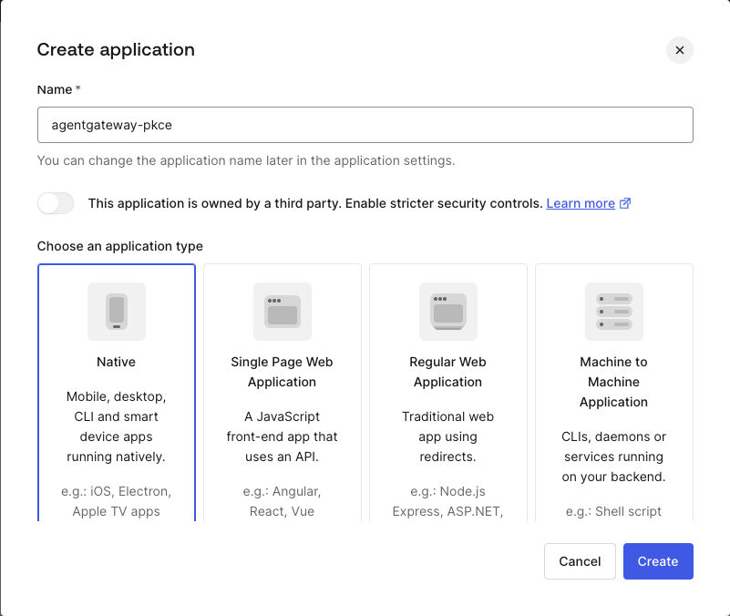
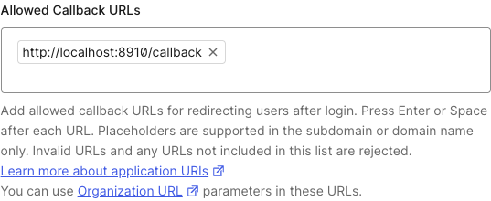
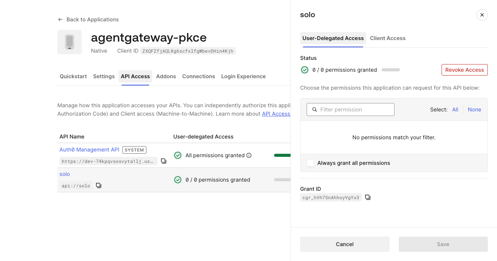
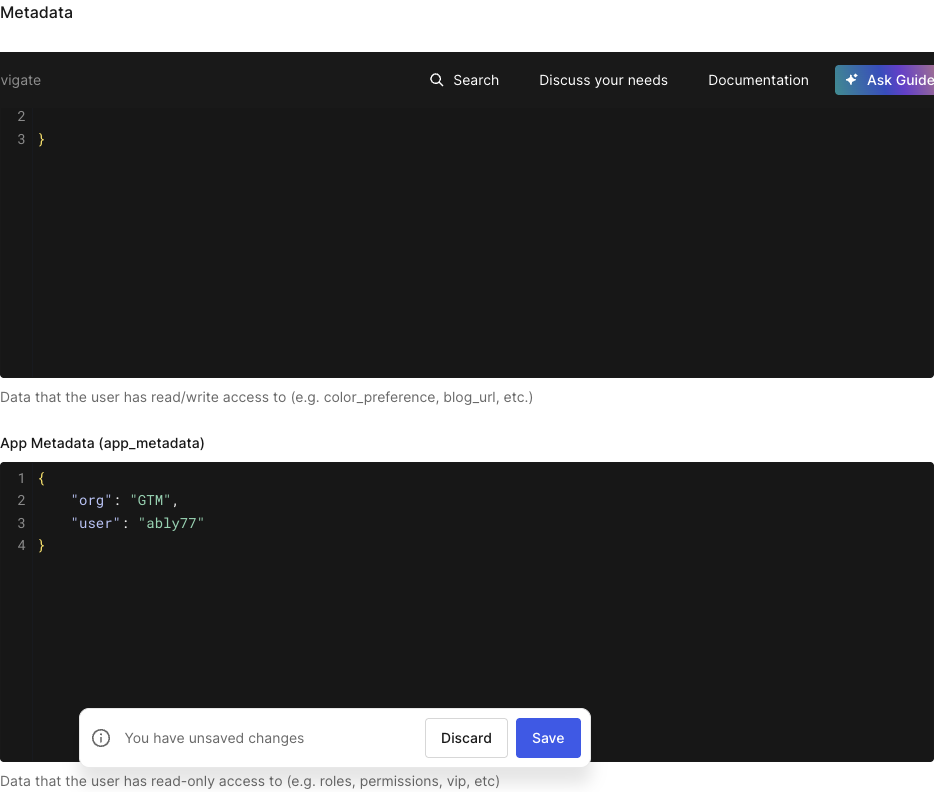
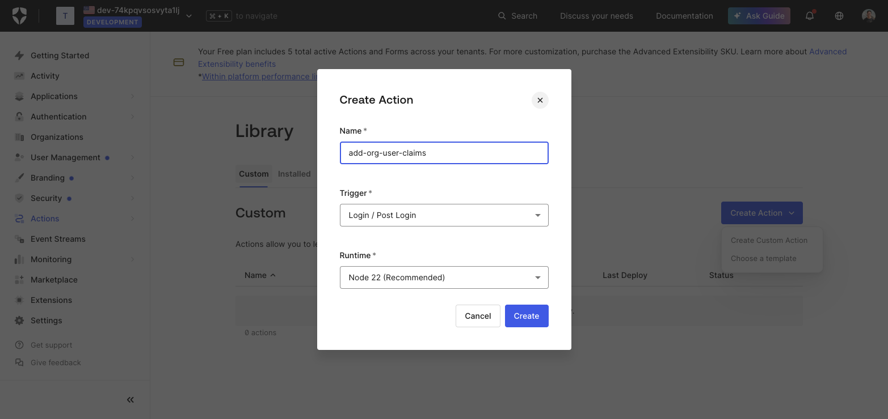
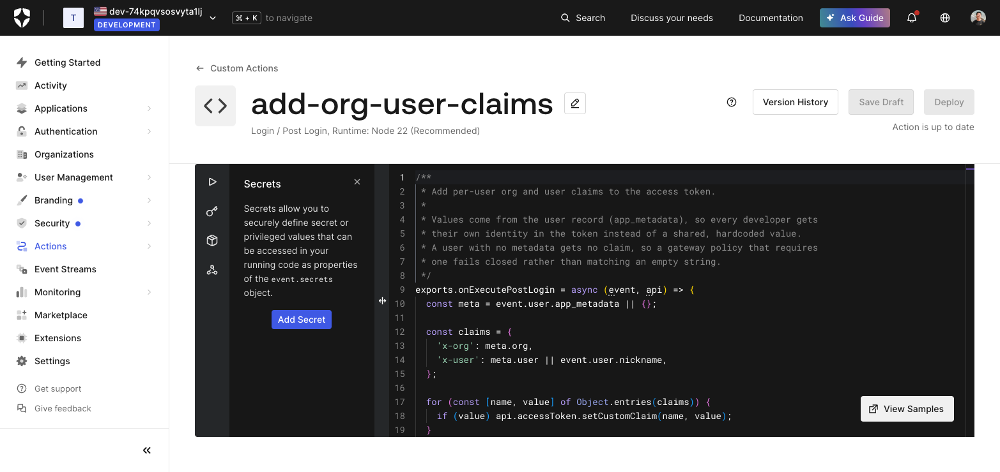
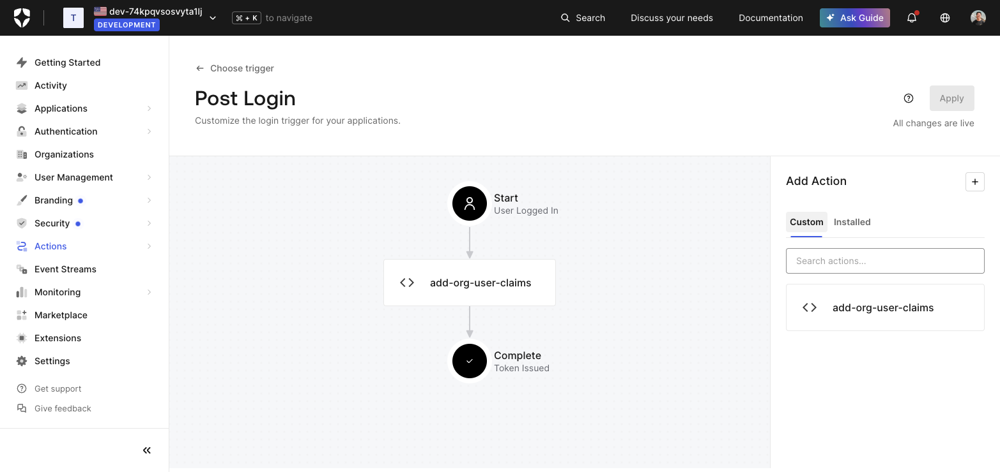

# Keep Claude Code Authenticated with Per-User Auth0 Tokens

In this lab, you'll route Claude Code through the gateway to Anthropic and authenticate it with a user identity instead of a shared or virtual API key. One browser login mints a per-user Auth0 token, and a credential helper renews it in the background, so the developer sees no `401` and holds no Anthropic key.

## Pre-requisites

This lab assumes that you have completed the setup in `001`. `002` is optional but recommended if you want to observe metrics and traces.

- `$ANTHROPIC_API_KEY` set in your shell, the key the **gateway** will hold on behalf of your developers
- [Claude Code](https://code.claude.com/docs) installed and working
- An Auth0 tenant where you can create an application and an API
- `python3` (3.8+) and `jq`

> **This lab leaves your existing Claude Code setup alone.** Every Claude Code invocation here runs with `--bare --settings`, which scopes the credential helper and the gateway endpoint to that one session. It writes nothing to `~/.claude/settings.json` and reads nothing from your normal login. Step 6 ends with an opt-in step if you want to make it permanent.

### Auth0 requirements

This lab needs a **public** client, because Claude Code runs on developer laptops and cannot keep a secret. In Auth0, create an application of type **Native** (Applications → Create Application → Native). Native applications are public clients: Auth0 neither requires nor accepts a client secret at token exchange, and PKCE takes the secret's place.



You also need an **API** (Applications → APIs) whose identifier becomes your audience. Auth0 issues a JWT the gateway can validate only when the authorization request names an audience.

| Variable | Description |
|---|---|
| `AUTH0_ISSUER` | Issuer URL with a **trailing slash**. Auth0 emits it in the `iss` claim and the policy does an exact string match |
| `AUTH0_PKCE_CLIENT_ID` | Client ID of the **Native** application |
| `AUTH0_AUDIENCE` | The API identifier, which becomes the `aud` claim the gateway requires |

Configure three settings:

1. **Allowed Callback URLs** (application → Settings): add `http://localhost:8910/callback`, the loopback address the login script listens on. It's a tag input, so press Enter to turn the URL into a chip, and append rather than replace.

   

2. **API access grant** (application → API Access → your API → Edit → **User-Delegated Access** → **Grant Access**). Use *User-Delegated Access*, the column that covers a user logging in through the application. *Client Access* governs `client_credentials`, which this lab doesn't use.

   

3. **Allow Offline Access** (APIs → your API → Settings → Access Settings): turn it **on**. Without it Auth0 returns no refresh token, and without a refresh token every renewal needs a browser.

---

## Lab Objectives

- Route Claude Code to Anthropic through the gateway using an `EnterpriseAgentgatewayBackend` and `HTTPRoute`
- Validate per-user Auth0 JWTs on that route with `jwtAuthentication` and a remote JWKS backend
- Obtain a user token with the Authorization Code flow + PKCE, with no client secret on the laptop
- Wire the token into Claude Code's `apiKeyHelper` for one session, leaving your own configuration untouched, so it renews from the refresh token
- Add per-user team claims with an Auth0 Post-Login Action and authorize on them with a CEL rule
- Verify that the Anthropic key stays in the cluster and that revoking access at Auth0 cuts off one developer

---

## Background

### The problem with sharing a provider key

Hand every developer the Anthropic API key and you have one shared credential with no expiry, no owner, and no way to cut off one person without rotating it for the whole team. Putting the gateway in front fixes custody, since the key then lives in a Kubernetes Secret, but something still has to authenticate the developer *to the gateway*.

A per-user Auth0 JWT solves that: it expires on its own, you can revoke it for one person, and it carries their identity into your access logs. The cost is ergonomics, because a token that expires every day means a login every morning.

Claude Code's **`apiKeyHelper`** setting closes that gap. It names a command that Claude Code executes to obtain the request credential, re-invoking it on an interval you control. Point it at a script that refreshes in the background and the developer stops thinking about expiry.

```
   ONE TIME                                    EVERY REQUEST
   ────────                                    ─────────────
   pkce-login.py                               Claude Code
        │  browser + PKCE                           │  runs apiKeyHelper
        ▼                                           ▼
   ┌───────┐                                  pkce-token.py
   │ Auth0 │                                       │  cached? valid? -> print
   └───────┘                                       │  expired? -> refresh_token grant
        │  access_token + refresh_token             ▼
        ▼                                      ┌───────┐
   ~/.agentgateway/pkce-token.json  ◀────────▶ │ Auth0 │
   (mode 0600)                                 └───────┘
                                                    │  fresh access token
                                                    ▼
                                            ┌──────────────┐   Anthropic key
                                            │ agentgateway │   injected here
                                            │  JWKS check  │ ─────────────▶ Anthropic
                                            └──────────────┘
```

### Two scripts, two jobs

Claude Code invokes a credential helper on its own schedule, over and over, so the helper cannot be interactive. Everything interactive lives in `pkce-login.py`, which you run once. `pkce-token.py` is the helper: stdout carries only the token, status messages go to stderr, and it renews from the refresh token once the cached one expires.

---

## Step 1 — Set Environment Variables

```bash
export AUTH0_ISSUER=$AUTH0_ISSUER                     # e.g. https://your-tenant.us.auth0.com/   (trailing slash REQUIRED)
export AUTH0_PKCE_CLIENT_ID=$AUTH0_PKCE_CLIENT_ID     # Client ID of the Native application
export AUTH0_AUDIENCE=$AUTH0_AUDIENCE                 # e.g. api://solo
export ANTHROPIC_API_KEY=$ANTHROPIC_API_KEY

export GATEWAY_IP=$(kubectl get svc -n agentgateway-system --selector=gateway.networking.k8s.io/gateway-name=agentgateway-proxy -o jsonpath='{.items[*].status.loadBalancer.ingress[0].ip}{.items[*].status.loadBalancer.ingress[0].hostname}')
echo $GATEWAY_IP
```

Derive the JWKS host from the issuer. A backend `host` takes a bare hostname, so strip the scheme and the trailing slash:

```bash
AUTH0_JWKS_HOST="${AUTH0_ISSUER#https://}"
export AUTH0_JWKS_HOST="${AUTH0_JWKS_HOST%/}"
echo $AUTH0_JWKS_HOST
```

Expected output, with no scheme and no trailing slash:

```
your-tenant.us.auth0.com
```

---

## Step 2 — Create the Anthropic Route

Store the Anthropic key in the cluster. This is the only copy your developers need:

```bash
kubectl create secret generic claude-secret -n agentgateway-system \
--from-literal="Authorization=$ANTHROPIC_API_KEY" \
--dry-run=client -oyaml | kubectl apply -f -
```

Create the route and backend:

```bash
kubectl apply -f - <<'EOF'
apiVersion: gateway.networking.k8s.io/v1
kind: HTTPRoute
metadata:
  name: claude
  namespace: agentgateway-system
spec:
  parentRefs:
    - name: agentgateway-proxy
      namespace: agentgateway-system
  rules:
    - matches:
        - path:
            type: PathPrefix
            value: /claude
      filters:
        - type: RequestHeaderModifier
          requestHeaderModifier:
            remove:
              - x-api-key
              - authorization
      backendRefs:
        - name: claude-anthropic
          group: enterpriseagentgateway.solo.io
          kind: EnterpriseAgentgatewayBackend
      timeouts:
        request: "540s"
---
apiVersion: enterpriseagentgateway.solo.io/v1alpha1
kind: EnterpriseAgentgatewayBackend
metadata:
  name: claude-anthropic
  namespace: agentgateway-system
spec:
  ai:
    provider:
      anthropic: {}
  policies:
    auth:
      secretRef:
        name: claude-secret
    ai:
      routes:
        "/v1/messages": "Messages"
        "/v1/models": "Passthrough"
        "*": "Passthrough"
EOF
```

> **Stripping `authorization` and `x-api-key`.** The developer's Auth0 JWT arrives in those headers and must **not** reach Anthropic. It isn't an Anthropic credential, and forwarding it would hand a user token to a third party. The `RequestHeaderModifier` removes both headers, then the backend's `auth.secretRef` attaches the real Anthropic key. JWT validation runs **before** the strip, so removing the header doesn't defeat authentication.

The long `540s` timeout accommodates extended thinking and long tool-use turns.

---

## Step 3 — Validate Auth0 Tokens on the Route

```bash
kubectl apply -f - <<EOF
apiVersion: enterpriseagentgateway.solo.io/v1alpha1
kind: EnterpriseAgentgatewayBackend
metadata:
  name: auth0-jwks
  namespace: agentgateway-system
spec:
  static:
    host: ${AUTH0_JWKS_HOST}
    port: 443
  policies:
    tls: {}
---
apiVersion: enterpriseagentgateway.solo.io/v1alpha1
kind: EnterpriseAgentgatewayPolicy
metadata:
  name: claude-auth0-jwt
  namespace: agentgateway-system
spec:
  targetRefs:
    - group: gateway.networking.k8s.io
      kind: HTTPRoute
      name: claude
  traffic:
    jwtAuthentication:
      mode: Strict
      providers:
        - issuer: ${AUTH0_ISSUER}
          audiences:
            - ${AUTH0_AUDIENCE}
          jwks:
            remote:
              backendRef:
                name: auth0-jwks
                namespace: agentgateway-system
                kind: EnterpriseAgentgatewayBackend
                group: enterpriseagentgateway.solo.io
              jwksPath: /.well-known/jwks.json
EOF
```

| Field | Purpose |
|---|---|
| `mode: Strict` | Reject requests without a valid token instead of passing them through |
| `issuer` | Must match `iss` exactly, **including the trailing slash** |
| `audiences` | Must contain the `aud` claim, the API identifier from Step 1 |
| `jwksPath` | **Keep the leading slash.** `traffic.jwtAuthentication` joins the path as written, unlike `backend.mcp.authentication` where a leading slash produces a double slash and a 404 |

The policy targets the `claude` HTTPRoute rather than the Gateway, so no other route on the shared proxy starts demanding Auth0 tokens.

> **Note: which header the gateway reads.** By default the gateway inspects only `Authorization: Bearer`. Claude Code sends its credential in **both** `Authorization: Bearer` and `x-api-key`, so it works as-is. To support a client that sends *only* `x-api-key`, such as the plain `anthropic` SDK, add a token location to the policy:
>
> ```yaml
> jwtAuthentication:
>   mode: Strict
>   location:
>     header:
>       name: x-api-key
> ```
>
> This setting is **either/or**: once set, the gateway stops accepting `Authorization: Bearer`, and the `curl` checks below need `-H "x-api-key: $TOKEN"` instead.

Verify the policy attached:

```bash
kubectl get enterpriseagentgatewaypolicy -n agentgateway-system claude-auth0-jwt \
  -o jsonpath='{.status.ancestors[0].conditions[*].message}{"\n"}'
```

Expected output:

```
Policy accepted Attached to all targets
```

---

## Step 4 — Confirm the Route Is Closed

```bash
curl -s "$GATEWAY_IP:8080/claude/v1/messages" \
  -H "content-type: application/json" \
  -H "anthropic-version: 2023-06-01" \
  -d '{
    "model": "claude-haiku-4-5-20251001",
    "max_tokens": 64,
    "messages": [
      {
        "role": "user",
        "content": "Say hi in five words."
      }
    ]
  }'
```

Expected output:

```
authentication failure: no bearer token found
```

Nothing reached Anthropic, so this request costs nothing.

---

## Step 5 — Log In Once with PKCE

The login script is the public OAuth client. It generates a `code_verifier`, sends only its SHA-256 hash, opens your browser, catches the redirect on `127.0.0.1:8910`, and exchanges the code **without any client secret**.

```bash
export OIDC_ISSUER="$AUTH0_ISSUER"
export OIDC_CLIENT_ID="$AUTH0_PKCE_CLIENT_ID"
export OIDC_AUDIENCE="$AUTH0_AUDIENCE"

./lib/oauth-pkce/pkce-login.py
```

Sign in as a tenant user. The first login also shows a consent screen, *"\<your application name\> is requesting access to your \<tenant\> account"*, because the request names an API audience. Click **Accept**.

Expected output:

```
Opening browser for login...
  https://your-tenant.us.auth0.com/authorize?response_type=code&client_id=...&code_challenge=...&code_challenge_method=S256&state=...

Cached credentials in /Users/you/.agentgateway/pkce-token.json (mode 0600)
  access_token is a JWT: True
  expires_in: 86400s
  refresh_token: present - renewals will be silent
```

`refresh_token: present` is the line to check. Without it, later renewals open a browser.

Confirm the token carries what the policy requires:

```bash
python3 -c "
import base64, json, pathlib
d = json.loads(pathlib.Path.home().joinpath('.agentgateway/pkce-token.json').read_text())
p = d['access_token'].split('.')[1]; p += '=' * (-len(p) % 4)
c = json.loads(base64.urlsafe_b64decode(p))
print(json.dumps({k: c.get(k) for k in ('iss','aud','sub','scope')}, indent=2))
"
```

Expected output:

```json
{
  "iss": "https://your-tenant.us.auth0.com/",
  "aud": [
    "api://solo",
    "https://your-tenant.us.auth0.com/userinfo"
  ],
  "sub": "google-oauth2|1138814259884843...",
  "scope": "openid profile email offline_access"
}
```

`sub` identifies the **human** who logged in rather than an application. `aud` is an array because the `openid` scope makes Auth0 append its `/userinfo` endpoint, and the gateway's `audiences` check passes when any entry matches.

Now prove the route opens for that token:

```bash
TOKEN=$(./lib/oauth-pkce/pkce-token.py)

curl -sS --fail-with-body "$GATEWAY_IP:8080/claude/v1/messages" \
  -H "content-type: application/json" \
  -H "anthropic-version: 2023-06-01" \
  -H "Authorization: Bearer $TOKEN" \
  -d '{
    "model": "claude-haiku-4-5-20251001",
    "max_tokens": 64,
    "messages": [
      {
        "role": "user",
        "content": "Say hi in five words."
      }
    ]
  }' | jq -r '.content[0].text'
```

Expected output:

```
Hi! How are you today?
```

That one response covers the whole chain: the JWT validated, the gateway stripped the `Authorization` header, injected the Anthropic key from the Secret, and returned the reply, with the caller holding no provider credential.

---

## Step 6 — Run Claude Code Through the Gateway

`pkce-token.py` prints a valid token and refreshes it when needed. Check it before handing it to Claude Code:

```bash
./lib/oauth-pkce/pkce-token.py
```

Expected output (the token on stdout, the status on stderr):

```
token valid for another 86373s
eyJhbGciOiJSUzI1NiIsInR5cCI6IkpXVCIsImtpZCI6...
```

Now hand it to Claude Code **for one session only**. `--bare` restricts authentication to `ANTHROPIC_API_KEY` or an `apiKeyHelper` supplied via `--settings` (*"OAuth and keychain are never read"*). `--settings` accepts inline JSON, so nothing on disk changes:

```bash
export ANTHROPIC_BASE_URL="http://$GATEWAY_IP:8080/claude"
export CLAUDE_CODE_API_KEY_HELPER_TTL_MS=3600000     # re-invoke the helper hourly
export PKCE_SETTINGS="{\"apiKeyHelper\":\"$PWD/lib/oauth-pkce/pkce-token.py\"}"

claude --bare --settings "$PKCE_SETTINGS"
```

Ask it something that requires a model call, such as `explain what an API gateway does in one sentence`. A normal answer means Claude Code authenticated with your Auth0 identity and the gateway supplied the Anthropic key.

| Piece | Why |
|---|---|
| `--bare` | Narrows credentials to `ANTHROPIC_API_KEY` or `apiKeyHelper`, so your keychain login can't satisfy the request in their place. It also skips hooks, plugins, and `CLAUDE.md` discovery, which keeps the session minimal |
| `--settings` inline JSON | Scopes `apiKeyHelper` to this invocation instead of `~/.claude/settings.json` |
| `$PWD/lib/...` | `apiKeyHelper` must be an **absolute** path; run these commands from the repo root |
| `ANTHROPIC_BASE_URL` | Sends requests to the gateway route rather than `api.anthropic.com` |

If you previously used Claude Code with Vertex AI or Bedrock, clear those first, since they take their own credentials and bypass the helper:

```bash
unset CLAUDE_CODE_USE_VERTEX CLAUDE_CODE_USE_BEDROCK
```

> **`ANTHROPIC_BASE_URL` and `$PKCE_SETTINGS` are per-shell.** Run `claude --bare` from a different terminal without them and Claude Code sends your Auth0 JWT to `api.anthropic.com`, which rejects it with `Invalid API key · Fix external API key`. The credential is fine; the request went to the wrong destination.

### Confirm the traffic went through the gateway

```bash
kubectl logs -n agentgateway-system -l app.kubernetes.io/name=agentgateway-proxy --tail 20 | grep /claude
```

Every Claude Code request appears with `endpoint=api.anthropic.com:443`, the model, and token counts.

### Optional — make it the default for this machine

Everything above stays scoped to a single command, which is what you want while working through the lab. Take the next step only if you want this to be how Claude Code authenticates **everywhere on this machine**: writing `apiKeyHelper` into your settings file changes authentication for every Claude Code session, including ones unrelated to this lab, and those sessions break if the helper fails or its cache expires with no refresh token.

```bash
mkdir -p ~/.claude
python3 - <<PY
import json, os, pathlib
p = pathlib.Path.home() / ".claude" / "settings.json"
s = json.loads(p.read_text()) if p.exists() else {}
s["apiKeyHelper"] = os.path.abspath("lib/oauth-pkce/pkce-token.py")
p.write_text(json.dumps(s, indent=2))
print(f"apiKeyHelper -> {s['apiKeyHelper']}")
PY
```

The script merges the key into your existing settings instead of overwriting them, and [Cleanup](#cleanup) removes that one key. With it in place, plain `claude` uses the helper and you can drop `--bare --settings`. Keep exporting `ANTHROPIC_BASE_URL`, which stays per-shell.

---

## Step 7 — Confirm Per-User Attribution

The gateway records which developer made each request. Look for `jwt.sub` in the access logs:

```bash
kubectl logs -n agentgateway-system -l app.kubernetes.io/name=agentgateway-proxy --tail 50 \
  | grep /claude | grep -o 'jwt.sub=[^ ]*' | sort | uniq -c
```

Expected output:

```
   4 jwt.sub=google-oauth2|113881425988484374005
```

That subject is the Auth0 identity of the person who logged in during Step 5. A shared provider key produces no `jwt.sub` at all, so per-user tokens in front of the provider credential are what let you tie a request back to a person.

Going back to normal takes nothing on the `--bare --settings` path: drop the flags and your usual login applies again. [Cleanup](#cleanup) handles the rest — the cached credential, the shell variables, and the `apiKeyHelper` key if you took the optional step in Step 6 — and cutting off one developer for good is the next section.

---

## Step 8 — Authorize by Team Claim

A policy written against `jwt.sub` needs an edit every time someone joins or leaves. Put the team in a claim instead and the policy stays fixed: you grant access to a team once, and membership changes stay in Auth0.

### Put the team on the user record

Store the team and the developer's handle on the user (User Management → Users → your user → Metadata → **App Metadata**). Use *App Metadata* rather than User Metadata, which the user can edit themselves — a value your policy trusts has to be admin-controlled.

```json
{
  "org": "GTM",
  "user": "ably77"
}
```



Give a second user a different team, `{"org": "engineering", "user": "jdoe"}`, so you have something to deny later.

### Add the claims with a Post-Login Action

Auth0 mints claims through an **Action**: Actions → Library → **Create Action** → **Build from scratch**, named `add-org-user-claims`, trigger **Login / Post Login**.



Replace the body with this, then click **Deploy**:

```js
exports.onExecutePostLogin = async (event, api) => {
  const meta = event.user.app_metadata || {};

  const claims = {
    'x-org': meta.org,
    'x-user': meta.user || event.user.nickname,
  };

  for (const [name, value] of Object.entries(claims)) {
    if (value) api.accessToken.setCustomClaim(name, value);
  }
};
```



The `if (value)` guard means a user with no `app_metadata.org` gets no `x-org` claim at all rather than an empty one, and a rule referencing a missing claim denies the request.

Attach it to the flow: Actions → **Triggers** → **post-login**, drag it between **Start** and **Complete**, then **Apply**.



> **Deploying is not enabling.** A deployed Action outside the flow never runs, and the flow discards your change if you navigate away before clicking **Apply**. The banner should read *All changes are live*.

### Mint a token that carries the claims

Actions run on interactive login, so the token in your cache predates this one:

```bash
rm -f ~/.agentgateway/pkce-token.json
./lib/oauth-pkce/pkce-login.py
```

Decode it with the snippet from Step 5, widened to print every claim:

```bash
python3 -c "
import base64, json, pathlib
d = json.loads(pathlib.Path.home().joinpath('.agentgateway/pkce-token.json').read_text())
p = d['access_token'].split('.')[1]; p += '=' * (-len(p) % 4)
print(json.dumps(json.loads(base64.urlsafe_b64decode(p)), indent=2))
"
```

Expected output, with the two new claims alongside the standard ones:

```json
{
  "x-org": "GTM",
  "x-user": "ably77",
  "iss": "https://your-tenant.us.auth0.com/",
  "sub": "google-oauth2|113881425988484374005",
  ...
}
```

The claims also have to survive the silent renewal, or a Claude Code session breaks an hour in when the helper swaps in a refreshed token. Force one:

```bash
python3 -c "
import json, pathlib
p = pathlib.Path.home() / '.agentgateway/pkce-token.json'
d = json.loads(p.read_text()); d['expires_at'] = 0
p.write_text(json.dumps(d, indent=2))
"
./lib/oauth-pkce/pkce-token.py > /dev/null
```

Decode again: `x-org` and `x-user` are still there, with a newer `iat`.

### Enforce the claim on the route

Add an `authorization` block to the policy from Step 3, leaving the rest of it untouched:

```bash
kubectl patch enterpriseagentgatewaypolicy -n agentgateway-system claude-auth0-jwt \
  --type merge -p '{"spec":{"traffic":{"authorization":{"policy":{"matchExpressions":["jwt[\"x-org\"] == \"GTM\""]}}}}}'
```

Authentication runs first, then authorization: no token still returns `401`, while a valid token from the wrong team now returns `403`. Your token carries `x-org: GTM`, so the request from Step 5 still returns a completion.

### Watch it deny

Point the rule at a team your token doesn't carry:

```bash
kubectl patch enterpriseagentgatewaypolicy -n agentgateway-system claude-auth0-jwt \
  --type merge -p '{"spec":{"traffic":{"authorization":{"policy":{"matchExpressions":["jwt[\"x-org\"] == \"engineering\""]}}}}}'
```

Wait a few seconds for the change to reach the proxy, then repeat the request:

```
authorization failed
```

The access log separates this from an authentication failure:

```
http.path=/claude/v1/messages http.status=403 jwt.sub=google-oauth2|113881425988484374005 protocol=http error="authorization failed" reason=Authorization
```

`reason=Authorization` with a `jwt.sub` present means the token was good and the rule rejected it, where Step 4's rejection carried `reason=JwtAuth` and no subject at all. Neither reaches Anthropic, so a denial costs nothing. Put the working rule back:

```bash
kubectl patch enterpriseagentgatewaypolicy -n agentgateway-system claude-auth0-jwt \
  --type merge -p '{"spec":{"traffic":{"authorization":{"policy":{"matchExpressions":["jwt[\"x-org\"] == \"GTM\""]}}}}}'
```

### Rules worth trying

Each expression goes in `matchExpressions` in place of the one above.

| Expression | Grants access to |
|---|---|
| `jwt["x-org"] == "GTM"` | One team |
| `jwt["x-org"] in ["GTM", "engineering"]` | Several teams, without repeating the claim |
| `jwt["x-org"] == "GTM" && jwt["x-user"] == "ably77"` | A named person on a named team |
| `"x-org" in jwt && jwt["x-org"] == "GTM"` | The same as the first rule, with the presence check spelled out |

> **Index hyphenated claims with brackets.** `jwt["x-org"]` works; `jwt.x-org` does not, because CEL reads the hyphen as subtraction. It fails quietly: the policy still reports `Policy accepted Attached to all targets` while **every** request returns `403`, exactly as it does for a rule naming a claim the token doesn't carry. Both fail closed, which is the right direction to fail but easy to misread as a broken gateway. Claim names without hyphens (`org`, `team`) can use dot access, as in `jwt.org == "GTM"`.

---

## Step 9 — Prove Renewal and Revocation

### Silent renewal

Force the cached token to look expired and run the helper again:

```bash
python3 -c "
import json, pathlib
p = pathlib.Path.home() / '.agentgateway/pkce-token.json'
d = json.loads(p.read_text()); d['expires_at'] = 0
p.write_text(json.dumps(d, indent=2))
print('expiry cleared')
"

./lib/oauth-pkce/pkce-token.py
```

Expected output:

```
access token expired - refreshing
refreshed - valid for 86400s
eyJhbGciOiJSUzI1NiIsInR5cCI6IkpXVCIsImtpZCI6...
```

No browser opened. Claude Code takes the same path on its own schedule, and the developer sees none of it.

### Revocation

Revoking the grant at Auth0 (application → API Access → your API → Edit → **Revoke Access**) invalidates the refresh token. The next renewal fails closed:

```
ERROR: refresh failed (403): {"error":"invalid_grant", ...}
  The refresh token may be revoked, expired, or already rotated.
  Run pkce-login.py to re-authenticate.
```

Claude Code then has no credential and the gateway rejects it. That cuts off one developer without rotating a key or touching anyone else's access. Re-grant access and run `pkce-login.py` to restore it.

### What this proves

| Observation | What it proves |
|---|---|
| Step 4 returned `401`, Step 5 returned a completion | The route is closed by default and the token is what opens it |
| No client secret appears anywhere | PKCE replaced it, which is what makes this safe for a client that ships to laptops |
| `sub` is a user, and `jwt.sub` appears in every access log line | Requests are attributable to a person and revocable individually |
| Anthropic replied without the caller holding a key | The provider key stayed in `claude-secret` and was injected after validation |
| The helper refreshed without a browser | Expiry is invisible to the developer |
| A valid token from the wrong team returned `403` | Team membership gates the route, and moving someone between teams is an IdP change rather than a policy edit |
| Revoking at Auth0 breaks renewal | Offboarding is an IdP action, not a key rotation |

---

## Observability

### View access logs

```bash
kubectl logs -n agentgateway-system -l app.kubernetes.io/name=agentgateway-proxy --tail 50 | grep /claude
```

A rejected request and an authenticated one look different in the log:

```
http.path=/claude/v1/messages http.status=401 protocol=http error="authentication failure: no bearer token found" reason=JwtAuth duration=0ms

http.path=/claude/v1/messages http.status=200 endpoint=api.anthropic.com:443 jwt.sub=google-oauth2|113881425988484374005 protocol=llm gen_ai.provider.name=anthropic gen_ai.request.model=claude-haiku-4-5-20251001 gen_ai.usage.input_tokens=13 gen_ai.usage.output_tokens=10 agw.ai.usage.cost.total=0.000063 duration=783ms
```

The rejection carries `reason=JwtAuth` and stops there: no `endpoint=api.anthropic.com:443`, no `protocol=llm`, no token counts. Unauthenticated traffic stops at the gateway, so you pay nothing for it.

**The authenticated line carries `jwt.sub`**, the Auth0 subject of the developer who made the request. Spend and prompts tie back to a person, which a shared provider key can't do. The gateway also logs the full claim set as `jwt.all`, so once Step 8 adds team claims you can attribute by any of them without changing the policy:

```bash
kubectl logs -n agentgateway-system -l app.kubernetes.io/name=agentgateway-proxy --tail 50 \
  | grep /claude | sort | tail -1 | grep -o 'jwt.all={[^}]*}'
```

Expected output, once Step 8 is in place:

```
jwt.all={"x-org": "GTM", "x-user": "ably77", "sub": "google-oauth2|113881425988484374005", "iss": "https://your-tenant.us.auth0.com/", ...}
```

The `sort` matters when the proxy runs more than one replica. `kubectl logs -l` returns each pod's tail one after another rather than merging them by time, so a bare `tail -1` can hand you an older request from whichever pod happens to come last. Log lines start with an RFC 3339 timestamp, so sorting them lexicographically puts them in chronological order.

Attribute by subject instead:

```bash
kubectl logs -n agentgateway-system -l app.kubernetes.io/name=agentgateway-proxy --tail 50 \
  | grep /claude | grep -o 'jwt.sub=[^ ]*' | sort | uniq -c
```

### View metrics in Grafana

Port-forward to Grafana (default credentials `admin` / `prom-operator`):

```bash
kubectl port-forward svc/grafana-prometheus -n monitoring 3000:3000
```

Open http://localhost:3000 and navigate to **Dashboards > AgentGateway Dashboard**.

### View traces

Port-forward the Solo UI:

```bash
kubectl port-forward -n agentgateway-system svc/solo-enterprise-ui 4000:80
```

Open http://localhost:4000 and click **Tracing** in the left navigation.

---

## Troubleshooting

| Symptom | Likely cause | Fix |
|---|---|---|
| `pkce-login.py` says `refresh_token: MISSING` | **Allow Offline Access** is off on the API | APIs → your API → Settings → Access Settings → enable it, then log in again |
| Browser bounces back to the callback with `Client "<id>" is not authorized to access resource server "<audience>"` | The application has no grant for the API | Application → API Access → your API → Edit → **User-Delegated Access** → **Grant Access** |
| Auth0 shows `Callback URL mismatch` | The loopback URL isn't registered | Add `http://localhost:8910/callback` to Allowed Callback URLs, scheme and port included |
| Token exchange fails with `access_denied` | The application is a confidential client (Regular Web Application), so Auth0 demands a secret | Create a **Native** application instead |
| `401` from Claude Code | `ANTHROPIC_BASE_URL` isn't pointing at the gateway, or the `apiKeyHelper` path isn't absolute | Check both. `$PWD/lib/...` resolves only from the repo root |
| `401` with a token that looks valid | `iss` or `aud` mismatch, most often a missing trailing slash on `issuer` | Decode the token per Step 5 and compare against the policy |
| Every request `401`s including valid tokens | The controller can't fetch JWKS | `kubectl logs -n agentgateway-system deployment/enterprise-agentgateway \| grep -i jwks`. Confirm `auth0-jwks` has `policies.tls: {}` and that `host` has no scheme and no trailing slash |
| Claude Code works but `curl` with `x-api-key` fails | The gateway inspects only `Authorization: Bearer` by default | See the token-location note in Step 3 |
| Anthropic returns `authentication_error: invalid x-api-key` | The **upstream** is rejecting `claude-secret` | Recreate the secret with a valid `$ANTHROPIC_API_KEY` |
| `pkce-token.py` exits `no cached credentials` | Never logged in, or the cache was deleted | Run `pkce-login.py` |
| Port `8910` is in use | Another login is still listening | `pkill -f pkce-login.py`. To use another port set `OIDC_PORT` **and** register the matching callback URL |
| The token carries no `x-org` or `x-user` after Step 8 | The Action is deployed but not in the post-login flow, or the flow was never applied | Actions → Triggers → post-login. The Action must sit between Start and Complete and the banner must read *All changes are live* |
| Claims still missing after fixing the flow | The cached token predates the Action, which runs only on interactive login | `rm ~/.agentgateway/pkce-token.json` and run `pkce-login.py` again |
| Every request `403`s with `reason=Authorization`, including your own | A hyphenated claim referenced with dot access (`jwt.x-org`), or a rule naming a claim the token lacks. Both fail closed while the policy still reports `Accepted` | Use bracket indexing, `jwt["x-org"]`, and confirm the claim exists by decoding the token per Step 8 |
| One user is denied while another is allowed | That user's `app_metadata` has no `org`, so the Action omits the claim | Add `app_metadata` for them, then have them log in again |
| Access log shows an older request, or claims look missing | The proxy runs multiple replicas and `kubectl logs -l` concatenates each pod's tail instead of merging by time | Add `sort` before `tail`, as in the [Observability](#view-access-logs) commands |

---

## Cleanup

```bash
kubectl delete enterpriseagentgatewaypolicy -n agentgateway-system claude-auth0-jwt --ignore-not-found
kubectl delete enterpriseagentgatewaybackend -n agentgateway-system auth0-jwks --ignore-not-found
kubectl delete httproute -n agentgateway-system claude --ignore-not-found
kubectl delete enterpriseagentgatewaybackend -n agentgateway-system claude-anthropic --ignore-not-found
kubectl delete secret -n agentgateway-system claude-secret --ignore-not-found
```

Remove the cached credential and the shell state. If you stayed on the `--bare --settings` path, this is the whole local cleanup, since nothing touched your Claude Code configuration:

```bash
rm -f ~/.agentgateway/pkce-token.json
unset ANTHROPIC_BASE_URL CLAUDE_CODE_API_KEY_HELPER_TTL_MS PKCE_SETTINGS \
      AUTH0_JWKS_HOST OIDC_ISSUER OIDC_CLIENT_ID OIDC_AUDIENCE
```

If you took the optional permanent step in Step 6, drop `apiKeyHelper` from your settings file. The script removes that one key and leaves the rest of the file intact:

```bash
python3 - <<'PY'
import json, pathlib
p = pathlib.Path.home() / ".claude" / "settings.json"
if p.exists():
    s = json.loads(p.read_text())
    if s.pop("apiKeyHelper", None) is not None:
        p.write_text(json.dumps(s, indent=2))
        print("apiKeyHelper removed")
    else:
        print("apiKeyHelper was not set - nothing to do")
PY
```

In Auth0, remove `http://localhost:8910/callback` from the Native application's Allowed Callback URLs, and delete the application if you created it only for this lab.

If you completed Step 8, undo the claim configuration separately. Deleting the application does not remove it: the Action is bound to the **tenant's** login flow and `app_metadata` lives on the **user**, so both outlive the application and keep applying to every other application in the tenant.

1. Actions → **Triggers** → **post-login**, remove `add-org-user-claims` from the flow, then **Apply**
2. Actions → **Library**, delete `add-org-user-claims`
3. User Management → Users → each user → Metadata → clear **App Metadata** back to `{}`

Step 1 on its own is enough if you'd rather keep the Action for later. Out of the flow it stops running, and nothing reads the claims once the gateway policy is gone.
