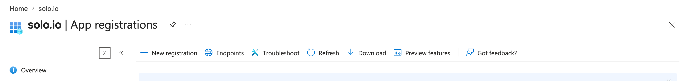
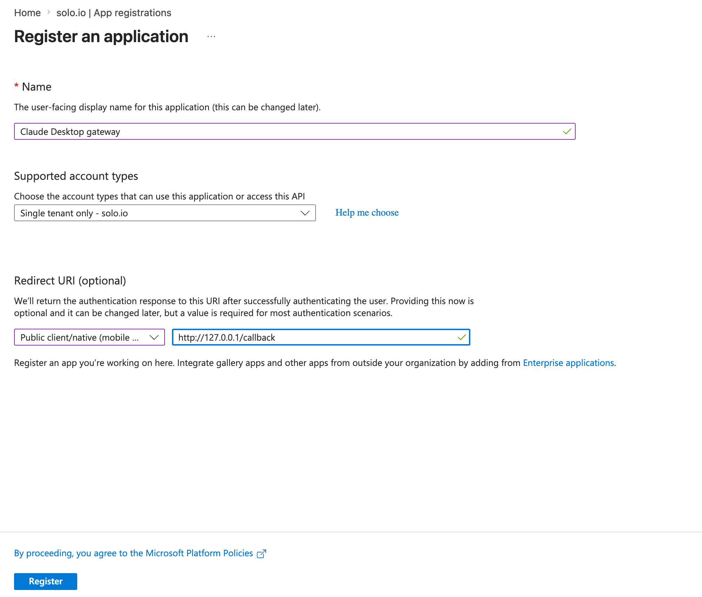
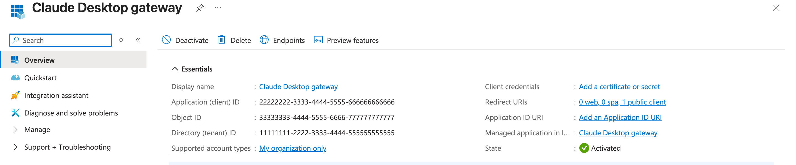
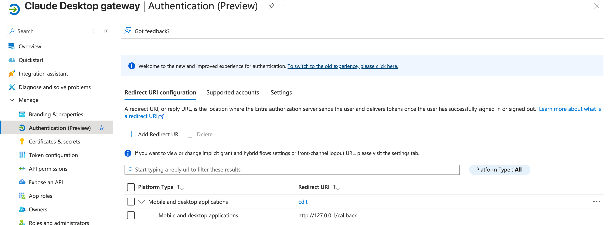
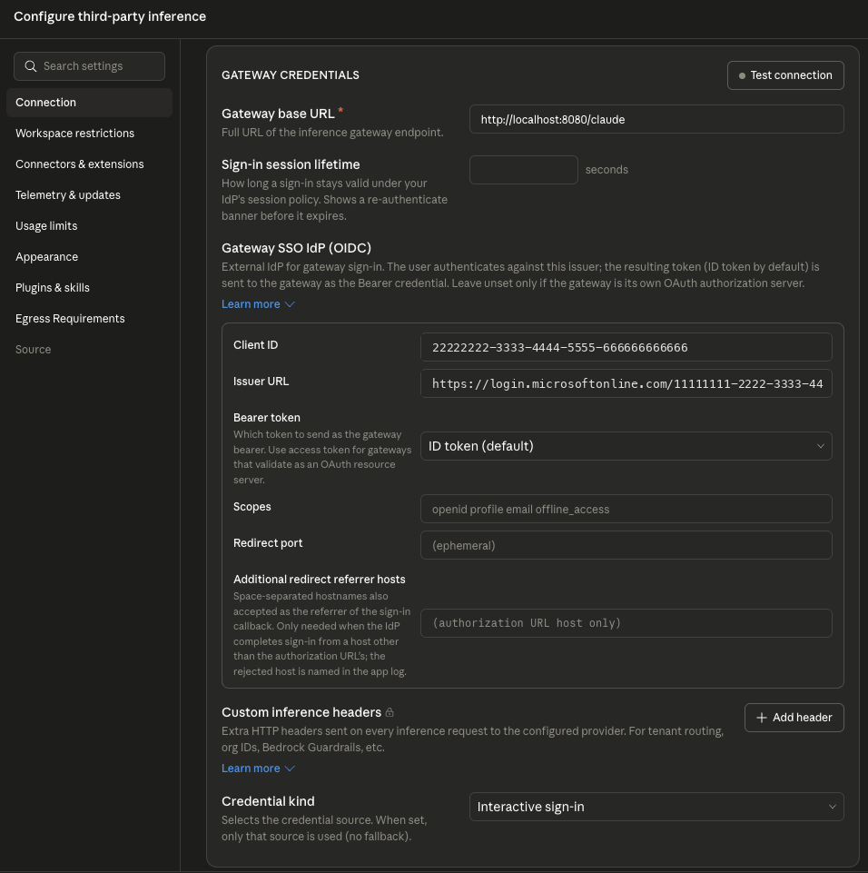
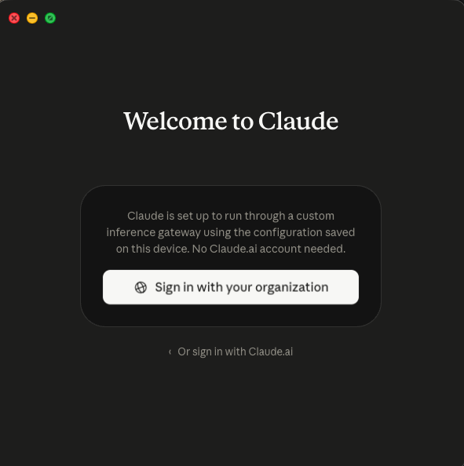
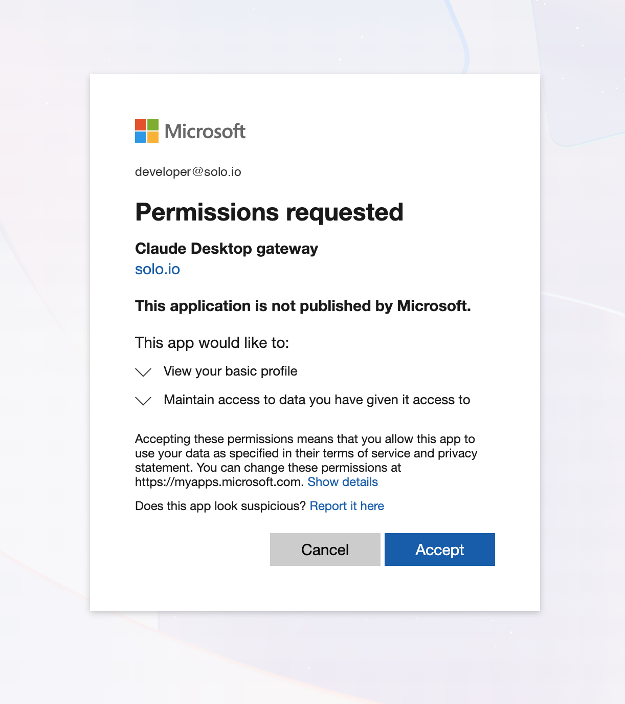
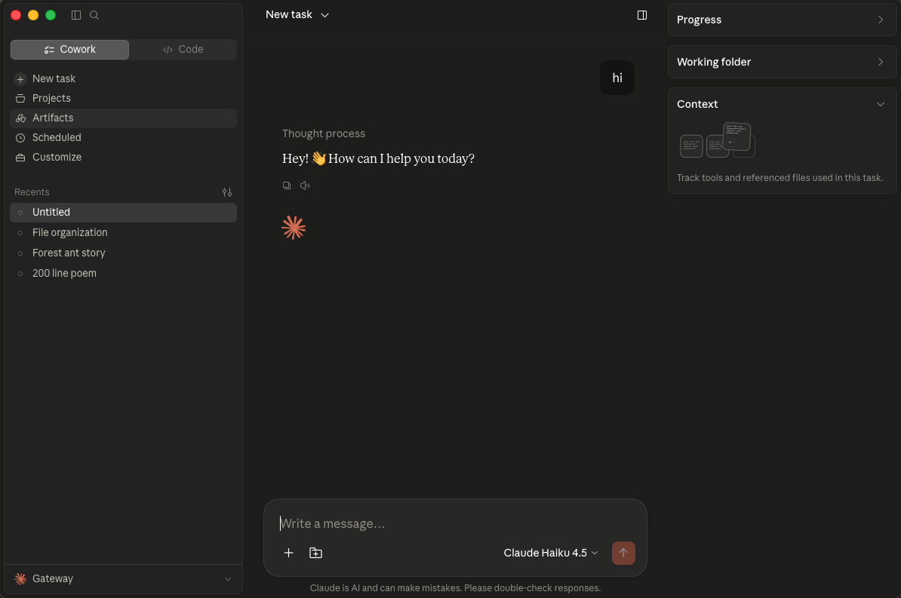

# Automate Claude Desktop Authentication with Microsoft Entra ID SSO

## Pre-requisites
This lab assumes that you have completed the setup in `001`. `002` is optional but recommended if you want to observe metrics and traces.

You will also need:
- A Microsoft Entra ID tenant where you can register applications
- Claude Desktop version `1.6889.0` or later (single sign-on for the Gateway connector requires it)
- An Anthropic credential for the gateway to inject upstream — either a `sk-ant-oat01...` OAuth token from your Claude subscription (`claude setup-token`) or a `sk-ant-api...` API key from console.anthropic.com

## Lab Objectives
- Register a public client application in Microsoft Entra ID for Claude Desktop's browser-based sign-in
- Create a passthrough route to Anthropic that injects a centrally-managed credential server-side
- Protect that route with JWT authentication so only tokens issued by your Entra tenant **for this application** are accepted
- Configure Claude Desktop's **Interactive sign-in** credential kind so each developer authenticates with their own work account
- Export the configuration as an MDM profile to roll the setup out to an entire team

## Overview

The [Claude Desktop lab](claude-desktop.md) routes inference through Enterprise AgentGateway with a static placeholder key: the gateway strips whatever credential the client sends and injects the real Anthropic credential server-side. That works, but it leaves the route open to anyone who can reach the gateway, and it gives you no per-user identity to attribute, rate limit, or revoke.

This lab replaces the static key with single sign-on. Each developer signs in to Microsoft Entra ID in their browser the first time they open Claude Desktop. The app then sends a per-user OIDC ID token as the `Authorization: Bearer` credential on every inference request and silently refreshes it in the background. The gateway validates the token's signature, issuer, and audience against your tenant before injecting the Anthropic credential upstream:

```
 Claude Desktop            browser                 agentgateway                    Anthropic
      |                       |                         |                              |
      |-- open sign-in ------>|                         |                              |
      |                       |-- PKCE auth code flow ->| (Entra ID)                   |
      |<-- id_token (via 127.0.0.1 loopback callback)   |                              |
      |                                                 |                              |
      |-- POST /claude/v1/messages ------------------- >|                              |
      |   Authorization: Bearer <id_token>              |-- validate iss + aud         |
      |                                                 |   against Entra JWKS         |
      |                                                 |-- inject Anthropic cred ---->|
      |<-- completion ----------------------------------|<-- 200 OK -------------------|
```

There is no long-lived secret on developer machines: MFA and conditional access are enforced by Entra at sign-in, and offboarding a developer in Entra revokes their gateway access with it.

> **Note on localhost requirement**: Claude Desktop's third-party inference connector enforces TLS for any non-loopback endpoint — the gateway base URL must be either `https://...` or `http://localhost...` / `http://127.0.0.1...`. To keep this workshop simple, without provisioning a TLS cert for the gateway, we port-forward the `agentgateway-proxy` Service to `localhost:8080` and point Claude Desktop at `http://localhost:8080/claude`, which satisfies the loopback exception. In a real deployment you would terminate TLS on the gateway and use the `https://` URL directly. This only affects the gateway base URL — the Entra sign-in flow is independent of it.

## Register the Entra Application

Claude Desktop signs users in with an OIDC authorization-code-with-PKCE flow in the system browser, returning to the app on a loopback redirect. That flow needs a **public client** registration in your tenant — no client secret, no API permissions.

1. In the [Microsoft Entra admin center](https://entra.microsoft.com), go to **Identity > Applications > App registrations** and select **New registration**



2. Fill in the registration form:

| Field | Value |
|---|---|
| **Name** | `Claude Desktop gateway` |
| **Supported account types** | `Single tenant only` |
| **Redirect URI platform** | `Public client/native (mobile & desktop)` |
| **Redirect URI** | `http://127.0.0.1/callback` |



> **Two details that matter here.** Use `127.0.0.1`, not `localhost` — Entra does not treat them as interchangeable, and Claude Desktop binds its callback to `127.0.0.1`. And the platform must be **Public client/native (mobile & desktop)**: it is the only platform type Entra allows to use *any* local port, which the app needs because it picks a free port at sign-in time. The `/callback` path is required — `http://127.0.0.1` alone fails at sign-in with `AADSTS50011`.

3. Click **Register**. On the app's **Overview** page, copy the **Application (client) ID** and **Directory (tenant) ID**:



Export both for the gateway configuration below:

```bash
export ENTRA_TENANT_ID=<your-directory-tenant-id>      # e.g. "11111111-2222-3333-4444-555555555555"
export ENTRA_CLIENT_ID=<your-application-client-id>    # e.g. "22222222-3333-4444-5555-666666666666"
```

4. Confirm the redirect URI landed on the right platform: open **Manage > Authentication** and verify `http://127.0.0.1/callback` is listed under **Mobile and desktop applications**:



That's the whole registration — a public PKCE client needs no client secret and no additional API permissions.

## Create the Gateway Resources

Use the Claude Code CLI to generate a long-lived OAuth token from your Claude subscription — this is the credential the gateway injects upstream:

```bash
claude setup-token
```

This will open a browser-based authentication flow. Once complete, the CLI will print your token. Export it:

```bash
export CLAUDE_CODE_OAUTH_TOKEN=<token-printed-by-setup-token>
```

> **Using a direct API key instead?** A `sk-ant-api...` key from console.anthropic.com works identically — put it in the same secret in place of the OAuth token.

Create the credential secret:

```bash
kubectl create secret generic claude-sso-upstream-credential -n agentgateway-system \
--from-literal="Authorization=$CLAUDE_CODE_OAUTH_TOKEN" \
--dry-run=client -oyaml | kubectl apply -f -
```

Create the route, the Anthropic backend, the Entra JWKS backend, and the JWT authentication policy:

```bash
kubectl apply -f - <<EOF
apiVersion: gateway.networking.k8s.io/v1
kind: HTTPRoute
metadata:
  name: claude-sso-route
  namespace: agentgateway-system
spec:
  parentRefs:
    - name: agentgateway-proxy
      namespace: agentgateway-system
  rules:
    - matches:
        - path:
            type: PathPrefix
            value: /claude
      filters:
        # required so that /claude/v1/models reaches the upstream as /v1/models
        # (Claude Desktop's "Model discovery" toggle calls this endpoint)
        - type: URLRewrite
          urlRewrite:
            path:
              type: ReplacePrefixMatch
              replacePrefixMatch: /
        - type: RequestHeaderModifier
          requestHeaderModifier:
            remove:
            - x-api-key
      backendRefs:
        - name: claude-sso-backend
          group: enterpriseagentgateway.solo.io
          kind: EnterpriseAgentgatewayBackend
      timeouts:
        request: "540s"
---
apiVersion: enterpriseagentgateway.solo.io/v1alpha1
kind: EnterpriseAgentgatewayBackend
metadata:
  name: claude-sso-backend
  namespace: agentgateway-system
spec:
  ai:
    provider:
      anthropic: {}
  policies:
    auth:
      secretRef:
        name: claude-sso-upstream-credential
    ai:
      routes:
        "/v1/messages": "Messages"
        "/v1/models": "Passthrough"
        "*": "Passthrough"
---
apiVersion: enterpriseagentgateway.solo.io/v1alpha1
kind: EnterpriseAgentgatewayBackend
metadata:
  name: entra-jwks
  namespace: agentgateway-system
spec:
  static:
    host: login.microsoftonline.com
    port: 443
  policies:
    tls: {}
---
apiVersion: enterpriseagentgateway.solo.io/v1alpha1
kind: EnterpriseAgentgatewayPolicy
metadata:
  name: claude-sso-jwt-policy
  namespace: agentgateway-system
spec:
  targetRefs:
    - group: gateway.networking.k8s.io
      kind: HTTPRoute
      name: claude-sso-route
  traffic:
    jwtAuthentication:
      mode: Strict
      providers:
        - issuer: https://login.microsoftonline.com/${ENTRA_TENANT_ID}/v2.0
          audiences:
            - ${ENTRA_CLIENT_ID}
          jwks:
            remote:
              backendRef:
                name: entra-jwks
                namespace: agentgateway-system
                kind: EnterpriseAgentgatewayBackend
                group: enterpriseagentgateway.solo.io
              jwksPath: ${ENTRA_TENANT_ID}/discovery/v2.0/keys
EOF
```

A few things worth calling out:

> **The policy validates `iss` AND `aud`, not just the signature.** Claude Desktop sends the OIDC ID token it received from Entra, whose audience is your application's client ID. Without the `audiences` check, the gateway would accept *any* valid token from your tenant — including tokens issued to unrelated applications. With it, only tokens minted for the `Claude Desktop gateway` app pass.

> **Why the v2.0 issuer?** Claude Desktop discovers Entra's endpoints from `https://login.microsoftonline.com/<tenant>/v2.0/.well-known/openid-configuration` and runs the v2 flow, so the ID tokens it obtains carry `iss: https://login.microsoftonline.com/<tenant>/v2.0`. The policy's `issuer` must match that claim exactly.

> **No leading slash on `jwksPath`.** The controller joins the JWKS backend's URL and `jwksPath` with a `/`; a leading slash produces a double slash and a 404 from Entra.

> **`jwtAuthentication` strips the JWT after validating it.** The ID token never reaches Anthropic — the backend's `auth.secretRef` injects the real Anthropic credential in its place. The route filter also removes any `x-api-key` a client might send.

## Verify the Gateway Requires Authentication

Port-forward the `agentgateway-proxy` Service to your local machine (the same port-forward we'll use for Claude Desktop):

```bash
kubectl port-forward -n agentgateway-system svc/agentgateway-proxy 8080:8080
```

In another terminal, send a request with no token:

```bash
curl -i "http://localhost:8080/claude/v1/messages" \
  -H "Content-Type: application/json" \
  -H "anthropic-version: 2023-06-01" \
  -d '{
    "model": "claude-haiku-4-5-20251001",
    "max_tokens": 1024,
    "messages": [
      {
        "role": "user",
        "content": "Explain what an API Gateway does in one sentence."
      }
    ]
  }'
```

Expected output: `401 Unauthorized` with `authentication failure: no bearer token found`. Unlike the static-key setup, the route no longer serves anonymous callers — a valid token from your Entra tenant is the only way through, and the first client to present one is Claude Desktop itself in the next section.

Leave the port-forward running for the Claude Desktop steps below.

## Configure Claude Desktop

### Enable Developer Mode

The **Configure third-party inference** panel is gated behind Claude Desktop's developer mode. Turn it on first:

1. Launch Claude Desktop
2. From the macOS menu bar, open **Help > Troubleshooting > Enable Developer Mode**

### Configure Interactive Sign-In

1. Open **Settings** and navigate to **Configure third-party inference**
2. Under **Connection**, open the provider dropdown and select **Gateway** (the "Connect to your own gateway" option)
3. Set **Credential kind** to **Interactive sign-in**. This hides the API-key field and reveals the **Gateway SSO IdP (OIDC)** section. Fill it in:

| Field | Value |
|---|---|
| **Gateway base URL** | `http://localhost:8080/claude` |
| **Credential kind** | `Interactive sign-in` |
| **Gateway SSO IdP (OIDC) > Client ID** | your `$ENTRA_CLIENT_ID` |
| **Gateway SSO IdP (OIDC) > Issuer URL** | `https://login.microsoftonline.com/<your-tenant-id>/v2.0` |
| **Gateway SSO IdP (OIDC) > Scopes** | *leave empty for the default* |
| **Gateway SSO IdP (OIDC) > Redirect port** | *leave empty — Entra allows any loopback port* |

Leave the remaining OIDC fields (**Bearer token**, **Additional redirect referrer hosts**) at their defaults — the gateway policy validates the default ID token directly:



> **Issuer URL is the base URL only.** Enter `https://login.microsoftonline.com/<tenant>/v2.0` without the `/.well-known/openid-configuration` suffix — the app appends that path itself to discover the authorization and token endpoints.

4. Click **Apply Changes**. Claude Desktop now runs against your gateway configuration and presents a **Sign in with your organization** button — no Claude.ai account involved:



5. Click **Sign in with your organization**. Your browser opens to your tenant's normal Entra sign-in page — complete it, including MFA if your tenant enforces it. The first sign-in shows a one-time consent prompt for the app's OIDC scopes (basic profile, plus offline access for silent token refresh). Click **Accept**:



You're then returned to the app. Use **Test connection** in the third-party inference panel at any point to confirm both **Model discovery** and **Inference** pass through the gateway.

### Try It Out

Start a new conversation in Claude Desktop — note the **Gateway** indicator in the corner of the app:



Every prompt now flows through the gateway carrying your personal Entra ID token, which the gateway validates and swaps for the centrally-managed Anthropic credential. The app refreshes the token silently in the background; if your session is revoked or expires under your tenant's policy, Claude Desktop shows a **Sign in again** prompt instead of failing silently.

For metrics, traces, and access logs on this traffic, use the observability tooling from the [monitoring tools lab](../../002-set-up-ui-and-monitoring-tools.md) — the same dashboards and trace views shown in the [Claude Desktop lab](claude-desktop.md) apply unchanged.

## Deploy at Scale with MDM

Everything you just configured by hand is a managed setting. Claude Desktop reads its third-party inference configuration from managed preferences, so rolling this out to tens or hundreds of developers is a config-distribution problem, not a credential-distribution one:

1. In the **Configure third-party inference** panel, click **Export**. Claude Desktop produces a `.mobileconfig` (macOS) or `.reg` (Windows) file containing exactly the settings you validated above
2. Push that profile through your MDM (Jamf, Intune, and similar)
3. Each developer opens Claude Desktop, sees the same **Sign in with your organization** screen shown above, and authenticates with their own work account — nothing else to distribute

The exported macOS payload contains these keys:

```xml
<key>inferenceProvider</key>
<string>gateway</string>
<key>inferenceGatewayBaseUrl</key>
<string>https://llm-gateway.example.corp/claude</string>
<key>inferenceCredentialKind</key>
<string>interactive</string>
<key>inferenceGatewayOidc</key>
<string>{"issuer":"https://login.microsoftonline.com/11111111-2222-3333-4444-555555555555/v2.0","clientId":"22222222-3333-4444-5555-666666666666"}</string>
```

> **`inferenceGatewayOidc` is one key whose value is a JSON string** — not separate dotted keys, and not a plist `<dict>`. If the app can't parse it, sign-in fails with `gateway SSO: server does not advertise device_authorization_endpoint`. The in-app **Export** always produces the correct format, so prefer it over hand-writing the profile.

> **Use `https://` in the deployed profile.** The `localhost` base URL in this lab only works because of the loopback exception and the port-forward. For a real rollout, terminate TLS on the gateway and export the profile with the `https://` URL — the connector rejects plain `http://` for any non-loopback host. The Entra redirect URI is unaffected by this change: it stays `http://127.0.0.1/callback` no matter what the gateway's address is, because it's where the browser hands the sign-in result back to the Claude Desktop app on the developer's own machine — the gateway is never part of that hop. Do not register the gateway's DNS name as a redirect URI.

## Cleanup

Stop the `kubectl port-forward` process (Ctrl-C), then remove the gateway resources:

```bash
kubectl delete enterpriseagentgatewaypolicy -n agentgateway-system claude-sso-jwt-policy --ignore-not-found
kubectl delete httproute -n agentgateway-system claude-sso-route --ignore-not-found
kubectl delete enterpriseagentgatewaybackend -n agentgateway-system claude-sso-backend --ignore-not-found
kubectl delete enterpriseagentgatewaybackend -n agentgateway-system entra-jwks --ignore-not-found
kubectl delete secret -n agentgateway-system claude-sso-upstream-credential --ignore-not-found
unset CLAUDE_CODE_OAUTH_TOKEN
```

To fully undo the lab, also delete the `Claude Desktop gateway` app registration in Entra (**App registrations > Claude Desktop gateway > Delete**) and remove the Gateway connector settings from Claude Desktop's third-party inference panel.
