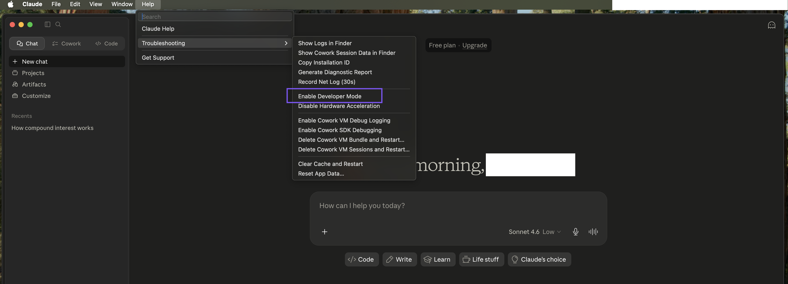
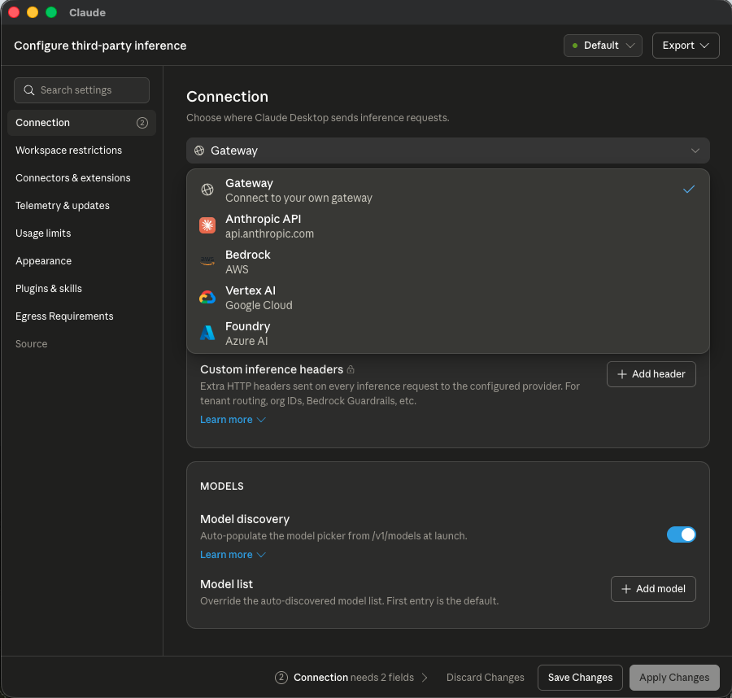
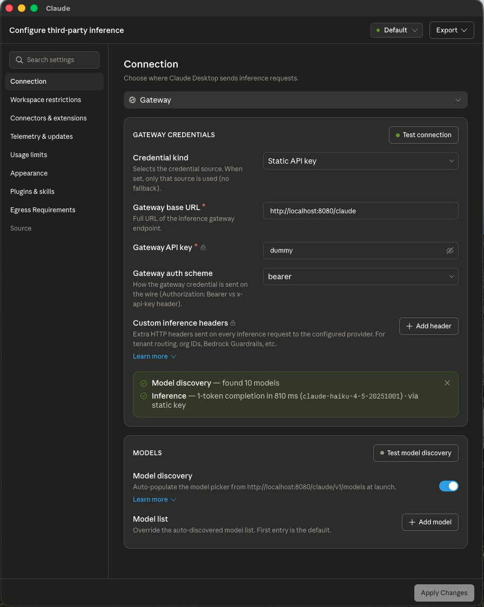
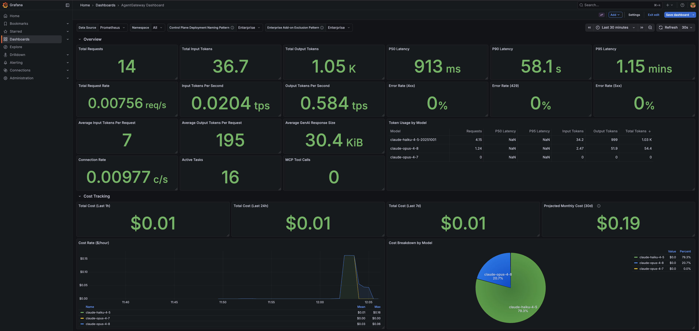
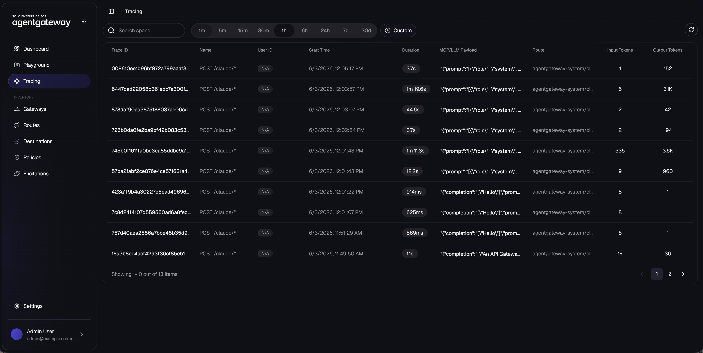
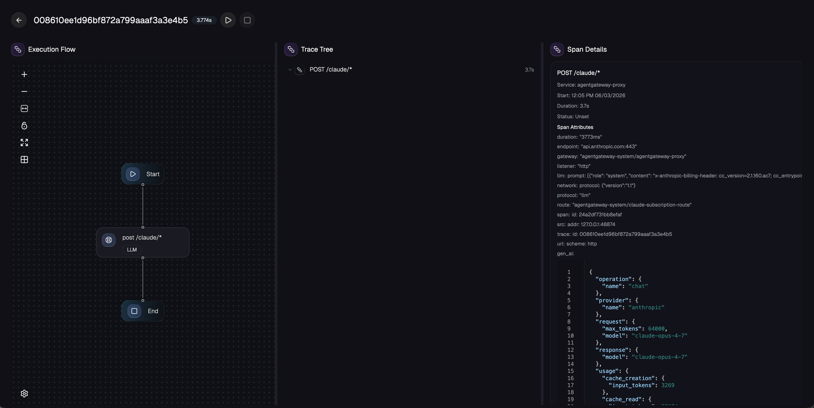

# Configure Enterprise AgentGateway for Claude Desktop

## Pre-requisites
This lab assumes that you have completed the setup in `001`. `002` is optional but recommended if you want to observe metrics and traces.

## Lab Objectives
- Choose between Direct API Key or Claude Max / Team Subscription access
- Create a Kubernetes secret that contains your Anthropic credentials
- Create a passthrough route to Anthropic as our backend LLM provider using a `Backend` and `HTTPRoute`
- Test the route with curl to verify connectivity
- Configure Claude Desktop's third-party inference settings to route through the gateway
- Validate Claude Desktop requests in Grafana UI and access logs

## Overview

This lab configures Claude Desktop to send inference requests through Enterprise AgentGateway using its built-in **Gateway** third-party inference connector. The gateway provides passthrough routing to Anthropic's Claude API while adding observability, rate limiting, retries, and guardrails for all Claude Desktop interactions.

> **Note on localhost requirement**: When using `http://<non-localhost>` (for example `http://$GATEWAY_IP:8080/claude`) as the gateway base URL, Claude Desktop's **Test connection** check fails immediately with:
>
> ```
> Connection — Invalid custom3p enterprise config: baseUrl: must use https (or http on loopback)
> ```
>
> The third-party inference connector enforces TLS for any non-loopback endpoint — the base URL must be either `https://...` or `http://localhost...` / `http://127.0.0.1...`. To keep this workshop simple, without provisioning a TLS cert for the gateway, we port-forward the `agentgateway-proxy` Service to `localhost:8080` and point Claude Desktop at `http://localhost:8080/claude`, which satisfies the loopback exception. In a real deployment you would terminate TLS on the gateway and use the `https://` URL directly.

## Choose Your Access Method

There are two ways to authenticate Claude Desktop through the gateway:

| | Claude Max / Team Subscription | Direct API Key |
|---|---|---|
| **Credential type** | `sk-ant-oat01...` OAuth token from your Claude subscription | `sk-ant-api...` key from console.anthropic.com |
| **Gateway setup** | Reuses the existing `agentgateway-proxy` listener | Reuses the existing `agentgateway-proxy` listener |
| **Path** | `http://localhost:8080/claude` (via port-forward) | `http://localhost:8080/claude` (via port-forward) |
| **Best for** | Individual or team Claude Max subscriptions | Service accounts, CI/CD, API-billed access |

Follow **Option A** or **Option B** below, then continue to the shared Claude Desktop configuration and observability steps.

---

## Option A: Claude Max / Team Subscription

### Configure Required Variables

Use the Claude Code CLI to generate a long-lived OAuth token from your Claude Max subscription:
```bash
claude setup-token
```

This will open a browser-based authentication flow. Once complete, the CLI will print your token. Export it:
```bash
export CLAUDE_CODE_OAUTH_TOKEN=<token-printed-by-setup-token>
```

### Create the Secret and Resources

```bash
kubectl apply -f - <<EOF
apiVersion: v1
kind: Secret
metadata:
  name: claude-subscription-token
  namespace: agentgateway-system
type: Opaque
stringData:
  Authorization: $CLAUDE_CODE_OAUTH_TOKEN
---
apiVersion: gateway.networking.k8s.io/v1
kind: HTTPRoute
metadata:
  name: claude-subscription-route
  namespace: agentgateway-system
spec:
  parentRefs:
    - name: agentgateway-proxy
      namespace: agentgateway-system
  rules:
    - matches:
        - path:
            type: PathPrefix
            value: /claude
      filters:
        # required so that /claude/v1/models reaches the upstream as /v1/models
        # (Claude Desktop's "Model discovery" toggle calls this endpoint)
        - type: URLRewrite
          urlRewrite:
            path:
              type: ReplacePrefixMatch
              replacePrefixMatch: /
        - type: RequestHeaderModifier
          requestHeaderModifier:
            remove:
            - x-api-key
            - authorization
      backendRefs:
        - name: claude-subscription-backend
          group: enterpriseagentgateway.solo.io
          kind: EnterpriseAgentgatewayBackend
---
apiVersion: enterpriseagentgateway.solo.io/v1alpha1
kind: EnterpriseAgentgatewayBackend
metadata:
  name: claude-subscription-backend
  namespace: agentgateway-system
spec:
  ai:
    provider:
      anthropic: {}
  policies:
    auth:
      secretRef:
        name: claude-subscription-token
    ai:
      routes:
        "/v1/messages": "Messages"
        "/v1/models": "Passthrough"
        "*": "Passthrough"
---
apiVersion: enterpriseagentgateway.solo.io/v1alpha1
kind: EnterpriseAgentgatewayPolicy
metadata:
  name: claude-policy
  namespace: agentgateway-system
spec:
  targetRefs:
  - group: gateway.networking.k8s.io
    kind: HTTPRoute
    name: claude-subscription-route
  traffic:
    retry:
      attempts: 3
      backoff: 500ms
      codes: [429, 502, 503, 504, 529]
    timeouts:
      request: 540s
    rateLimit:
      local:
      - tokens: 5000000
        unit: Hours
EOF
```

### Test the Route with curl

Port-forward the `agentgateway-proxy` Service to your local machine (the same port-forward we'll use for Claude Desktop):
```bash
kubectl port-forward -n agentgateway-system svc/agentgateway-proxy 8080:8080
```

In another terminal, send a test request:
```bash
curl -i "http://localhost:8080/claude/v1/messages" \
  -H "Content-Type: application/json" \
  -H "anthropic-version: 2023-06-01" \
  -d '{
    "model": "claude-haiku-4-5-20251001",
    "max_tokens": 1024,
    "messages": [
      {
        "role": "user",
        "content": "Explain what an API Gateway does in one sentence."
      }
    ]
  }'
```

You should receive a `200 OK` with a Claude response body. Leave the port-forward running for the Claude Desktop steps below.

---

## Option B: Direct API Key

### Configure Required Variables

Replace with a valid Anthropic API key:
```bash
export CLAUDE_API_KEY=<your-anthropic-api-key>
```

Create the Anthropic API key secret:
```bash
kubectl create secret generic claude-direct-apikey -n agentgateway-system \
--from-literal="Authorization=$CLAUDE_API_KEY" \
--dry-run=client -oyaml | kubectl apply -f -
```

### Create Anthropic Route and Backend

```bash
kubectl apply -f - <<EOF
apiVersion: gateway.networking.k8s.io/v1
kind: HTTPRoute
metadata:
  name: claude-directapikey-route
  namespace: agentgateway-system
spec:
  parentRefs:
    - name: agentgateway-proxy
      namespace: agentgateway-system
  rules:
    - matches:
        - path:
            type: PathPrefix
            value: /claude
      filters:
        - type: URLRewrite
          urlRewrite:
            path:
              type: ReplacePrefixMatch
              replacePrefixMatch: /
        - type: RequestHeaderModifier
          requestHeaderModifier:
            remove:
            - x-api-key
            - authorization
      backendRefs:
        - name: claude-direct-apikey-backend
          group: enterpriseagentgateway.solo.io
          kind: EnterpriseAgentgatewayBackend
      timeouts:
        request: "540s"
---
apiVersion: enterpriseagentgateway.solo.io/v1alpha1
kind: EnterpriseAgentgatewayBackend
metadata:
  name: claude-direct-apikey-backend
  namespace: agentgateway-system
spec:
  ai:
    provider:
      anthropic: {}
  policies:
    auth:
      secretRef:
        name: claude-direct-apikey
    ai:
      routes:
        "/v1/messages": "Messages"
        "/v1/models": "Passthrough"
        "*": "Passthrough"
EOF
```

### Test the Route with curl

Port-forward the `agentgateway-proxy` Service to your local machine:
```bash
kubectl port-forward -n agentgateway-system svc/agentgateway-proxy 8080:8080
```

In another terminal, send a test request:
```bash
curl -i "http://localhost:8080/claude/v1/messages" \
  -H "Content-Type: application/json" \
  -H "anthropic-version: 2023-06-01" \
  -d '{
    "model": "claude-haiku-4-5-20251001",
    "max_tokens": 1024,
    "messages": [
      {
        "role": "user",
        "content": "Explain what an API Gateway does in one sentence."
      }
    ]
  }'
```

Leave the port-forward running for the Claude Desktop steps below.

---

## Configure Claude Desktop

These steps apply to both Option A and Option B. They assume the port-forward from the previous step is still running, exposing the gateway at `http://localhost:8080`.

### Enable Developer Mode

The **Configure third-party inference** panel is gated behind Claude Desktop's developer mode. Turn it on first:

1. Launch Claude Desktop
2. From the macOS menu bar, open **Help > Troubleshooting > Enable Developer Mode**



Once developer mode is on, the third-party inference settings become available under **Settings**.

### Open Third-Party Inference Settings

1. Open **Settings** and navigate to **Configure third-party inference**
2. Under **Connection**, open the provider dropdown and select **Gateway** (the "Connect to your own gateway" option)



### Fill in the Gateway Credentials

Configure the **Gateway Credentials** section as shown:

| Field | Value |
|---|---|
| **Credential kind** | `Static API key` |
| **Gateway base URL** | `http://localhost:8080/claude` |
| **Gateway API key** | `dummy` *(any non-empty value — the gateway injects the real credential server-side)* |
| **Gateway auth scheme** | `bearer` |

Under **Models**, leave **Model discovery** enabled so Claude Desktop auto-populates the model picker from `GET /claude/v1/models` at launch.

Click **Test connection** to confirm the gateway is reachable. You should see green confirmation messages for both **Model discovery** (e.g., *"found 10 models"*) and **Inference** (e.g., *"1-token completion in 810 ms (claude-haiku-4-5-20251001) — via static key"*).



Click **Apply Changes**. Claude Desktop will now send all inference traffic through Enterprise AgentGateway.

### Try It Out

Start a new conversation in Claude Desktop. Every prompt now flows through the gateway, where it picks up the team OAuth token (Option A) or API key (Option B), retries, rate limits, and observability you configured.

---

## Observability

These steps apply to both Option A and Option B.

### View Metrics in Grafana

Use the AgentGateway Grafana dashboard set up in the [monitoring tools lab](../../002-set-up-ui-and-monitoring-tools.md) to visualize metrics.

1. Port-forward to the Grafana service:
```bash
kubectl port-forward svc/grafana-prometheus -n monitoring 3000:3000
```

2. Open http://localhost:3000 in your browser

3. Login with credentials:
   - Username: `admin`
   - Password: Value of `$GRAFANA_ADMIN_PASSWORD` (default: `prom-operator`)

4. Navigate to **Dashboards > AgentGateway Dashboard** to view metrics



The dashboard provides real-time visualization of:
- Core GenAI metrics (request rates, token usage by model — you should see `claude-haiku-4-5-*` and `claude-opus-4-*` / `claude-sonnet-4-*` rows populate as you chat with Claude Desktop)
- Latency percentiles (P50 / P95 / P99) and request/token rates
- Cost tracking (1h / 24h / 7d totals and projected monthly cost by model)
- Streaming metrics (TTFT, TPOT)
- Connection and runtime metrics

### View Traces in the Solo UI

Distributed traces for Claude Desktop requests are surfaced in the Solo UI deployed in the [monitoring tools lab](../../002-set-up-ui-and-monitoring-tools.md). The UI ingests OTLP spans from AgentGateway via its built-in OpenTelemetry collector and stores them in ClickHouse.

1. Port-forward to the Solo UI service:
```bash
kubectl port-forward -n agentgateway-system svc/solo-enterprise-ui 4000:80
```

2. Open http://localhost:4000 in your browser

3. Click **Tracing** in the left nav



You will see a table of recent spans with the following columns:

| Column | Example |
|---|---|
| **Trace ID** | `18a3b8ec4acf4293f36cf85eb18d0dc6` |
| **Name** | `POST /claude/*` |
| **User ID** | populated when JWT-based authn is configured (otherwise `N/A`) |
| **Start Time** / **Duration** | per-request latency |
| **MCP/LLM Payload** | click to open the **AI Payload** drawer with the full `prompt` and `completion` JSON |
| **Route** | `agentgateway-system/claude-subscription-route` (Option A) or `agentgateway-system/claude-directapikey-route` (Option B) |
| **Input Tokens** / **Output Tokens** | per-request token counts |

Use the **search spans** box at the top to filter, the time-range selector to scope the window, and the route column to confirm Claude Desktop traffic is hitting the route you created in this lab.

4. Click any row to open the trace detail view



The detail view gives you three coordinated panels:

- **Execution Flow** — a visual `Start → POST /claude/* → End` graph of the request through the gateway
- **Trace Tree** — the underlying span hierarchy
- **Span Details** — the full OpenTelemetry attributes for the selected span, including the gen-AI semantic conventions emitted by AgentGateway: `operation: "chat"`, `provider: "anthropic"`, `request.model`, `request.max_tokens`, `response.model`, and `usage.input_tokens` / `usage.output_tokens` / `usage.cache_creation` / `usage.cache_read`

Cross-reference the **Trace ID** with the access logs (next section) to jump from a single log line directly to its full prompt/completion payload and span attributes.

### View Access Logs

AgentGateway automatically logs detailed information about LLM requests to stdout. You can tail the logs to see Claude Desktop traffic flowing through:

```bash
kubectl logs -n agentgateway-system -l app.kubernetes.io/name=agentgateway-proxy --prefix --tail 20
```

Example output shows comprehensive request details including:
- Model information (e.g., `claude-haiku-4-5-20251001`)
- Token usage (input and output tokens)
- Request duration
- Trace IDs for correlation with Solo UI traces
- Full request and response bodies

### View Metrics Endpoint

AgentGateway exposes Prometheus-compatible metrics at the `/metrics` endpoint. You can curl this endpoint directly:

```bash
kubectl port-forward -n agentgateway-system deployment/agentgateway-proxy 15020:15020 & \
sleep 1 && curl -s http://localhost:15020/metrics && kill $!
```

Look for metrics like:
- `agentgateway_gen_ai_client_token_usage` - Token usage by model and type
- `agentgateway_gen_ai_server_request_duration` - Request latency for Claude API calls
- `agentgateway_requests_total` - HTTP request counts

---

## Cleanup

Stop the `kubectl port-forward` process (Ctrl-C) and run the cleanup for whichever option you followed.

### Option A: Claude Max / Team Subscription

```bash
kubectl delete httproute -n agentgateway-system claude-subscription-route
kubectl delete enterpriseagentgatewaybackend -n agentgateway-system claude-subscription-backend
kubectl delete enterpriseagentgatewaypolicy -n agentgateway-system claude-policy
kubectl delete secret -n agentgateway-system claude-subscription-token
unset CLAUDE_CODE_OAUTH_TOKEN
```

### Option B: Direct API Key

```bash
kubectl delete httproute -n agentgateway-system claude-directapikey-route
kubectl delete enterpriseagentgatewaybackend -n agentgateway-system claude-direct-apikey-backend
kubectl delete secret -n agentgateway-system claude-direct-apikey
unset CLAUDE_API_KEY
```
