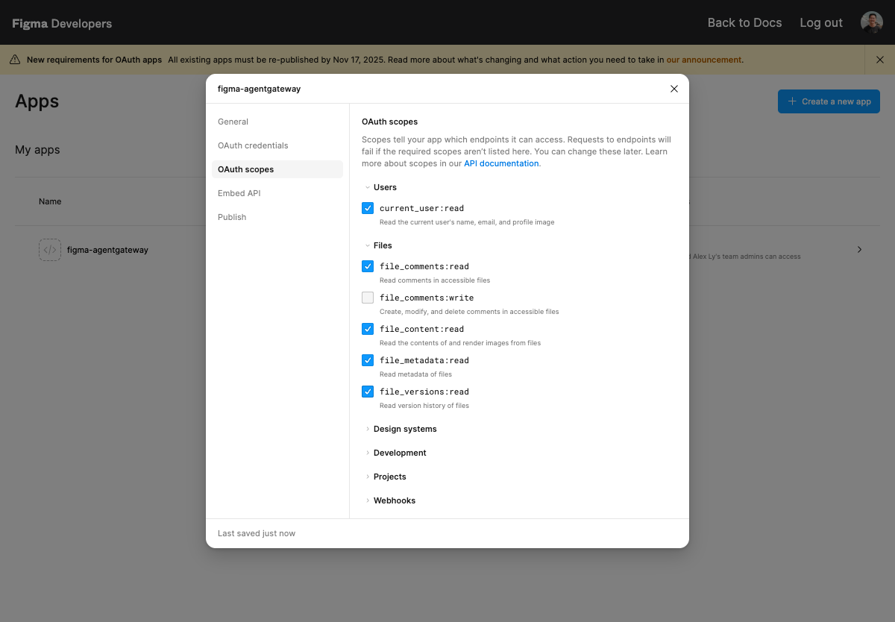
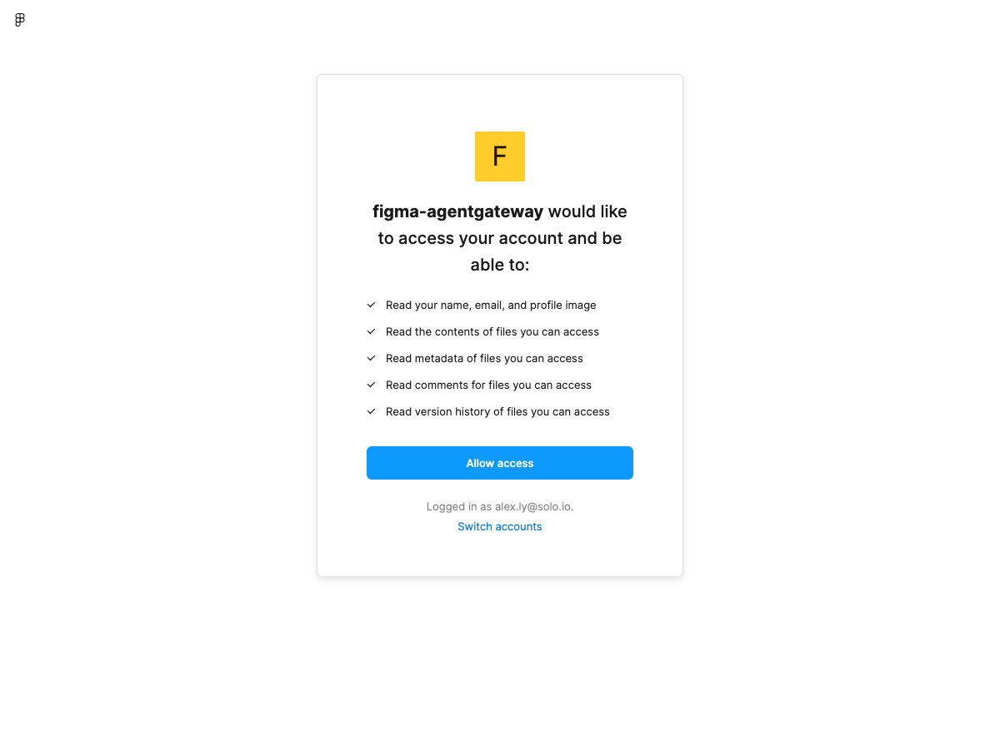
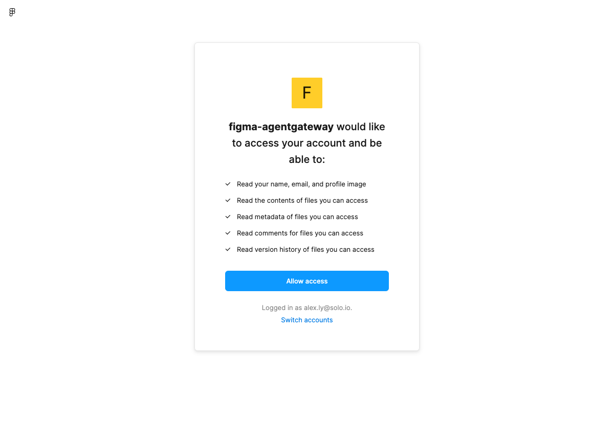
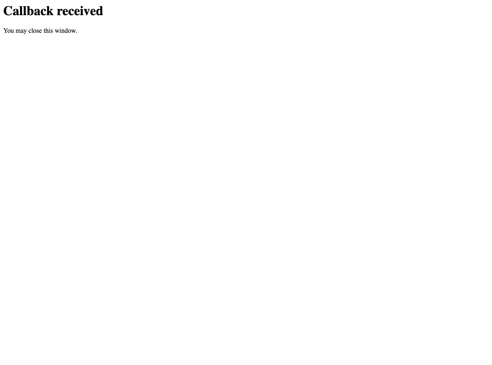

# Connect MCP Client → agentgateway → Figma (Auth0 + Token-Exchange Elicitation)

Turn the Figma REST API into an MCP server behind Enterprise Agentgateway, guard it with
Auth0 (eager OAuth), and broker a per-user Figma OAuth token to call `api.figma.com` on the
user's behalf. Claude Code then reaches Figma through the gateway with two OAuth logins and
no Figma-side allowlisting of the gateway.

> **Why the OpenAPI→MCP workaround?** Figma does not expose a native MCP server you can put
> a gateway in front of, and it won't allowlist agentgateway as an OAuth client for a hosted
> MCP. So this lab wraps Figma's OpenAPI spec as an MCP backend (`protocol: OpenAPI`) and uses
> the gateway's token-exchange elicitation to obtain the user's Figma token at call time.

## Architecture: two independent OAuth layers

```
                 Layer A: inbound MCP auth (Auth0)          Layer B: downstream (Figma OAuth)
                 ─────────────────────────────────          ────────────────────────────────
  ┌───────────┐   1. discover + DCR   ┌──────────────┐   5. tool call needs Figma token
  │  Claude   │ ────────────────────▶ │ agentgateway │ ─── elicit ──▶ browser ──▶ Figma OAuth
  │   Code    │ ◀──────────────────── │ (eager-OAuth │ ◀── token ─────────────────────────────
  └───────────┘  2. login @ Auth0     │  issuer +    │   6. inject Figma token, call api.figma.com
       │         3. Auth0 JWT         │  MCP backend)│
       └────────▶ 4. validated ──────▶└──────────────┘
```

- **Layer A** — Claude Code authenticates to the gateway. The gateway is the OAuth
  Authorization Server the client sees (`/oauth-issuer/...`); it brokers the code flow to
  Auth0 and validates the resulting Auth0 JWT at the MCP backend. This follows
  [`../mcp-eager-auth-auth0.md`](../mcp-eager-auth-auth0.md).
- **Layer B** — when Claude calls a Figma tool, the gateway has no Figma token for you, so it
  elicits a Figma OAuth login (browser), stores the token bound to your identity, and injects
  it into `api.figma.com` calls.

You complete two browser logins the first time: Auth0, then Figma.

Files in this folder:

| File | Purpose |
|---|---|
| `README.md` | This runbook |
| `figma-mcp.yaml` | Figma-specific CRs (backend, route, CORS, elicitation policy+secret, auth0-jwks) — `envsubst`-templated |
| `figma-openapi.json` | Full Figma REST OpenAPI spec (v0.40.0, 42 paths) → loaded into a ConfigMap |

---

## Pre-requisites

- Lab `001` baseline running (agentgateway-proxy Gateway with an HTTP listener on 8080). This
  runbook was validated against controller **v2026.6.1** on a local KinD cluster.
- `kubectl`, `helm`, `openssl`, `jq`, `envsubst` (gettext), Node 18+ (for Claude Code).
- A way to resolve `mcp-auth0.glootest.com` to the gateway LoadBalancer — a local
  `/etc/hosts` entry (this runbook; needs sudo).

### Auth0 (Layer A) — you create these in the Auth0 dashboard

1. **Application** → *Regular Web Application*, grant type **Authorization Code**.
2. **API** (an "audience") under Auth0 → APIs.
3. Add **both** callbacks to the app's *Allowed Callback URLs*:
   ```
   https://mcp-auth0.glootest.com/oauth-issuer/callback/downstream
   https://mcp-auth0.glootest.com/oauth-issuer/callback/upstream
   ```
   The eager-OAuth issuer runs a dual flow; registering only one yields
   `invalid_request: callback url not allowed` after login.

### Figma (Layer B) — you create these in the Figma dashboard

1. Go to **figma.com → your avatar → Settings → Developers**, or directly
   [figma.com/developers/apps](https://www.figma.com/developers/apps) → **Create a new app**.
2. Give it a name (e.g. `agentgateway-mcp`). You'll get a **Client ID** and **Client secret**.
3. Under the app's **OAuth 2.0** / redirect settings, add this **single** callback:
   ```
   https://mcp-auth0.glootest.com/oauth-issuer/callback/upstream
   ```
   > This is the eager-OAuth issuer's *upstream* callback. Because the elicitation Secret uses
   > `mcp_resource` (not `redirect_uri`), the gateway routes the Figma redirect through
   > `<gateway>/oauth-issuer/callback/upstream`. There is no separate UI callback to register.
4. **Enable OAuth scopes** (the app defaults to *none* → otherwise Figma rejects the flow with
   `{"error":true,"status":400,"message":"Invalid scopes for app"}`). In the app's **OAuth scopes**
   tab, enable: `current_user:read`, `file_content:read`, `file_metadata:read`,
   `file_comments:read`, `file_versions:read`.
   > ⚠️ **`files:read` is retired for *new* OAuth apps.** The modern read scopes are the granular
   > `file_content:read` / `file_metadata:read` / `file_versions:read`. The scope string in the
   > elicitation Secret (Step 6) must be a subset of what's enabled here.

   
5. Keep the **Client ID** and **Client secret** for Step 1.

---

## Step 1 — Environment variables + DNS

Run every command in this runbook from **this lab folder** — Step 6 reads `figma-openapi.json`
by relative path, and the certs land in `./example_certs`:

```bash
cd labs/mcp/figma-mcp-auth0   # adjust to wherever you cloned the workshop
```

```bash
# --- Auth0 (Layer A) ---
export AUTH0_ISSUER=https://YOUR_TENANT.us.auth0.com/     # TRAILING SLASH REQUIRED
export AUTH0_DOMAIN=YOUR_TENANT.us.auth0.com              # host only, no scheme/path
export AUTH0_CLIENT_ID=xxxxxxxxxxxxxxxxxxxx
export AUTH0_CLIENT_SECRET=xxxxxxxxxxxxxxxxxxxxxxxxxxxxxxxxxxxxxxxx
export AUTH0_AUDIENCE=https://api.example.com             # your Auth0 API identifier

# --- Figma (Layer B) ---
export FIGMA_CLIENT_ID=xxxxxxxxxxxxxxxxxxxxxx
export FIGMA_CLIENT_SECRET=xxxxxxxxxxxxxxxxxxxxxxxxxxxxxxxx

# --- Gateway ---
export AUTH0_GATEWAY_HOST=mcp-auth0.glootest.com

# --- Controller version (auto-detected from the running release) ---
export ENTERPRISE_AGW_VERSION=$(helm get metadata enterprise-agentgateway -n agentgateway-system | awk '/^VERSION:/ {print $2}')
echo "controller version: $ENTERPRISE_AGW_VERSION"
```

Map the hostname to the gateway LoadBalancer IP:

```bash
export GATEWAY_IP=$(kubectl get svc -n agentgateway-system \
  --selector=gateway.networking.k8s.io/gateway-name=agentgateway-proxy \
  -o jsonpath='{.items[*].status.loadBalancer.ingress[0].ip}{.items[*].status.loadBalancer.ingress[0].hostname}')
echo "$GATEWAY_IP"

# Idempotent: drop any stale line for this host first, then add the current IP.
# (Re-running a plain `tee -a` would append duplicate/stale entries.)
sudo sed -i '' "/[[:space:]]${AUTH0_GATEWAY_HOST}\$/d" /etc/hosts 2>/dev/null || \
  sudo sed -i "/[[:space:]]${AUTH0_GATEWAY_HOST}\$/d" /etc/hosts
echo "$GATEWAY_IP $AUTH0_GATEWAY_HOST" | sudo tee -a /etc/hosts
```

---

## Step 2 — Self-signed TLS cert + HTTPS listener

OAuth requires HTTPS for anything that isn't `localhost`. Create a self-signed cert for
`mcp-auth0.glootest.com` and add a port-443 HTTPS listener alongside the existing HTTP:8080.

```bash
mkdir -p example_certs
openssl req -x509 -sha256 -nodes -days 365 -newkey rsa:2048 \
  -subj '/O=Solo.io/CN=glootest.com' \
  -keyout example_certs/glootest.com.key -out example_certs/glootest.com.crt

openssl req -out example_certs/gateway.csr -newkey rsa:2048 -nodes \
  -keyout example_certs/gateway.key -subj "/CN=mcp-auth0.glootest.com/O=Solo.io"

openssl x509 -req -sha256 -days 365 \
  -CA example_certs/glootest.com.crt -CAkey example_certs/glootest.com.key -set_serial 0 \
  -in example_certs/gateway.csr -out example_certs/gateway.crt \
  -extfile <(printf "subjectAltName=DNS:mcp-auth0.glootest.com")

kubectl create secret tls -n agentgateway-system mcp-auth0-tls \
  --key example_certs/gateway.key --cert example_certs/gateway.crt \
  --dry-run=client -oyaml | kubectl apply -f -
```

Add the HTTPS listener (keeps the 8080 HTTP listener so other labs still work):

```bash
kubectl apply -f - <<EOF
apiVersion: gateway.networking.k8s.io/v1
kind: Gateway
metadata:
  name: agentgateway-proxy
  namespace: agentgateway-system
spec:
  gatewayClassName: enterprise-agentgateway
  # Preserve the per-gateway params ref this cluster uses (holds STS env from Step 4).
  infrastructure:
    parametersRef:
      group: enterpriseagentgateway.solo.io
      kind: EnterpriseAgentgatewayParameters
      name: agentgateway-config
  listeners:
    - name: http
      port: 8080
      protocol: HTTP
      allowedRoutes:
        namespaces: { from: All }
    - name: https
      port: 443
      protocol: HTTPS
      hostname: mcp-auth0.glootest.com
      tls:
        mode: Terminate
        certificateRefs:
          - name: mcp-auth0-tls
            kind: Secret
      allowedRoutes:
        namespaces: { from: All }
EOF

kubectl get gateway -n agentgateway-system agentgateway-proxy \
  -o jsonpath='{range .status.listeners[*]}{.name}{"\t"}{.conditions[?(@.type=="Programmed")].status}{"\n"}{end}'
# expect: http True / https True
```

> **State store:** this runbook uses **SQLite in-memory** (no Postgres). OAuth/elicitation
> state is lost on a controller pod restart — fine for a personal setup. For durable state,
> deploy Postgres per `../mcp-eager-auth-auth0.md` Step 3 and add the `database:` block in Step 4.

---

## Step 3 — STS env on the proxy params

The proxy needs to know where the in-cluster STS lives. Patch the `EnterpriseAgentgatewayParameters`
that your `agentgateway-proxy` Gateway references (check with
`kubectl get gateway agentgateway-proxy -n agentgateway-system -o jsonpath='{.spec.infrastructure.parametersRef.name}'`
— on this workshop it is `agentgateway-config`). A `merge` patch preserves all other settings.

```bash
kubectl patch enterpriseagentgatewayparameters agentgateway-config \
  -n agentgateway-system --type=merge -p='
spec:
  env:
    - name: STS_URI
      value: http://enterprise-agentgateway.agentgateway-system.svc.cluster.local:7777/elicitations/oauth2/token
    - name: STS_AUTH_TOKEN
      value: /var/run/secrets/xds-tokens/xds-token
'
kubectl get enterpriseagentgatewayparameters agentgateway-config \
  -n agentgateway-system -o jsonpath='{.spec.env}' | jq .
```

---

## Step 4 — Helm upgrade: enable eager-OAuth pointed at Auth0

> **`--reuse-values` is required here.** It preserves your existing install values (license key,
> `gatewayClassParametersRefs`, and any shared-extension wiring) and only adds the eager-OAuth
> config below. A full `-f values.yaml` upgrade without `--reuse-values` can silently drop those
> settings.

```bash
helm upgrade enterprise-agentgateway \
  oci://us-docker.pkg.dev/solo-public/enterprise-agentgateway/charts/enterprise-agentgateway \
  --version $ENTERPRISE_AGW_VERSION -n agentgateway-system \
  --reuse-values \
  -f -<<EOF
tokenExchange:
  enabled: true
  issuer: "enterprise-agentgateway.agentgateway-system.svc.cluster.local:7777"
  tokenExpiration: 24h
  subjectValidator:
    validatorType: remote
    remoteConfig:
      url: "https://${AUTH0_DOMAIN}/.well-known/jwks.json"
  apiValidator:
    validatorType: remote
    remoteConfig:
      url: "https://${AUTH0_DOMAIN}/.well-known/jwks.json"
  actorValidator:
    validatorType: k8s
controller:
  extraEnv:
    KGW_OAUTH_ISSUER_CONFIG: |
      {
        "gateway_config": {
          "base_url": "https://${AUTH0_GATEWAY_HOST}/oauth-issuer"
        },
        "client_config": {
          "clients": {
            "${AUTH0_CLIENT_ID}": "${AUTH0_CLIENT_SECRET}"
          }
        },
        "downstream_server": {
          "name": "auth0",
          "client_id": "${AUTH0_CLIENT_ID}",
          "client_secret": "${AUTH0_CLIENT_SECRET}",
          "authorize_url": "${AUTH0_ISSUER}authorize",
          "token_url": "${AUTH0_ISSUER}oauth/token",
          "redirect_uri": "https://${AUTH0_GATEWAY_HOST}/oauth-issuer/callback/downstream",
          "scopes": ["openid", "profile", "email"]
        }
      }
EOF

kubectl rollout status -n agentgateway-system deployment/enterprise-agentgateway --timeout=180s
kubectl rollout status -n agentgateway-system deployment/agentgateway-proxy --timeout=180s
```

> All three validators (`subject`/`api`/`actor`) are required at boot even though only the
> eager-OAuth issuer is used. Missing one → `error creating actor validator: unsupported validator type:`.

---

## Step 5 — Route the eager-OAuth issuer endpoints

```bash
kubectl apply -f - <<'EOF'
apiVersion: gateway.networking.k8s.io/v1
kind: HTTPRoute
metadata:
  name: oauth-issuer
  namespace: agentgateway-system
spec:
  parentRefs:
    - name: agentgateway-proxy
      namespace: agentgateway-system
      sectionName: https
  hostnames:
    - mcp-auth0.glootest.com
  rules:
    - matches:
        - path:
            type: PathPrefix
            value: /oauth-issuer
      backendRefs:
        - name: enterprise-agentgateway
          namespace: agentgateway-system
          port: 7777
EOF

kubectl get httproute -n agentgateway-system oauth-issuer \
  -o jsonpath='{.status.parents[0].conditions[?(@.type=="Accepted")].status}{"\n"}'
# expect: True
```

---

## Step 6 — Deploy the Figma backend

> **`figma-openapi.json` in this folder is already down-converted** — you can skip straight to
> the ConfigMap command. The detail below is only needed if you refresh the spec from upstream.
>
> <details><summary>Why the spec is pre-processed (OpenAPI 3.1 → 3.0)</summary>
>
> Figma publishes an **OpenAPI 3.1** spec. agentgateway's OpenAPI→MCP parser rejects 3.1's
> nullable syntax `"type": ["string","null"]`, NACKing the backend in the data plane with
> `failed to parse OpenAPI schema for MCP target ...: invalid type: sequence, expected a string`
> (the route then 500s with `service not found`). To refresh from upstream:
> ```bash
> curl -sL https://raw.githubusercontent.com/figma/rest-api-spec/main/openapi/openapi.yaml -o /tmp/f.yaml
> yq -o=json '.' /tmp/f.yaml \
>   | jq 'walk(if (type=="object" and (.type? | type=="array"))
>              then .type = (((.type | map(select(. != "null"))) + ["string"]) | .[0]) else . end)' \
>   > figma-openapi.json
> ```
> </details>

Load the full (down-converted) Figma OpenAPI spec into a ConfigMap (`--server-side` avoids the
last-applied annotation, which would double the ~477 KB object past etcd's 1 MiB limit):

```bash
# Must be run from this lab folder (see Step 1) — the --from-file path is relative.
kubectl create configmap figma-openapi-schema -n agentgateway-system \
  --from-file=schema=figma-openapi.json \
  --dry-run=client -o yaml | kubectl apply --server-side -f -
```

Apply the Figma delta (fills `${...}` from your Step 1 exports):

```bash
envsubst < figma-mcp.yaml | kubectl apply -f -
```

Confirm the MCP authentication policy attached cleanly (JWKS resolved):

```bash
kubectl get enterpriseagentgatewaybackend ent-figma-openapi-backend \
  -n agentgateway-system -o jsonpath='{.status}{"\n"}'

curl -sk "https://${AUTH0_GATEWAY_HOST}/.well-known/oauth-authorization-server/figma/openapi/mcp" \
  | jq .registration_endpoint
# expect the GATEWAY host, e.g. https://mcp-auth0.glootest.com/oauth-issuer/register  (NOT Auth0)
```

---

## Step 7 — Connect Claude Code

```bash
claude mcp add figma-mcp-auth0 --transport http https://mcp-auth0.glootest.com/figma/openapi/mcp
claude mcp list   # expect: figma-mcp-auth0: https://mcp-auth0.glootest.com/figma/openapi/mcp (http)
```

Launch Claude Code with Node TLS verification disabled (self-signed gateway cert). Do **not**
put this in your shell rc — it disables TLS for all Node processes in the shell.

```bash
NODE_TLS_REJECT_UNAUTHORIZED=0 claude
```

Then, at the prompt, trigger a Figma tool, e.g.:

```
Use figma-mcp-auth0 to get my current Figma user profile.
```

What happens the first time:

0. **Self-signed cert warning (up front).** The browser's very first hop is the gateway's own
   `…/oauth-issuer/authorize` on `mcp-auth0.glootest.com`, so the "Your connection is not
   private" warning appears **before** Auth0 — click **Advanced → Proceed**. Accepting it once
   covers the return `…/callback/upstream` hop too (same host), so you won't be prompted again.

1. **Auth0 login (Layer A).** Claude Code discovers the gateway AS, registers, and opens a
   browser to **Auth0 Universal Login**. Complete it. (URL bar should show `${AUTH0_DOMAIN}`.)

   

   > The eager-OAuth issuer runs a **dual flow**: after Auth0 it chains directly to the Figma
   > (upstream) consent in the *same* browser session, then returns to the client's local
   > callback. If you already have an active Auth0 session, step 1 completes instantly and you
   > go straight to the Figma consent below.

2. **Figma login (Layer B).** The browser continues to **Figma's OAuth consent** listing the
   five read scopes — click **Allow access**. (Figma re-shows this consent on every fresh login;
   it does not remember a prior grant.)

   

3. Figma redirects through `…/oauth-issuer/callback/upstream` and the browser returns to
   **Claude Code's own success page** ("you can close this window" — image below). Depending on
   timing you may briefly see the gateway's **"Authorization complete."** page first.

   

4. Claude Code retries; the gateway injects your Figma token and the call returns real data — no 401.

Subsequent runs reuse both tokens (until the SQLite state is wiped by a controller restart,
per the Step 2 callout).

> **Note on token binding:** the Figma token is stored bound to the **Auth0 identity** (`sub`) that
> made the call. Each distinct user identity gets its own Figma elicitation the first time — this
> is the intended per-user credential-forwarding behavior.

---

## Verify

A successful `getMe` returns your real Figma profile:

```json
{ "id": "…", "email": "you@example.com", "handle": "Your Name",
  "img_url": "https://s3-alpha.figma.com/profile/…" }
```

Two quick gateway checks (no browser needed) confirm the inbound auth layer is wired correctly:

```bash
# 1) Unauthenticated request is challenged with 401 + WWW-Authenticate (not 406) → JWKS resolved
curl -sk -D- -o /dev/null "https://mcp-auth0.glootest.com/figma/openapi/mcp" \
  -H "accept: application/json, text/event-stream" | grep -iE "^HTTP|www-authenticate"

# 2) The gateway serves its OWN authorization-server metadata (registration at the gateway, not Auth0)
curl -sk "https://mcp-auth0.glootest.com/.well-known/oauth-authorization-server/figma/openapi/mcp" \
  | jq .registration_endpoint
```

---

## Step 8 — Read a Figma design as codegen context

`getMe` only proves the plumbing. The backend exposes 49 Figma tools (`getFile`, `getFileNodes`,
`getImages`, `getFileStyles`, `getComments`, `getFileVersions`, …), all guarded by the same two
OAuth layers, so Claude can read an actual design file.

Open any Figma design file in your browser and copy its key from the URL —
`figma.com/design/`**`<FILE_KEY>`**`/<name>` — then ask Claude Code:

```
Using figma-mcp-auth0, read Figma file <FILE_KEY>:
1. getFileMeta — name + who last touched it
2. getFile with depth=2 — list the pages and the top-level frames on each
3. getImages — render the "Thumbnail" frame to a PNG
Then summarize the design and outline how you'd rebuild the "Product page" frame in React.
```

Claude chains the tools through the gateway (injecting your Figma token on each call) and
returns real data. Against Figma's built-in "Figma basics" starter file this yields:

```
getFileMeta  → name "Figma basics", last_touched_by "your-handle"
getFile d=2  → page "Figma Basics": Thumbnail, About this file, What's in this?,
               Practice designs, Homepage, Shopping cart, Product page  (FRAMEs)
getImages    → https://figma-alpha-api.s3.us-west-2.amazonaws.com/images/…  (rendered PNG)
```

> ⚠️ **Tool arguments are nested, not flat.** Because the backend is `protocol: OpenAPI`,
> agentgateway groups each operation's parameters under `path`/`query` objects. `getFile`
> takes `{"path":{"file_key":"…"},"query":{"depth":2}}` — **not** a top-level `file_key`.
> Claude infers this from each tool's input schema, but if you call the tool by hand with a
> flat `file_key` the path param is left empty and Figma answers `{"status":403,"err":
> "Permission denied"}` (a misleading 403 — it means "malformed request", not "no access").

---

## Alternative client — drive the backend with MCP Inspector

Claude Code is one MCP client; the [MCP Inspector](https://github.com/modelcontextprotocol/inspector)
is a visual one. Its Guided OAuth Flow steps through the same Layer-A handshake this lab builds —
protected-resource discovery → AS-metadata discovery → dynamic client registration → token exchange —
with an expandable panel at each step, which makes it useful for inspecting where OAuth discovery
points (gateway vs. Auth0) and the nested `path`/`query` shape of the OpenAPI tool args.

The Inspector's proxy is a Node process that terminates TLS to the gateway, so it needs the same
self-signed-cert escape hatch as Step 7. Run it from `npx` (no clone, no config file):

```bash
NODE_TLS_REJECT_UNAUTHORIZED=0 npx @modelcontextprotocol/inspector
```

It prints a **proxy session token** and auto-opens the UI with the token pre-filled —
`http://localhost:6274/?MCP_PROXY_AUTH_TOKEN=…` (UI on **6274**, proxy on **6277**). If you open
`localhost:6274` by hand instead, paste that token into **Configuration → Proxy Session Token** or it
returns 403.

**Connect (left sidebar):**

1. **Transport Type** → `Streamable HTTP`.
2. **URL** → `https://mcp-auth0.glootest.com/figma/openapi/mcp`.
3. **Configuration → Request Timeout** → bump to `120000` ms. The connect triggers *two* browser
   logins (Auth0, then Figma); the default 10 s timeout will abort mid-flow.

**Authenticate (Layer A + B, same dual flow as Claude Code):**

4. Under *"Need to configure authentication?"* click **Open Auth Settings**, then **Guided OAuth Flow**
   (recommended for debugging) — or **Quick OAuth Flow** for a one-click redirect.
5. The Inspector discovers the gateway's AS metadata and **dynamically registers itself** at
   `…/oauth-issuer/register` (DCR), then opens the browser. Just like Step 7: accept the self-signed
   cert warning on `mcp-auth0.glootest.com` → log in at **Auth0** → **Allow access** at **Figma** →
   the browser returns to the Inspector's `http://localhost:6274/oauth/callback`.
   > You don't register the Inspector's callback anywhere — DCR registers `localhost:6274/oauth/callback`
   > on the fly. The Auth0/Figma callbacks from the pre-reqs are the *gateway's* upstream/downstream
   > (`…/oauth-issuer/callback/{upstream,downstream}`), not the client's.
6. In the Guided flow, expand each step to check the layer: the **client registration** step should
   show `registration_endpoint` on the gateway (`…/oauth-issuer/register`), not Auth0. This is where
   the "points at Auth0" failure in Troubleshooting surfaces first.

**Use it:**

7. Click **Connect**, then **Tools → List Tools** — you'll see the 49 Figma operations.
8. Pick **getMe → Run Tool** → your real Figma profile JSON (the same payload as the Verify section).
9. Try **getFile**: the Inspector renders the form from the OpenAPI schema, so it already groups the
   inputs — fill `path.file_key` and `query.depth`, not a flat `file_key`. This is the Step 8 nesting
   gotcha made visible; a flat field leaves the path param empty → Figma's misleading
   `403 Permission denied`.

---

## Troubleshooting

| Symptom | Likely cause | Fix |
|---|---|---|
| `GET /figma/openapi/mcp` returns **406** (not 401), well-known returns 404 | MCP auth policy `PartiallyValid` — controller couldn't fetch JWKS. Almost always a **leading slash** on `jwksPath` | `jwksPath: .well-known/jwks.json` (no leading slash). Check `kubectl logs -n agentgateway-system deploy/enterprise-agentgateway | grep -i jwks` |
| `registration_endpoint` in AS metadata points at **Auth0**, not the gateway | `agentgateway.dev/issuer-proxy` missing, or `oauth-issuer` route not Accepted | Confirm `issuer-proxy` in the backend; `kubectl get httproute -n agentgateway-system oauth-issuer` |
| `/oauth-issuer/register` 404/501 | Step 4 didn't enable `tokenExchange`, or Step 5 route missing | Re-check Step 4 values landed and the route is Accepted |
| Auth0 `callback url not allowed` after login | Only one of the two Auth0 callbacks registered | Register **both** `/oauth-issuer/callback/downstream` and `.../callback/upstream` |
| **Figma** error page after consent (`invalid redirect_uri`) | Figma app callback missing/wrong | Register `https://mcp-auth0.glootest.com/oauth-issuer/callback/upstream` in the Figma app |
| Controller `CrashLoopBackOff`: `unsupported validator type:` | Missing a validator in Step 4 | Include all three (`subject`/`api`/`actor`) |
| 401 after Auth0 login with a valid-looking JWT | `aud` doesn't match `${AUTH0_AUDIENCE}`, or issuer trailing-slash mismatch | Decode JWT at jwt.io; set `${AUTH0_AUDIENCE}` as the Auth0 **Default Audience** (Auth0 → Settings → API Authorization) if Auth0 omits `aud` |
| Figma call returns **401/403** *after* the Figma consent completes (token not injected) | Elicitation stored the token but didn't inject it | On `ent-figma-openapi-exchange`, set `spec.backend.tokenExchange.mode: ElicitationOnly` (the validated MCP-elicitation mode) and re-apply |
| Tool returns `{"status":403,"err":"Permission denied"}` even though auth succeeded | Args passed **flat** (`file_key`) so the OpenAPI path param is empty | Nest them: `{"path":{"file_key":"…"},"query":{…}}`. See Step 8. |
| Elicitation never fires (no Figma browser prompt) | Policy-level `elicitation.secretName` not resolving | Confirm the `figma-token-exchange` Secret is in `agentgateway-system`; as a fallback add `tokenExchange.elicitation.secretName: figma-token-exchange` to the Step 4 helm values |
| Claude Code SSL error / `unable to verify the first certificate` | Self-signed cert not trusted by Node | Launch with `NODE_TLS_REJECT_UNAUTHORIZED=0 claude` |
| `mcp-auth0.glootest.com` doesn't resolve | `/etc/hosts` entry missing/stale | Re-run the Step 1 `tee -a /etc/hosts`; flush DNS on macOS |
| **Inspector**: "Error Connecting to MCP Inspector Proxy" / 403 on connect | Proxy session token missing | Use the auto-opened `…?MCP_PROXY_AUTH_TOKEN=…` URL, or paste the console token into **Configuration → Proxy Session Token** |
| **Inspector**: OAuth stalls / TLS error reaching the gateway | Launched without the self-signed escape hatch | Relaunch with `NODE_TLS_REJECT_UNAUTHORIZED=0 npx @modelcontextprotocol/inspector` |
| **Inspector**: OAuth aborts before the browser returns | Default 10 s request timeout too short for two logins | **Configuration → Request Timeout** → `120000` ms |
| **Inspector**: Quick OAuth Flow shows a "paste the code" box | Quick flow uses the debug callback (`/oauth/callback/debug`), a manual copy-paste path | Use **Guided OAuth Flow** for the automatic `/oauth/callback`, or paste the `code` from the browser URL back into the box |
| **Inspector**: proxy logs show repeated `GET /figma/openapi/mcp` → **404 `mcp: session not found`** | Benign — the `OpenAPI` MCP backend is **stateless** (no server-side GET/SSE stream), so the Inspector's optional stream GET 404s while the tool-call POSTs succeed | Ignore it; confirm the JWT still validates in the same log line and that `served elicitation token` fires on tool calls |

Useful commands:

```bash
curl -sk "https://${AUTH0_GATEWAY_HOST}/.well-known/oauth-protected-resource/figma/openapi/mcp" | jq .
kubectl logs -n agentgateway-system deploy/enterprise-agentgateway -f   # controller (issuer + STS)
kubectl logs -n agentgateway-system deploy/agentgateway-proxy -f        # data plane
```

---

## Cleanup

```bash
claude mcp remove figma-mcp-auth0

envsubst < figma-mcp.yaml | kubectl delete -f - --ignore-not-found
kubectl delete configmap figma-openapi-schema -n agentgateway-system --ignore-not-found
kubectl delete httproute oauth-issuer -n agentgateway-system --ignore-not-found
kubectl delete secret mcp-auth0-tls -n agentgateway-system --ignore-not-found

# Roll back the STS env added in Step 3
kubectl patch enterpriseagentgatewayparameters agentgateway-config \
  -n agentgateway-system --type=json -p='[{"op":"remove","path":"/spec/env"}]' || true

# Restore the HTTP-only Gateway (drop the HTTPS listener)
kubectl apply -f - <<EOF
apiVersion: gateway.networking.k8s.io/v1
kind: Gateway
metadata:
  name: agentgateway-proxy
  namespace: agentgateway-system
spec:
  gatewayClassName: enterprise-agentgateway
  infrastructure:
    parametersRef:
      group: enterpriseagentgateway.solo.io
      kind: EnterpriseAgentgatewayParameters
      name: agentgateway-config
  listeners:
    - name: http
      port: 8080
      protocol: HTTP
      allowedRoutes:
        namespaces: { from: All }
EOF

# Disable eager-OAuth (reuse-values keeps gatewayClassParametersRefs + license)
helm upgrade enterprise-agentgateway \
  oci://us-docker.pkg.dev/solo-public/enterprise-agentgateway/charts/enterprise-agentgateway \
  --version $ENTERPRISE_AGW_VERSION -n agentgateway-system \
  --reuse-values --set tokenExchange.enabled=false
kubectl rollout restart -n agentgateway-system deployment/enterprise-agentgateway

rm -rf example_certs
sudo sed -i '' "/${AUTH0_GATEWAY_HOST}/d" /etc/hosts   # macOS; drop the '' on Linux
```
