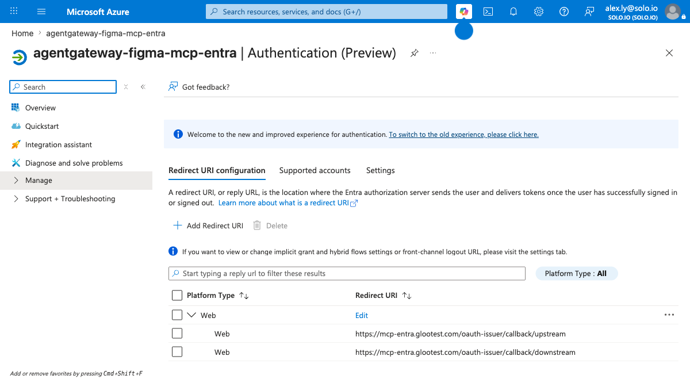
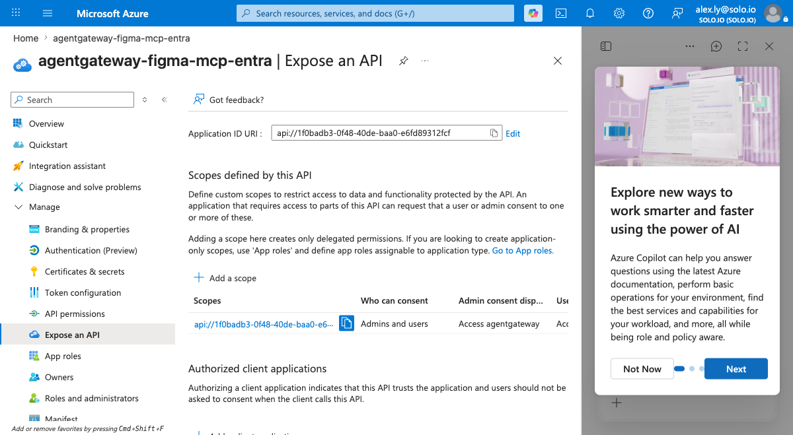
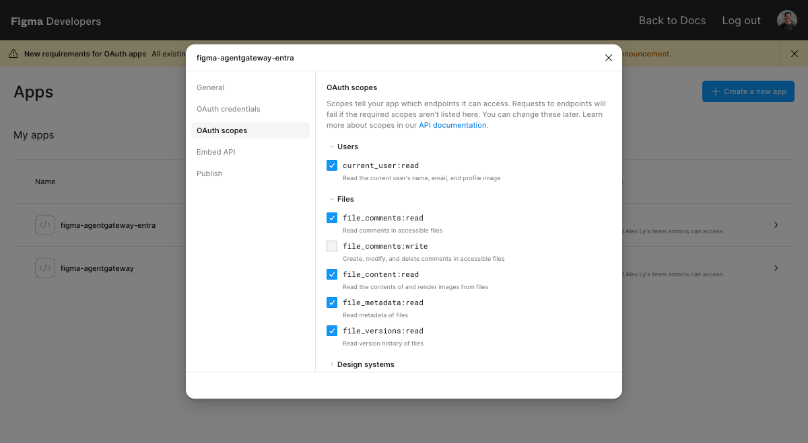
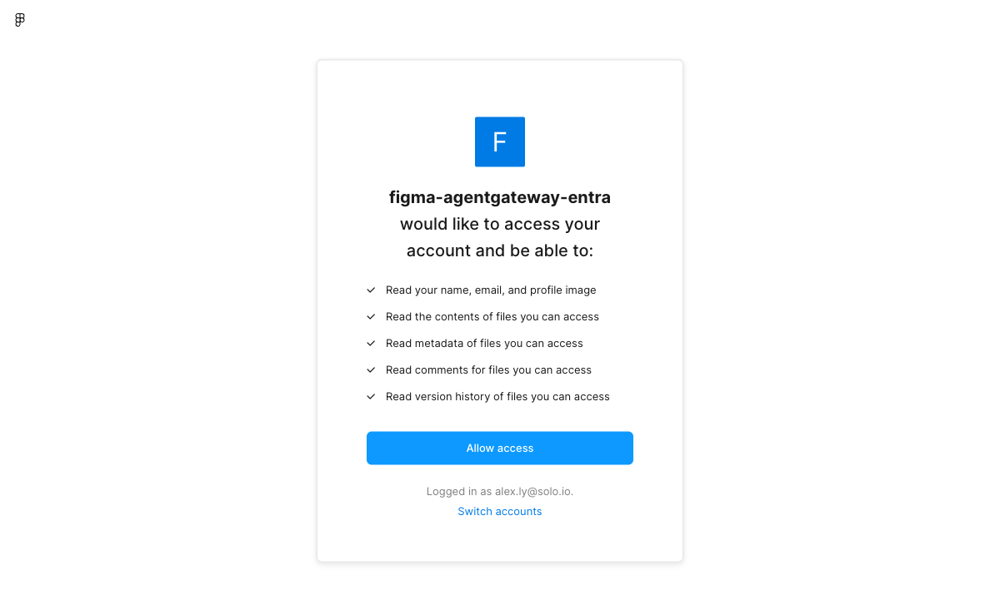
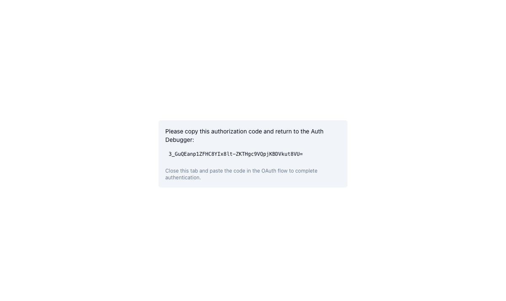
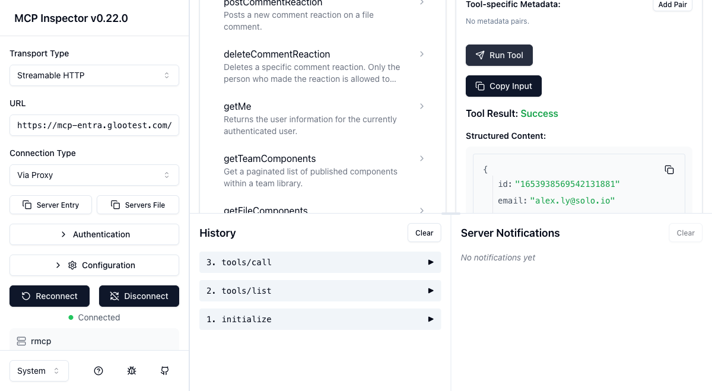

# Connect MCP Client → agentgateway → Figma (Microsoft Entra ID + Token-Exchange Elicitation)

Turn the Figma REST API into an MCP server behind Enterprise Agentgateway, guard it with
**Microsoft Entra ID** (eager OAuth), and broker a per-user Figma OAuth token to call
`api.figma.com` on the user's behalf. Claude Code then reaches Figma through the gateway with
two OAuth logins (Entra, then Figma) and no Figma-side allowlisting of the gateway.

> **This is the Entra variant of [`../figma-mcp-auth0/`](../figma-mcp-auth0/README.md).** Only
> **Layer A** (the inbound MCP auth) changed — Auth0 → Entra. **Layer B (the Figma elicitation)
> is unchanged.** If you've done the Auth0 lab, the only new material here is the Entra app
> registration and the Entra-flavored Helm values in Steps 1 and 4.

## Why Entra for the front door but still elicitation for Figma?

The two OAuth layers use two *different* gateway mechanisms, and they don't overlap:

- **Layer A — inbound MCP auth (Entra).** The gateway is the OAuth Authorization Server the
  client sees (`/oauth-issuer/...`); its eager-OAuth issuer brokers the code flow to Entra and
  validates the resulting Entra JWT at the MCP backend.
- **Layer B — downstream Figma OAuth (elicitation).** When Claude calls a Figma tool, the
  gateway has no Figma token for you, so it **elicits** a Figma OAuth login (browser), stores the
  token bound to your Entra identity, and injects it into `api.figma.com` calls.

> **Why not Entra OBO for Layer B?** OBO ([`../../identity-delegation/msft-entra-obo.md`](../../identity-delegation/msft-entra-obo.md))
> exchanges *the same* Entra token for a downstream token — it only works when the downstream API
> lives in the *same* Entra tenant (e.g. Microsoft Graph). Figma is a **foreign IdP**; Entra
> cannot mint a Figma token, so Layer B must be elicitation. (Entra OBO also *disables*
> elicitation, so the two are mutually exclusive by design. This lab uses elicitation only.)

## Architecture: two independent OAuth layers

```
                 Layer A: inbound MCP auth (Entra)           Layer B: downstream (Figma OAuth)
                 ─────────────────────────────────           ────────────────────────────────
  ┌───────────┐   1. discover + DCR   ┌──────────────┐   5. tool call needs Figma token
  │  Claude   │ ────────────────────▶ │ agentgateway │ ─── elicit ──▶ browser ──▶ Figma OAuth
  │   Code    │ ◀──────────────────── │ (eager-OAuth │ ◀── token ─────────────────────────────
  └───────────┘  2. login @ Entra     │  issuer +    │   6. inject Figma token, call api.figma.com
       │         3. Entra JWT         │  MCP backend)│
       └────────▶ 4. validated ──────▶└──────────────┘
```

You complete two browser logins the first time: Microsoft (Entra), then Figma.

Files in this folder:

| File | Purpose |
|---|---|
| `README.md` | This runbook |
| `figma-mcp.yaml` | Figma-specific CRs (backend, route, CORS, elicitation policy+secret, entra-jwks) — `envsubst`-templated |
| `figma-openapi.json` | Full Figma REST OpenAPI spec (v0.40.0, 42 paths, down-converted 3.1→3.0) → loaded into a ConfigMap |
| `images/` | Screenshots referenced by this runbook (Entra + Figma config, runtime OAuth) |
| `.figma-creds.env.example` | Template for a gitignored `.figma-creds.env` holding your Entra/Figma credentials (see Step 1) |

---

## Pre-requisites

- Lab `001` baseline running (agentgateway-proxy Gateway with an HTTP listener on 8080). This
  runbook mirrors the Auth0 lab, validated against controller **v2026.6.1**+ on a local KinD cluster.
- `kubectl`, `helm`, `openssl`, `jq`, `envsubst` (gettext), Node 18+ (for Claude Code).
- A way to resolve `mcp-entra.glootest.com` to the gateway LoadBalancer — a local
  `/etc/hosts` entry (this runbook; needs sudo).

### Entra ID (Layer A) — you create this in the Azure portal

You can **reuse the middle-tier app registration from the [Entra OBO lab](../../identity-delegation/msft-entra-obo.md)**
— you just add the gateway callbacks and expose a scope (the OBO lab didn't need either, because
it fetched tokens with `az` instead of an interactive browser login).

1. **App registration** (reuse `ENTRA_MIDDLETIER_CLIENT_ID` or create a new one). Note the
   **tenant ID** and **client ID**, and create a **client secret** — the eager-OAuth issuer is a
   confidential client and exchanges the auth code with this secret.
2. **Authentication → Add a platform → Web.** Register **both** eager-OAuth callbacks:
   ```
   https://mcp-entra.glootest.com/oauth-issuer/callback/downstream
   https://mcp-entra.glootest.com/oauth-issuer/callback/upstream
   ```
   The issuer runs a dual flow; registering only one yields `AADSTS50011: redirect URI ...
   does not match` after login. (This is the Entra equivalent of the Auth0 "both callbacks" rule.)

   
3. **Expose an API.** Under **Expose an API**, set the Application ID URI to `api://<client-id>`
   (the default) and **Add a scope** named `agentgateway` (admin+user consent, enabled). The
   inbound token must carry `aud: api://<client-id>`, which happens only when the login requests
   a scope *belonging to this API* — a bare `openid profile email` login returns a Graph/userinfo
   token with the wrong audience and the MCP policy 401s.

   
4. **API permissions.** Ensure the app has (and has consented to) the delegated OIDC scopes
   `openid`, `profile`, `email`. Grant admin consent if your tenant requires it.
5. **Access token version (important).** Under **Manifest**, note `accessTokenAcceptedVersion`:
   - `null` or `1` → tokens have `iss = https://sts.windows.net/<tenant>/` (v1). Use this in
     `figma-mcp.yaml` (the default in this lab).
   - `2` → tokens have `iss = https://login.microsoftonline.com/<tenant>/v2.0`. If you set this,
     change the `issuer:` in `figma-mcp.yaml` to match.

### Figma (Layer B) — you create this in the Figma dashboard

Identical to the Auth0 lab. Go to [figma.com/developers/apps](https://www.figma.com/developers/apps)
→ **Create a new app**:

1. Name it (e.g. `agentgateway-mcp`). You get a **Client ID** and **Client secret**.
2. Under **OAuth 2.0** / redirect settings, add this **single** callback:
   ```
   https://mcp-entra.glootest.com/oauth-issuer/callback/upstream
   ```
   > Because the elicitation Secret uses `mcp_resource` (not `redirect_uri`), the gateway routes
   > the Figma redirect through the eager-OAuth issuer's *upstream* callback. There is no separate
   > UI callback to register.
3. **Enable OAuth scopes** (defaults to *none* → Figma otherwise rejects with
   `{"error":true,"status":400,"message":"Invalid scopes for app"}`). In the **OAuth scopes** tab,
   enable: `current_user:read`, `file_content:read`, `file_metadata:read`, `file_comments:read`,
   `file_versions:read`.
   > ⚠️ `files:read` is retired for *new* OAuth apps — use the granular `file_content:read` /
   > `file_metadata:read` / `file_versions:read`. The scope string in the elicitation Secret
   > (`figma-mcp.yaml`) must be a subset of what's enabled here.

   
4. Keep the **Client ID** and **Client secret** for Step 1.

---

## Step 1 — Environment variables + DNS

> **Tip — reusable credentials file:** copy `.figma-creds.env.example` to `.figma-creds.env` (gitignored), fill in the values from your Entra and Figma app registrations, and `source .figma-creds.env` instead of re-exporting everything each session. Never commit a populated copy.

Run every command in this runbook from **this lab folder** — Step 6 reads `figma-openapi.json`
by relative path, and the certs land in `./example_certs`:

```bash
cd labs/mcp/figma-mcp-entra   # adjust to wherever you cloned the workshop
```

```bash
# --- Entra (Layer A) ---
export ENTRA_TENANT_ID=xxxxxxxx-xxxx-xxxx-xxxx-xxxxxxxxxxxx      # Azure AD tenant (GUID)
export ENTRA_CLIENT_ID=xxxxxxxx-xxxx-xxxx-xxxx-xxxxxxxxxxxx      # app registration (middle-tier) client ID
export ENTRA_CLIENT_SECRET=xxxxxxxxxxxxxxxxxxxxxxxxxxxxxxxxxxxxxxxx  # client secret for the app above
export ENTRA_API_SCOPE="api://${ENTRA_CLIENT_ID}/agentgateway"  # the scope you exposed in Pre-reqs step 3

# --- Figma (Layer B) ---
export FIGMA_CLIENT_ID=xxxxxxxxxxxxxxxxxxxxxx
export FIGMA_CLIENT_SECRET=xxxxxxxxxxxxxxxxxxxxxxxxxxxxxxxx

# --- Gateway ---
export ENTRA_GATEWAY_HOST=mcp-entra.glootest.com

# Derived Entra endpoints (v2 authorize/token; v1-style tenant JWKS discovery)
export ENTRA_AUTHORITY="https://login.microsoftonline.com/${ENTRA_TENANT_ID}"
export ENTRA_JWKS_URL="${ENTRA_AUTHORITY}/discovery/v2.0/keys"

# --- Controller version (auto-detected from the running release) ---
export ENTERPRISE_AGW_VERSION=$(helm get metadata enterprise-agentgateway -n agentgateway-system | awk '/^VERSION:/ {print $2}')
echo "controller version: $ENTERPRISE_AGW_VERSION"
```

Map the hostname to the gateway LoadBalancer IP:

```bash
export GATEWAY_IP=$(kubectl get svc -n agentgateway-system \
  --selector=gateway.networking.k8s.io/gateway-name=agentgateway-proxy \
  -o jsonpath='{.items[*].status.loadBalancer.ingress[0].ip}{.items[*].status.loadBalancer.ingress[0].hostname}')
echo "$GATEWAY_IP"

# Idempotent: drop any stale line for this host first, then add the current IP.
sudo sed -i '' "/[[:space:]]${ENTRA_GATEWAY_HOST}\$/d" /etc/hosts 2>/dev/null || \
  sudo sed -i "/[[:space:]]${ENTRA_GATEWAY_HOST}\$/d" /etc/hosts
echo "$GATEWAY_IP $ENTRA_GATEWAY_HOST" | sudo tee -a /etc/hosts
```

---

## Step 2 — Self-signed TLS cert + HTTPS listener

OAuth requires HTTPS for anything that isn't `localhost`. Create a self-signed cert for
`mcp-entra.glootest.com` and add a port-443 HTTPS listener alongside the existing HTTP:8080.

```bash
mkdir -p example_certs
openssl req -x509 -sha256 -nodes -days 365 -newkey rsa:2048 \
  -subj '/O=Solo.io/CN=glootest.com' \
  -keyout example_certs/glootest.com.key -out example_certs/glootest.com.crt

openssl req -out example_certs/gateway.csr -newkey rsa:2048 -nodes \
  -keyout example_certs/gateway.key -subj "/CN=mcp-entra.glootest.com/O=Solo.io"

openssl x509 -req -sha256 -days 365 \
  -CA example_certs/glootest.com.crt -CAkey example_certs/glootest.com.key -set_serial 0 \
  -in example_certs/gateway.csr -out example_certs/gateway.crt \
  -extfile <(printf "subjectAltName=DNS:mcp-entra.glootest.com")

kubectl create secret tls -n agentgateway-system mcp-entra-tls \
  --key example_certs/gateway.key --cert example_certs/gateway.crt \
  --dry-run=client -oyaml | kubectl apply -f -
```

Add the HTTPS listener (keeps the 8080 HTTP listener so other labs still work):

```bash
kubectl apply -f - <<EOF
apiVersion: gateway.networking.k8s.io/v1
kind: Gateway
metadata:
  name: agentgateway-proxy
  namespace: agentgateway-system
spec:
  gatewayClassName: enterprise-agentgateway
  # Preserve the per-gateway params ref this cluster uses (holds STS env from Step 3).
  infrastructure:
    parametersRef:
      group: enterpriseagentgateway.solo.io
      kind: EnterpriseAgentgatewayParameters
      name: agentgateway-config
  listeners:
    - name: http
      port: 8080
      protocol: HTTP
      allowedRoutes:
        namespaces: { from: All }
    - name: https
      port: 443
      protocol: HTTPS
      hostname: mcp-entra.glootest.com
      tls:
        mode: Terminate
        certificateRefs:
          - name: mcp-entra-tls
            kind: Secret
      allowedRoutes:
        namespaces: { from: All }
EOF

kubectl get gateway -n agentgateway-system agentgateway-proxy \
  -o jsonpath='{range .status.listeners[*]}{.name}{"\t"}{.conditions[?(@.type=="Programmed")].status}{"\n"}{end}'
# expect: http True / https True
```

> **State store:** this runbook uses **SQLite in-memory** (no Postgres). OAuth/elicitation
> state is lost on a controller pod restart — fine for a personal setup. For durable state,
> deploy Postgres per `../mcp-eager-auth-auth0.md` Step 3 and add the `database:` block in Step 4.

---

## Step 3 — STS env on the proxy params

The proxy needs to know where the in-cluster STS lives. This lab uses the **elicitation** STS
path (`/elicitations/oauth2/token`), *not* the RFC 8693 / Entra-OBO path (`/oauth2/token`) — Layer
B is elicitation. Patch the `EnterpriseAgentgatewayParameters` your `agentgateway-proxy` Gateway
references (`agentgateway-config` on this workshop). A `merge` patch preserves other settings.

```bash
kubectl patch enterpriseagentgatewayparameters agentgateway-config \
  -n agentgateway-system --type=merge -p='
spec:
  env:
    - name: STS_URI
      value: http://enterprise-agentgateway.agentgateway-system.svc.cluster.local:7777/elicitations/oauth2/token
    - name: STS_AUTH_TOKEN
      value: /var/run/secrets/xds-tokens/xds-token
'
kubectl get enterpriseagentgatewayparameters agentgateway-config \
  -n agentgateway-system -o jsonpath='{.spec.env}' | jq .
```

---

## Step 4 — Helm upgrade: enable eager-OAuth pointed at Entra

> **`--reuse-values` is required here.** It preserves your existing install values (license key,
> `gatewayClassParametersRefs`, and any shared-extension wiring) and only adds the eager-OAuth
> config below. A full `-f values.yaml` upgrade without `--reuse-values` can silently drop those
> settings.

The only difference from the Auth0 lab is the IdP: the `subject/api` JWKS validators and the
issuer's `downstream_server` now point at Entra.

```bash
helm upgrade enterprise-agentgateway \
  oci://us-docker.pkg.dev/solo-public/enterprise-agentgateway/charts/enterprise-agentgateway \
  --version $ENTERPRISE_AGW_VERSION -n agentgateway-system \
  --reuse-values \
  -f -<<EOF
tokenExchange:
  enabled: true
  issuer: "enterprise-agentgateway.agentgateway-system.svc.cluster.local:7777"
  tokenExpiration: 24h
  subjectValidator:
    validatorType: remote
    remoteConfig:
      url: "${ENTRA_JWKS_URL}"
  apiValidator:
    validatorType: remote
    remoteConfig:
      url: "${ENTRA_JWKS_URL}"
  actorValidator:
    validatorType: k8s
controller:
  extraEnv:
    KGW_OAUTH_ISSUER_CONFIG: |
      {
        "gateway_config": {
          "base_url": "https://${ENTRA_GATEWAY_HOST}/oauth-issuer"
        },
        "client_config": {
          "clients": {
            "${ENTRA_CLIENT_ID}": "${ENTRA_CLIENT_SECRET}"
          }
        },
        "downstream_server": {
          "name": "entra",
          "client_id": "${ENTRA_CLIENT_ID}",
          "client_secret": "${ENTRA_CLIENT_SECRET}",
          "authorize_url": "${ENTRA_AUTHORITY}/oauth2/v2.0/authorize",
          "token_url": "${ENTRA_AUTHORITY}/oauth2/v2.0/token",
          "redirect_uri": "https://${ENTRA_GATEWAY_HOST}/oauth-issuer/callback/downstream",
          "scopes": ["openid", "profile", "email", "${ENTRA_API_SCOPE}"]
        }
      }
EOF

kubectl rollout status -n agentgateway-system deployment/enterprise-agentgateway --timeout=180s
kubectl rollout status -n agentgateway-system deployment/agentgateway-proxy --timeout=180s
```

> **Why the API scope is in `scopes`.** Including `${ENTRA_API_SCOPE}` (e.g.
> `api://<client-id>/agentgateway`) is what makes Entra mint an access token with
> `aud: api://<client-id>` — the audience the MCP auth policy validates. The reserved OIDC scopes
> (`openid`/`profile`/`email`) can be combined with a single resource's scope in one request.
>
> **Entra authorize URL has no query string**, so the eager-OAuth issuer's URL builder appends
> `?client_id=...` cleanly. (The double-`?` bug in [issue #7382](https://github.com/solo-io/agentgateway-enterprise/issues/7382)
> only bites providers whose `authorize_url` already carries query params.)
>
> All three validators (`subject`/`api`/`actor`) are required at boot even though only the
> eager-OAuth issuer is used. Missing one → `error creating actor validator: unsupported validator type:`.

---

## Step 5 — Route the eager-OAuth issuer endpoints

```bash
kubectl apply -f - <<'EOF'
apiVersion: gateway.networking.k8s.io/v1
kind: HTTPRoute
metadata:
  name: oauth-issuer
  namespace: agentgateway-system
spec:
  parentRefs:
    - name: agentgateway-proxy
      namespace: agentgateway-system
      sectionName: https
  hostnames:
    - mcp-entra.glootest.com
  rules:
    - matches:
        - path:
            type: PathPrefix
            value: /oauth-issuer
      backendRefs:
        - name: enterprise-agentgateway
          namespace: agentgateway-system
          port: 7777
EOF

kubectl get httproute -n agentgateway-system oauth-issuer \
  -o jsonpath='{.status.parents[0].conditions[?(@.type=="Accepted")].status}{"\n"}'
# expect: True
```

---

## Step 6 — Deploy the Figma backend

> **`figma-openapi.json` in this folder is already down-converted** (OpenAPI 3.1 → 3.0) — skip
> straight to the ConfigMap command. agentgateway's OpenAPI→MCP parser rejects 3.1's nullable
> `"type": ["string","null"]` syntax; the file here is pre-processed. To refresh from upstream see
> the collapsible note in [`../figma-mcp-auth0/README.md`](../figma-mcp-auth0/README.md) Step 6.

Load the full (down-converted) Figma OpenAPI spec into a ConfigMap (`--server-side` avoids the
last-applied annotation, which would double the ~477 KB object past etcd's 1 MiB limit):

```bash
# Must be run from this lab folder (see Step 1) — the --from-file path is relative.
kubectl create configmap figma-openapi-schema -n agentgateway-system \
  --from-file=schema=figma-openapi.json \
  --dry-run=client -o yaml | kubectl apply --server-side -f -
```

Apply the Figma delta (fills `${...}` from your Step 1 exports):

```bash
envsubst < figma-mcp.yaml | kubectl apply -f -
```

Confirm the MCP authentication policy attached cleanly (JWKS resolved against Entra):

```bash
kubectl get enterpriseagentgatewaybackend ent-figma-openapi-backend \
  -n agentgateway-system -o jsonpath='{.status}{"\n"}'

curl -sk "https://${ENTRA_GATEWAY_HOST}/.well-known/oauth-authorization-server/figma/openapi/mcp" \
  | jq .registration_endpoint
# expect the GATEWAY host, e.g. https://mcp-entra.glootest.com/oauth-issuer/register  (NOT Entra)
```

---

## Step 7 — Connect Claude Code

```bash
claude mcp add figma-mcp-entra --transport http https://mcp-entra.glootest.com/figma/openapi/mcp
claude mcp list   # expect: figma-mcp-entra: https://mcp-entra.glootest.com/figma/openapi/mcp (http)
```

Launch Claude Code with Node TLS verification disabled (self-signed gateway cert). Do **not**
put this in your shell rc — it disables TLS for all Node processes in the shell.

```bash
NODE_TLS_REJECT_UNAUTHORIZED=0 claude
```

Then, at the prompt, trigger a Figma tool, e.g.:

```
Use figma-mcp-entra to get my current Figma user profile.
```

What happens the first time:

0. **Self-signed cert warning (up front).** The browser's first hop is the gateway's own
   `…/oauth-issuer/authorize` on `mcp-entra.glootest.com`, so the "Your connection is not private"
   warning appears **before** the Microsoft login — click **Advanced → Proceed**. Accepting it once
   covers the return `…/callback/upstream` hop too (same host).

1. **Microsoft login (Layer A).** Claude Code discovers the gateway AS, registers, and opens a
   browser to **Microsoft Entra sign-in**. Complete it (and grant consent if prompted). URL bar
   shows `login.microsoftonline.com`.

   > The eager-OAuth issuer runs a **dual flow**: after Entra it chains directly to the Figma
   > (upstream) consent in the *same* browser session, then returns to the client's local callback.
   > If you already have an active Entra session, step 1 completes instantly and you go straight to
   > the Figma consent.

2. **Figma login (Layer B).** The browser continues to **Figma's OAuth consent** listing the read
   scopes — click **Allow access**. (Figma re-shows this consent on every fresh login.)

   

3. Figma redirects through `…/oauth-issuer/callback/upstream` and the browser returns to
   **Claude Code's own success page** ("you can close this window"). You may briefly see the
   gateway's **"Authorization complete."** page first.

4. Claude Code retries; the gateway injects your Figma token and the call returns real data — no 401. Subsequent runs reuse both tokens.

> **Token binding:** the Figma token is stored bound to the **Entra identity** (`sub`) that made
> the call. Each distinct user identity gets its own Figma elicitation the first time — the intended
> per-user credential-forwarding behavior.

---

## Verify

A successful `getMe` returns your real Figma profile:

```json
{ "id": "…", "email": "you@example.com", "handle": "Your Name",
  "img_url": "https://s3-alpha.figma.com/profile/…" }
```

> **Validated live** (controller v2026.6.1): the inbound Microsoft login SSO'd through an existing
> Entra session, chained to the Figma consent, and `getMe` returned the real profile — both OAuth
> layers end-to-end. If you have no active Entra session, you'll see the `login.microsoftonline.com`
> sign-in before the Figma consent.

Two quick gateway checks (no browser needed) confirm the inbound auth layer is wired correctly:

```bash
# 1) Unauthenticated request is challenged with 401 + WWW-Authenticate (not 406) → JWKS resolved
curl -sk -D- -o /dev/null "https://mcp-entra.glootest.com/figma/openapi/mcp" \
  -H "accept: application/json, text/event-stream" | grep -iE "^HTTP|www-authenticate"

# 2) The gateway serves its OWN authorization-server metadata (registration at the gateway, not Entra)
curl -sk "https://mcp-entra.glootest.com/.well-known/oauth-authorization-server/figma/openapi/mcp" \
  | jq .registration_endpoint
```

Optionally, decode the inbound token your login produced to confirm `aud`/`iss` match the policy.
Grab it from the controller logs after a successful call:

```bash
kubectl logs -n agentgateway-system deploy/enterprise-agentgateway --tail=100 | grep -i '"jwt"'
# expect aud: api://<client-id> and iss matching the issuer in figma-mcp.yaml
```

---

## Step 8 — Read a Figma design as codegen context

`getMe` only proves the plumbing. The backend exposes 49 Figma tools (`getFile`, `getFileNodes`,
`getImages`, `getFileStyles`, `getComments`, `getFileVersions`, …), all guarded by the same two
OAuth layers, so Claude can read an actual design file.

Open any Figma design file in your browser and copy its key from the URL —
`figma.com/design/`**`<FILE_KEY>`**`/<name>` — then ask Claude Code:

```
Using figma-mcp-entra, read Figma file <FILE_KEY>:
1. getFileMeta — name + who last touched it
2. getFile with depth=2 — list the pages and the top-level frames on each
3. getImages — render the "Thumbnail" frame to a PNG
Then summarize the design and outline how you'd rebuild the "Product page" frame in React.
```

> ⚠️ **Tool arguments are nested, not flat.** Because the backend is `protocol: OpenAPI`,
> agentgateway groups each operation's parameters under `path`/`query` objects. `getFile`
> takes `{"path":{"file_key":"…"},"query":{"depth":2}}` — **not** a top-level `file_key`.
> Claude infers this from each tool's input schema, but a flat `file_key` leaves the path param
> empty and Figma answers `{"status":403,"err":"Permission denied"}` (a misleading 403 — it means
> "malformed request", not "no access").

---

## Alternative client — drive the backend with MCP Inspector

The [MCP Inspector](https://github.com/modelcontextprotocol/inspector) steps through the same
Layer-A handshake with an expandable panel at each step (protected-resource discovery → AS-metadata
discovery → DCR → token exchange), which makes it useful for inspecting where OAuth discovery points
(gateway vs. Entra) and the nested `path`/`query` shape of the OpenAPI tool args.

The Inspector's proxy is a Node process that terminates TLS to the gateway, so it needs the same
self-signed-cert escape hatch as Step 7:

```bash
NODE_TLS_REJECT_UNAUTHORIZED=0 npx @modelcontextprotocol/inspector
```

Use the auto-opened `http://localhost:6274/?MCP_PROXY_AUTH_TOKEN=…` URL (UI on **6274**, proxy on
**6277**). Connect with:

1. **Transport Type** → `Streamable HTTP`.
2. **URL** → `https://mcp-entra.glootest.com/figma/openapi/mcp`.
3. **Configuration → Request Timeout** → `120000` ms (the connect triggers two browser logins;
   the default 10 s aborts mid-flow).

Then **Open Auth Settings → Guided OAuth Flow**. The Inspector discovers the gateway's AS metadata,
dynamically registers itself at `…/oauth-issuer/register`, and opens the browser: accept the
self-signed cert → **Microsoft** login → **Allow access** at **Figma**. The Guided flow uses a
**debug callback** (`http://localhost:6274/oauth/callback/debug`) that displays the returned
authorization code for you to paste back into the **Authorization Code** box, then **Continue**:



After the token exchange the Inspector shows **Connected**. **Tools → List Tools** shows the 49 Figma
operations; run **getMe** for your profile. For **getFile**, fill `path.file_key` and `query.depth`,
not a flat `file_key`.



> **Validated live** here on controller v2026.6.1 via this exact Guided flow: Microsoft login SSO'd
> through an existing Entra session, chained to the Figma consent, and `getMe` returned the real
> profile — confirming both OAuth layers end-to-end.

---

## Troubleshooting

| Symptom | Likely cause | Fix |
|---|---|---|
| `GET /figma/openapi/mcp` returns **406** (not 401), well-known returns 404 | MCP auth policy `PartiallyValid` — controller couldn't fetch JWKS. Almost always a **leading slash** on `jwksPath` | `jwksPath: ${ENTRA_TENANT_ID}/discovery/v2.0/keys` (no leading slash). Check `kubectl logs -n agentgateway-system deploy/enterprise-agentgateway \| grep -i jwks` |
| `registration_endpoint` in AS metadata points at **Entra**, not the gateway | `agentgateway.dev/issuer-proxy` missing, or `oauth-issuer` route not Accepted | Confirm `issuer-proxy` in the backend; `kubectl get httproute -n agentgateway-system oauth-issuer` |
| `/oauth-issuer/register` 404/501 | Step 4 didn't enable `tokenExchange`, or Step 5 route missing | Re-check Step 4 values landed and the route is Accepted |
| **Entra** `AADSTS50011: redirect URI ... does not match` after login | Only one (or neither) of the two gateway callbacks registered on the Entra app | Register **both** `/oauth-issuer/callback/downstream` and `.../callback/upstream` as **Web** redirect URIs |
| **Entra** `AADSTS65001` (consent not granted) | User/admin hasn't consented to the app's scopes | Complete interactive consent, or have an admin grant consent for the app in the Azure portal |
| 401 after Microsoft login with a valid-looking JWT — `JWT audience mismatch` | Token `aud` isn't `api://<client-id>` — the login didn't request the API scope | Confirm `${ENTRA_API_SCOPE}` is in the Step 4 `downstream_server.scopes` **and** exposed on the app (Pre-reqs step 3) |
| 401 after login — `JWT issuer not recognized` | Token `iss` (v1 `sts.windows.net` vs v2 `login.microsoftonline.com/.../v2.0`) doesn't match `issuer:` in `figma-mcp.yaml` | Decode the token at jwt.io; set `issuer:` to match, governed by the app's `accessTokenAcceptedVersion` (Pre-reqs step 5) |
| Controller `CrashLoopBackOff`: `unsupported validator type:` | Missing a validator in Step 4 | Include all three (`subject`/`api`/`actor`) |
| **Figma** error page after consent (`invalid redirect_uri`) | Figma app callback missing/wrong | Register `https://mcp-entra.glootest.com/oauth-issuer/callback/upstream` in the Figma app |
| Figma call **401/403** *after* the Figma consent completes (token not injected) | Elicitation stored the token but didn't inject it | On `ent-figma-openapi-exchange`, set `spec.backend.tokenExchange.mode: ElicitationOnly` and re-apply |
| Tool returns `{"status":403,"err":"Permission denied"}` even though auth succeeded | Args passed **flat** (`file_key`) so the OpenAPI path param is empty | Nest them: `{"path":{"file_key":"…"},"query":{…}}`. See Step 8. |
| Elicitation never fires (no Figma browser prompt) | Policy-level `elicitation.secretName` not resolving | Confirm the `figma-token-exchange` Secret is in `agentgateway-system`; STS_URI in Step 3 uses the **`/elicitations/oauth2/token`** path (not `/oauth2/token`) |
| Claude Code SSL error / `unable to verify the first certificate` | Self-signed cert not trusted by Node | Launch with `NODE_TLS_REJECT_UNAUTHORIZED=0 claude` |
| `mcp-entra.glootest.com` doesn't resolve | `/etc/hosts` entry missing/stale | Re-run the Step 1 `tee -a /etc/hosts`; flush DNS on macOS |

Useful commands:

```bash
curl -sk "https://${ENTRA_GATEWAY_HOST}/.well-known/oauth-protected-resource/figma/openapi/mcp" | jq .
kubectl logs -n agentgateway-system deploy/enterprise-agentgateway -f   # controller (issuer + STS)
kubectl logs -n agentgateway-system deploy/agentgateway-proxy -f        # data plane
```

---

## Cleanup

```bash
claude mcp remove figma-mcp-entra

envsubst < figma-mcp.yaml | kubectl delete -f - --ignore-not-found
kubectl delete configmap figma-openapi-schema -n agentgateway-system --ignore-not-found
kubectl delete httproute oauth-issuer -n agentgateway-system --ignore-not-found
kubectl delete secret mcp-entra-tls -n agentgateway-system --ignore-not-found

# Roll back the STS env added in Step 3
kubectl patch enterpriseagentgatewayparameters agentgateway-config \
  -n agentgateway-system --type=json -p='[{"op":"remove","path":"/spec/env"}]' || true

# Restore the HTTP-only Gateway (drop the HTTPS listener)
kubectl apply -f - <<EOF
apiVersion: gateway.networking.k8s.io/v1
kind: Gateway
metadata:
  name: agentgateway-proxy
  namespace: agentgateway-system
spec:
  gatewayClassName: enterprise-agentgateway
  infrastructure:
    parametersRef:
      group: enterpriseagentgateway.solo.io
      kind: EnterpriseAgentgatewayParameters
      name: agentgateway-config
  listeners:
    - name: http
      port: 8080
      protocol: HTTP
      allowedRoutes:
        namespaces: { from: All }
EOF

# Disable eager-OAuth (reuse-values keeps gatewayClassParametersRefs + license)
helm upgrade enterprise-agentgateway \
  oci://us-docker.pkg.dev/solo-public/enterprise-agentgateway/charts/enterprise-agentgateway \
  --version $ENTERPRISE_AGW_VERSION -n agentgateway-system \
  --reuse-values --set tokenExchange.enabled=false
kubectl rollout restart -n agentgateway-system deployment/enterprise-agentgateway

rm -rf example_certs
sudo sed -i '' "/${ENTRA_GATEWAY_HOST}/d" /etc/hosts   # macOS; drop the '' on Linux
```
