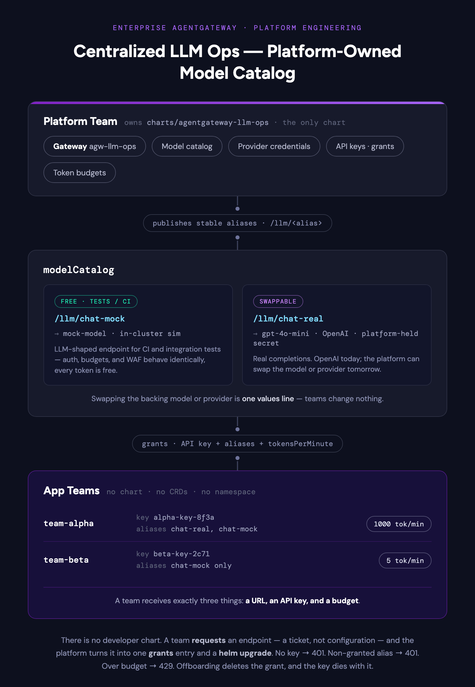

# Centralized LLM Ops: One Chart, One Persona

Give every application team a chart of their own and they will eventually self-serve a rate limit, a route, or a model they were never meant to have. The [platform and developer chart lab](platform-and-developer-helm-charts-mcp.md) solves that with schemas: two charts, two personas, and a developer chart whose values file has no field for a traffic policy — that lab demonstrates the model with MCP endpoints.

This lab goes one step further. There is no developer chart at all. The platform team runs LLM consumption as an internal product: it owns the model catalog, the provider credentials, and every API key. An application team never deploys a model, never sees a provider secret, and never runs `helm install`. A team's entire interaction with the platform is a request — "we need an endpoint for X" — and the platform's response is a grant. Exactly **one** Helm chart exists, `agentgateway-llm-ops`, and exactly one persona — the platform team — ever runs Helm against it.

The chart operates a small catalog of named aliases, and this lab uses two of them to carry two different use cases:

- **`chat-mock`** — an LLM-shaped endpoint for tests and CI, where nobody reads the answer. Auth, rate limiting, WAF, and routing behave exactly as they do for a real model, but every token is free.
- **`chat-real`** — real completions, where the platform manages the provider relationship. Today that provider is OpenAI; tomorrow the platform can point the same alias at a different provider or model without any team noticing.

> This lab requires Enterprise Agentgateway **v2026.6.3** or later (the version installed in [001](../../001-install-enterprise-agentgateway.md)).

## Pre-requisites

This lab assumes you have completed the setup in [001](../../001-install-enterprise-agentgateway.md). [002](../../002-set-up-ui-and-monitoring-tools.md) is optional but recommended if you want to observe metrics and traces.

- **Helm 3** installed.
- Run every command **from the workshop root** (the directory that contains `charts/`). Chart paths below are repo-root-relative.
- The chart referenced here lives at `charts/agentgateway-llm-ops`.
- A valid **OpenAI API key**, exported as `OPENAI_API_KEY`. Step 1 uses it to create the platform's provider credential, and Step 2's `chat-real` call is a real, billed OpenAI call.

> **Note:** The chart installs its **own** `Gateway` named `agw-llm-ops`, alongside the `agentgateway-proxy` gateway from `001`. The two coexist; this lab never modifies `001`.

## Lab Objectives

- Launch a platform-owned LLM service with a curated model catalog
- Grant two teams endpoints, turning each team's request into one `grants` entry and a `helm upgrade`
- Enforce per-team token budgets on shared URLs
- Show that teams cannot reach aliases they were never granted
- Swap the model behind an alias with zero team involvement
- Isolate a team's grant into its own release, without touching the platform's shared install
- Offboard a team, both by values edit and by release uninstall

---

## Overview



Every alias is a stable URL, `/llm/<alias>`, backed by a provider and a model the platform chose. A grant is what connects a team to an alias: it mints the team's API key, adds that key to the key set of every alias the team was granted, and sets the team's token budget. A team that has no grant for an alias has no key in that alias's key set, so every request it sends there fails auth — the alias is closed by default.

| Contract element | Set by | Held by |
|---|---|---|
| URL (`/llm/<alias>`) | Platform (catalog entry) | Shared across every granted team |
| API key | Platform (grant) | The team, as an opaque credential |
| Token budget | Platform (grant) | Enforced at the gateway, not by the team |
| Provider + model | Platform (catalog entry) | Never exposed to the team |
| Provider credentials | Platform (pre-created Secret) | Never leaves `agentgateway-system` |
| Key lifecycle (issue, rotate, revoke) | Platform (grant add/remove) | The team holds no lever over this |

**Why there is no developer chart.** A team's only artifact in this model is the request itself — which alias, for what use case, at what volume — filed as a pull request or a service-desk ticket. Helm never sees it; a human on the platform team does, and translates it into a values change on the one chart that exists. There is nothing for a team to install, and therefore nothing for a team to misconfigure.

---

## Step 1: The platform launches the LLM service

### Deploy the platform-run mock model

The platform runs its own mock model for the `chat-mock` alias, so CI traffic never touches a real provider. Deploy it into `agentgateway-system`:

```bash
kubectl apply -f - <<EOF
apiVersion: apps/v1
kind: Deployment
metadata:
  name: mock-model
  namespace: agentgateway-system
spec:
  replicas: 1
  selector:
    matchLabels:
      app: mock-model
  template:
    metadata:
      labels:
        app: mock-model
    spec:
      containers:
        - name: vllm-sim
          image: ghcr.io/llm-d/llm-d-inference-sim:latest
          imagePullPolicy: IfNotPresent
          args:
            - --model
            - mock-model
            - --port
            - "8000"
          ports:
            - containerPort: 8000
              name: http
              protocol: TCP
---
apiVersion: v1
kind: Service
metadata:
  name: mock-model-svc
  namespace: agentgateway-system
  labels:
    app: mock-model
spec:
  selector:
    app: mock-model
  ports:
    - name: http
      protocol: TCP
      port: 8000
      targetPort: 8000
  type: ClusterIP
EOF

kubectl rollout status -n agentgateway-system deploy/mock-model --timeout=180s
```

Expected output:

```
deployment.apps/mock-model created
service/mock-model-svc created
deployment "mock-model" successfully rolled out
```

### Create the platform-held provider credential

The `chat-real` alias needs a real OpenAI credential. The platform creates and holds this Secret; no team ever sees it:

```bash
kubectl create secret generic openai-secret -n agentgateway-system \
  --from-literal="Authorization=Bearer $OPENAI_API_KEY" \
  --dry-run=client -oyaml | kubectl apply -f -
```

Expected output:

```
secret/openai-secret created
```

### Define the model catalog

Create `llm-ops-values.yaml` with the two-alias catalog and an empty grant list — the service exists, but no team has access to it yet:

```bash
cat > llm-ops-values.yaml <<'EOF'
gateway:
  name: agw-llm-ops
modelCatalog:
  - alias: chat-mock
    provider: openai
    model: mock-model
    host: mock-model-svc.agentgateway-system.svc.cluster.local
    port: 8000
    apiPath: /v1/chat/completions
  - alias: chat-real
    provider: openai
    model: gpt-4o-mini
    auth:
      secretRef: openai-secret
grants: []  # no teams granted yet
EOF
```

Install the chart into `agentgateway-system`:

```bash
helm install agw-llm-ops charts/agentgateway-llm-ops \
  -n agentgateway-system \
  --values llm-ops-values.yaml
```

Expected output:

```
NAME: agw-llm-ops
NAMESPACE: agentgateway-system
STATUS: deployed
REVISION: 1
...
```

Verify the catalog rendered: a `Gateway`, one route and one auth policy per alias, and the access-log policy:

```bash
kubectl get gateway,httproute,enterpriseagentgatewaybackend,enterpriseagentgatewaypolicy \
  -n agentgateway-system -l app.kubernetes.io/part-of=agentgateway-llm-ops
```

Expected output:

```
NAME                                             CLASS                     ADDRESS          PROGRAMMED   AGE
gateway.gateway.networking.k8s.io/agw-llm-ops    enterprise-agentgateway   172.18.255.251   True         5s

NAME                                                  HOSTNAMES   AGE
httproute.gateway.networking.k8s.io/llm-chat-mock                 5s
httproute.gateway.networking.k8s.io/llm-chat-real                 5s

NAME                                                                            ACCEPTED   AGE
enterpriseagentgatewaybackend.enterpriseagentgateway.solo.io/llm-chat-mock      True       5s
enterpriseagentgatewaybackend.enterpriseagentgateway.solo.io/llm-chat-real      True       5s

NAME                                                                                 ACCEPTED   ATTACHED   AGE
enterpriseagentgatewaypolicy.enterpriseagentgateway.solo.io/agw-llm-ops-access-log   True       True       5s
enterpriseagentgatewaypolicy.enterpriseagentgateway.solo.io/llm-chat-mock-auth       True       True       5s
enterpriseagentgatewaypolicy.enterpriseagentgateway.solo.io/llm-chat-real-auth       True       True       5s
```

Wait for the proxy fleet to roll out:

```bash
kubectl rollout status -n agentgateway-system deploy/agw-llm-ops --timeout=180s
```

Expected output:

```
deployment "agw-llm-ops" successfully rolled out
```

Capture the gateway address for the rest of the lab:

```bash
export GATEWAY_IP=$(kubectl get svc -n agentgateway-system --selector=gateway.networking.k8s.io/gateway-name=agw-llm-ops -o jsonpath='{.items[*].status.loadBalancer.ingress[0].ip}{.items[*].status.loadBalancer.ingress[0].hostname}')
echo "GATEWAY_IP=${GATEWAY_IP}"
```

Expected output:

```
GATEWAY_IP=172.18.255.251
```

### Prove the service is closed by default

The catalog is live, but every alias's key set is still empty. Neither a missing key nor a made-up one gets past auth:

```bash
curl -s -o /dev/null -w "chat-mock no-key:  %{http_code}\n" "http://${GATEWAY_IP}:8080/llm/chat-mock" \
  -H "content-type: application/json" \
  -d '{"model":"mock-model","messages":[{"role":"user","content":"ping"}]}'
curl -s -o /dev/null -w "chat-real bad-key: %{http_code}\n" "http://${GATEWAY_IP}:8080/llm/chat-real" \
  -H "content-type: application/json" \
  -H "Authorization: Bearer not-a-real-key" \
  -d '{"model":"gpt-4o-mini","messages":[{"role":"user","content":"ping"}]}'
```

Expected output:

```
chat-mock no-key:  401
chat-real bad-key: 401
```

Access to a catalog alias only ever comes from a grant.

---

## Step 2: Team alpha requests an endpoint

Team alpha needs real completions for a customer-support summarization feature. It files a request with the platform team — a pull request to the platform's repo, a service-desk ticket, whatever the organization uses: **team `team-alpha` wants access to `chat-real` for customer-support summarization, at around 800 tokens per minute.** The request is a conversation between teams, not configuration; nothing about it touches the cluster.

### The platform reviews and grants

The platform reads the request, rounds the requested budget up to a clean number, and adds a grant. It regenerates `llm-ops-values.yaml` with the new `grants` entry:

```bash
cat > llm-ops-values.yaml <<'EOF'
gateway:
  name: agw-llm-ops
modelCatalog:
  - alias: chat-mock
    provider: openai
    model: mock-model
    host: mock-model-svc.agentgateway-system.svc.cluster.local
    port: 8000
    apiPath: /v1/chat/completions
  - alias: chat-real
    provider: openai
    model: gpt-4o-mini
    auth:
      secretRef: openai-secret
grants:
  - team: team-alpha
    key: alpha-key-8f3a
    aliases:
      - chat-real
      - chat-mock
    tokensPerMinute: 1000
EOF

helm upgrade agw-llm-ops charts/agentgateway-llm-ops \
  -n agentgateway-system \
  --values llm-ops-values.yaml
```

Expected output:

```
Release "agw-llm-ops" has been upgraded. Happy Helming!
NAME: agw-llm-ops
NAMESPACE: agentgateway-system
STATUS: deployed
REVISION: 2
...
```

Verify the minted key Secret carries both alias labels:

```bash
kubectl get secret llm-key-team-alpha -n agentgateway-system -o jsonpath='{.metadata.labels}{"\n"}'
```

Expected output:

```
{"app.kubernetes.io/instance":"agw-llm-ops","app.kubernetes.io/managed-by":"Helm","app.kubernetes.io/part-of":"agentgateway-llm-ops","llm-ops.agentgateway.solo.io/alias-chat-mock":"granted","llm-ops.agentgateway.solo.io/alias-chat-real":"granted"}
```

### Alpha calls chat-real

The new key takes a few seconds to propagate to the proxy fleet. Send a real request — this is a real, billed call to the OpenAI API. If you see a `401`, the proxy hasn't picked up the key yet; wait a few seconds and re-run:

```bash
sleep 10
curl -s "http://${GATEWAY_IP}:8080/llm/chat-real" \
  -H "content-type: application/json" \
  -H "Authorization: Bearer alpha-key-8f3a" \
  -d '{"model":"gpt-4o-mini","messages":[{"role":"user","content":"One-line haiku about gateways"}]}' | jq -r '.model'
```

Expected output:

```
gpt-4o-mini
```

(OpenAI may return a dated variant such as `gpt-4o-mini-2024-07-18`; either confirms a real completion came back.)

### Alpha's CI calls chat-mock

The same key works on both granted aliases:

```bash
curl -s -o /dev/null -w "alpha chat-mock: %{http_code}\n" "http://${GATEWAY_IP}:8080/llm/chat-mock" \
  -H "content-type: application/json" \
  -H "Authorization: Bearer alpha-key-8f3a" \
  -d '{"model":"mock-model","messages":[{"role":"user","content":"ping"}]}'
```

Expected output:

```
alpha chat-mock: 200
```

One key, two aliases. Team alpha received exactly three things: a URL, a key, and a budget.

---

## Step 3: Team beta requests a test endpoint

Team beta only needs to exercise the gateway integration in CI — responses are discarded, so a real model would be wasted spend. Its request: **access to `chat-mock` for gateway integration tests, at a trickle of a budget.** The platform grants it, appending a second entry to `llm-ops-values.yaml`:

```bash
cat > llm-ops-values.yaml <<'EOF'
gateway:
  name: agw-llm-ops
modelCatalog:
  - alias: chat-mock
    provider: openai
    model: mock-model
    host: mock-model-svc.agentgateway-system.svc.cluster.local
    port: 8000
    apiPath: /v1/chat/completions
  - alias: chat-real
    provider: openai
    model: gpt-4o-mini
    auth:
      secretRef: openai-secret
grants:
  - team: team-alpha
    key: alpha-key-8f3a
    aliases:
      - chat-real
      - chat-mock
    tokensPerMinute: 1000
  - team: team-beta
    key: beta-key-2c71
    aliases:
      - chat-mock
    tokensPerMinute: 5
EOF

helm upgrade agw-llm-ops charts/agentgateway-llm-ops \
  -n agentgateway-system \
  --values llm-ops-values.yaml
```

Expected output:

```
Release "agw-llm-ops" has been upgraded. Happy Helming!
NAME: agw-llm-ops
NAMESPACE: agentgateway-system
STATUS: deployed
REVISION: 3
...
```

> **Note on the tiny budget:** `5` tokens/minute is demo-scale, set small enough to trip a `429` in two requests. What matters is not the number — it's that the platform sets it, and the team never chooses it.

### Budget demo

Counters live in a fixed clock-minute window. If the first request already 429s, wait for the next minute and rerun. Token budgets are only known to be exceeded once a response comes back, so each call's usage is recorded a moment after the call returns; a short pause between the two calls gives that accounting time to land before the next request's budget check:

```bash
for i in 1 2; do
  curl -s -o /dev/null -w "beta-$i: %{http_code}\n" "http://${GATEWAY_IP}:8080/llm/chat-mock" \
    -H "content-type: application/json" \
    -H "Authorization: Bearer beta-key-2c71" \
    -d '{"model":"mock-model","messages":[{"role":"user","content":"Whats your favorite poem?"}]}'
  sleep 2
done
curl -s -o /dev/null -w "alpha:  %{http_code}\n" "http://${GATEWAY_IP}:8080/llm/chat-mock" \
  -H "content-type: application/json" \
  -H "Authorization: Bearer alpha-key-8f3a" \
  -d '{"model":"mock-model","messages":[{"role":"user","content":"Whats your favorite poem?"}]}'
```

Expected output:

```
beta-1: 200
beta-2: 429
alpha:  200
```

Same URL, same request body — the budget comes from the validated key, not from anything the client can set. This is exactly what `chat-mock` exists for: team beta exercised auth and rate limiting in full without spending a single provider token.

---

## Step 4: What teams cannot do

### It cannot reach an alias it wasn't granted

Team beta's key is valid — just not for `chat-real`:

```bash
curl -s -o /dev/null -w "beta on chat-real: %{http_code}\n" "http://${GATEWAY_IP}:8080/llm/chat-real" \
  -H "content-type: application/json" \
  -H "Authorization: Bearer beta-key-2c71" \
  -d '{"model":"gpt-4o-mini","messages":[{"role":"user","content":"ping"}]}'
```

Expected output:

```
beta on chat-real: 401
```

Team beta's Secret carries the `alias-chat-mock` label but not `alias-chat-real`. `chat-real`'s key set has never heard of it — team beta was granted a test endpoint, and it cannot quietly run up OpenAI spend on a different one.

### There is nothing else to attempt

No developer chart exists for a team to install. A team holds no CRDs, no namespace of its own in this model, and no provider credentials. Even the model name in a request body cannot steer the backend: the alias's provider and model are pinned server-side. The only lever a team has is another request to the platform team.

| Attempt | Outcome | Mechanism |
|---|---|---|
| Call an alias the team wasn't granted | `401` | The alias's key set (a Secret label selector) never includes that team's key |
| Send more requests than the budget allows | `429` | The per-team `RateLimitConfig` descriptor caps tokens/minute at the gateway |
| Ask for a bigger budget | Nothing to edit | Budgets live in a platform-held values file; the team holds no chart and no values file of its own |
| Send a different model name in the request body | No effect on routing or policy | The alias's backend pins the platform-chosen model server-side; the request body's `model` field never selects a different provider or model |
| Install a competing gateway, route, or policy | No standing to try | The team has no chart, no CRDs, and no release — there is nothing to install |

---

## Step 5: The platform swaps the model behind chat-real

The platform decides to move `chat-real` to a smaller, cheaper model. This is a one-line change in `llm-ops-values.yaml`, regenerated in full:

```bash
cat > llm-ops-values.yaml <<'EOF'
gateway:
  name: agw-llm-ops
modelCatalog:
  - alias: chat-mock
    provider: openai
    model: mock-model
    host: mock-model-svc.agentgateway-system.svc.cluster.local
    port: 8000
    apiPath: /v1/chat/completions
  - alias: chat-real
    provider: openai
    model: gpt-4.1-nano
    auth:
      secretRef: openai-secret
grants:
  - team: team-alpha
    key: alpha-key-8f3a
    aliases:
      - chat-real
      - chat-mock
    tokensPerMinute: 1000
  - team: team-beta
    key: beta-key-2c71
    aliases:
      - chat-mock
    tokensPerMinute: 5
EOF

helm upgrade agw-llm-ops charts/agentgateway-llm-ops \
  -n agentgateway-system \
  --values llm-ops-values.yaml
```

Expected output:

```
Release "agw-llm-ops" has been upgraded. Happy Helming!
NAME: agw-llm-ops
NAMESPACE: agentgateway-system
STATUS: deployed
REVISION: 4
...
```

The catalog change takes a few seconds to propagate to the proxy fleet. Rerun the **exact same call** team alpha made in Step 2 — same URL, same key, same request body, `"model":"gpt-4o-mini"` included. If the response still shows the old model, wait a few seconds and re-run:

```bash
sleep 10
curl -s "http://${GATEWAY_IP}:8080/llm/chat-real" \
  -H "content-type: application/json" \
  -H "Authorization: Bearer alpha-key-8f3a" \
  -d '{"model":"gpt-4o-mini","messages":[{"role":"user","content":"One-line haiku about gateways"}]}' | jq -r '.model'
```

Expected output:

```
gpt-4.1-nano
```

(OpenAI may return a dated variant of this model name; either confirms the swap took effect.)

Team alpha's request body still says `gpt-4o-mini` — byte-for-byte the same string it sent in Step 2 — and the answer still came back from `gpt-4.1-nano`. The `EnterpriseAgentgatewayBackend`'s pinned model wins every time; the request body's `model` field is never consulted for routing, so the platform can move an alias to a different model (or provider) without a team changing, or even noticing, a single byte of its own request. Swapping the *provider* instead of the model is the same one-line change (`provider: anthropic` plus a different platform-held `secretRef`); this lab swaps the model only because a second provider credential can't be assumed for every reader.

---

## Step 6: Isolate a team's grant into its own release

Every grant so far has lived in the platform's single values file, `llm-ops-values.yaml`, changed by one `helm upgrade` of one release, `agw-llm-ops`. That works as long as one team owns the file. It gets in the way once several application teams want independent change cadences — team beta wants to bump its own budget the day before a demo, without waiting on review of an unrelated catalog change team alpha is making the same week. The platform can give team beta its own values file and its own release without touching the shared `Gateway`, the catalog, or the URLs any team already calls.

`agentgateway-llm-ops` supports this with the same chart, not a second one: a values file that sets `gateway: null` and carries only `grants` renders **only** that team's `Secret` and its `RateLimitConfig`/`EnterpriseAgentgatewayPolicy` budget pair into the same namespace as the infra release — no `Gateway`, no parameters, no catalog. The platform still runs `helm install` for team beta; nothing here is self-service. What moves is the release boundary: team beta's grant now has its own revision history and its own uninstall, decoupled from `agw-llm-ops`.

### The platform removes beta's grant from the shared values file

Team beta's entry comes out of `llm-ops-values.yaml`, leaving only team alpha:

```bash
cat > llm-ops-values.yaml <<'EOF'
gateway:
  name: agw-llm-ops
modelCatalog:
  - alias: chat-mock
    provider: openai
    model: mock-model
    host: mock-model-svc.agentgateway-system.svc.cluster.local
    port: 8000
    apiPath: /v1/chat/completions
  - alias: chat-real
    provider: openai
    model: gpt-4.1-nano
    auth:
      secretRef: openai-secret
grants:
  - team: team-alpha
    key: alpha-key-8f3a
    aliases:
      - chat-real
      - chat-mock
    tokensPerMinute: 1000
EOF

helm upgrade agw-llm-ops charts/agentgateway-llm-ops \
  -n agentgateway-system \
  --values llm-ops-values.yaml
```

Expected output:

```
Release "agw-llm-ops" has been upgraded. Happy Helming!
NAME: agw-llm-ops
NAMESPACE: agentgateway-system
STATUS: deployed
REVISION: 5
...
```

Beta's key dies with the grant, proving the platform's values file no longer carries it. The proxy fleet takes a few seconds to drop the key; if you see a `200`, wait a few seconds and re-run:

```bash
sleep 10
curl -s -o /dev/null -w "beta mid-migration: %{http_code}\n" "http://${GATEWAY_IP}:8080/llm/chat-mock" \
  -H "content-type: application/json" \
  -H "Authorization: Bearer beta-key-2c71" \
  -d '{"model":"mock-model","messages":[{"role":"user","content":"ping"}]}'
```

Expected output:

```
beta mid-migration: 401
```

### The platform installs beta's grant as its own release

A second values file carries nothing but beta's grant, with `gateway: null` to opt out of the chart's default infra:

```bash
cat > beta-grant.yaml <<'EOF'
gateway: null   # this release carries only the grant -- null out the chart's default infra
grants:
  - team: team-beta
    key: beta-key-2c71
    aliases:
      - chat-mock
    tokensPerMinute: 5
EOF

helm install grant-team-beta charts/agentgateway-llm-ops \
  -n agentgateway-system \
  --values beta-grant.yaml
```

Expected output:

```
NAME: grant-team-beta
NAMESPACE: agentgateway-system
STATUS: deployed
REVISION: 1
...
```

`grant-team-beta` is a second, independent release in the same namespace as `agw-llm-ops`, with its own revision history and its own uninstall. It shares the `Gateway` and the `llm-chat-mock` route `agw-llm-ops` already created, because its `EnterpriseAgentgatewayPolicy` targets that `HTTPRoute` by name rather than owning a `Gateway` of its own.

### Beta's key and budget both come back

The new key takes a few seconds to propagate to the proxy fleet. The 5 tokens/minute budget from Step 3 came along with the grant, so the first call succeeds and the second one 429s — counters live in a fixed clock-minute window; if the first request already 429s, wait for the next minute and rerun. As in Step 3, a short pause between the two calls gives the first call's token usage time to land before the second call's budget check:

```bash
sleep 10
for i in 1 2; do
  curl -s -o /dev/null -w "beta-$i: %{http_code}\n" "http://${GATEWAY_IP}:8080/llm/chat-mock" \
    -H "content-type: application/json" \
    -H "Authorization: Bearer beta-key-2c71" \
    -d '{"model":"mock-model","messages":[{"role":"user","content":"Whats your favorite poem?"}]}'
  sleep 2
done
```

Expected output:

```
beta-1: 200
beta-2: 429
```

### Verify the resources moved with the grant

Beta's key `Secret` and its budget `RateLimitConfig` now belong to `grant-team-beta`, not `agw-llm-ops`:

```bash
kubectl get secret llm-key-team-beta -n agentgateway-system -o jsonpath='{.metadata.labels}{"\n"}'
kubectl get ratelimitconfig llm-budget-team-beta -n agentgateway-system -o jsonpath='{.metadata.labels}{"\n"}'
```

Expected output:

```
{"app.kubernetes.io/instance":"grant-team-beta","app.kubernetes.io/managed-by":"Helm","app.kubernetes.io/part-of":"agentgateway-llm-ops","llm-ops.agentgateway.solo.io/alias-chat-mock":"granted"}
{"app.kubernetes.io/instance":"grant-team-beta","app.kubernetes.io/managed-by":"Helm","app.kubernetes.io/part-of":"agentgateway-llm-ops"}
```

Nothing about the URL, the catalog, or team alpha's grant changed. Team beta's interface to the platform is still a request, not a `helm install` it runs itself — the platform runs `grant-team-beta` from the same repo, under the same review process, as every other release in this lab. What changed is the release boundary: team beta's grant now upgrades and uninstalls on its own schedule. That's GitOps ergonomics for the platform team, not self-service for team beta.

---

## Step 7: The platform offboards a team

Team beta's project ends. Because its grant lives in its own release, offboarding it is a release uninstall rather than a values edit:

```bash
helm uninstall grant-team-beta -n agentgateway-system
```

Expected output:

```
release "grant-team-beta" uninstalled
```

Confirm the key is gone:

```bash
kubectl get secret llm-key-team-beta -n agentgateway-system
```

Expected output:

```
Error from server (NotFound): secrets "llm-key-team-beta" not found
```

And confirm team beta's key no longer works, even on the alias it used to reach. The proxy fleet takes a few seconds to drop the key; if you see a `200`, wait a few seconds and re-run:

```bash
sleep 10
curl -s -o /dev/null -w "beta after offboarding: %{http_code}\n" "http://${GATEWAY_IP}:8080/llm/chat-mock" \
  -H "content-type: application/json" \
  -H "Authorization: Bearer beta-key-2c71" \
  -d '{"model":"mock-model","messages":[{"role":"user","content":"ping"}]}'
```

Expected output:

```
beta after offboarding: 401
```

A team whose grant still lives in the platform's values file, like team alpha, would be offboarded with the same values edit and `helm upgrade` that removed beta's entry from `llm-ops-values.yaml` in Step 6; a team whose grant was isolated into its own release, like team beta here, is offboarded with a single `helm uninstall` and no values file to touch at all.

---

## Observability

Access logging is on because the chart enables it by default (`observability.accessLog`), so every request through `agw-llm-ops` is logged. View the proxy's logs:

```bash
kubectl logs -n agentgateway-system -l app.kubernetes.io/name=agw-llm-ops --prefix --tail 20
```

Each LLM request shows its route, status, token usage, and whether the response streamed, for example:

```
...gateway=agentgateway-system/agw-llm-ops route=agentgateway-system/llm-chat-real ... http.status=200 protocol=llm gen_ai.request.model=gpt-4o-mini gen_ai.response.model=gpt-4o-mini-2024-07-18 gen_ai.usage.input_tokens=13 gen_ai.usage.output_tokens=19 llm.streaming=false
...gateway=agentgateway-system/agw-llm-ops route=agentgateway-system/llm-chat-mock ... http.status=200 protocol=llm gen_ai.request.model=mock-model gen_ai.response.model=mock-model gen_ai.usage.input_tokens=10 gen_ai.usage.output_tokens=54 llm.streaming=false
...gateway=agentgateway-system/agw-llm-ops route=agentgateway-system/llm-chat-mock ... http.status=429 protocol=llm reason=DirectResponse
```

The access log does not carry a per-team field — it shows route, status, and token counts, not which key made the call. A `429` from the budget limiter logs as `reason=DirectResponse` with no per-team detail in the line itself. Per-team accounting is enforced, and observable, at the rate limiter instead: each team gets its own `llm-budget-<team>` `RateLimitConfig`, tracked and capped independently, and each alias route carries one `EnterpriseAgentgatewayPolicy` that lists the budgets of every team the release granted that alias — so a `429` on a given alias is attributable to a specific team's usage even though the log line itself doesn't name the team. For dashboards and traces built on top of this, use the Grafana stack from `002`.

---

## Cleanup

`grant-team-beta` was already uninstalled in Step 7; the line below is tolerant so cleanup succeeds even if you jump straight here:

```bash
helm uninstall grant-team-beta -n agentgateway-system 2>/dev/null || true
helm uninstall agw-llm-ops -n agentgateway-system
kubectl delete deploy/mock-model svc/mock-model-svc -n agentgateway-system --ignore-not-found
kubectl delete secret openai-secret -n agentgateway-system --ignore-not-found
rm -f llm-ops-values.yaml beta-grant.yaml
```

Expected output:

```
release "agw-llm-ops" uninstalled
deployment.apps "mock-model" deleted
service "mock-model-svc" deleted
secret "openai-secret" deleted
```

(The tolerant `grant-team-beta` uninstall prints nothing when the release is already gone; if you skipped Step 7, it prints `release "grant-team-beta" uninstalled` instead — only stderr is suppressed.)

(Newer kubectl clients append `from agentgateway-system namespace` to each delete line.)

Confirm `agw-llm-ops` is gone and the `001` gateway survives:

```bash
kubectl get gateway agw-llm-ops -n agentgateway-system
kubectl get gateway agentgateway-proxy -n agentgateway-system
```

Expected output:

```
Error from server (NotFound): gateways.gateway.networking.k8s.io "agw-llm-ops" not found
NAME                 CLASS                     ADDRESS          PROGRAMMED   AGE
agentgateway-proxy   enterprise-agentgateway   172.18.255.254   True         28h
```
